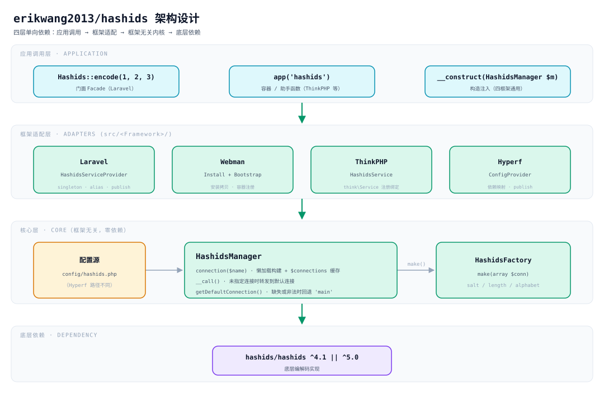
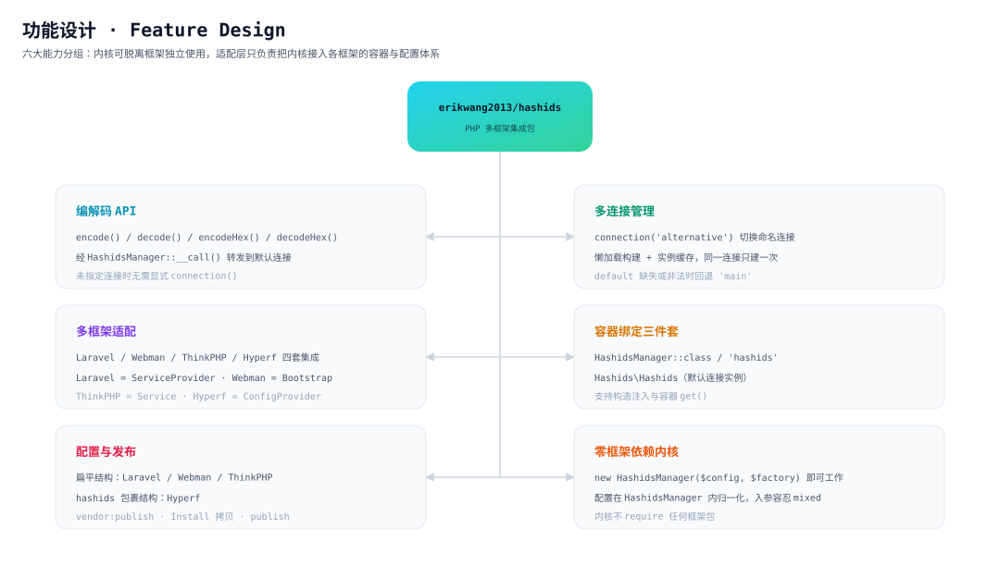
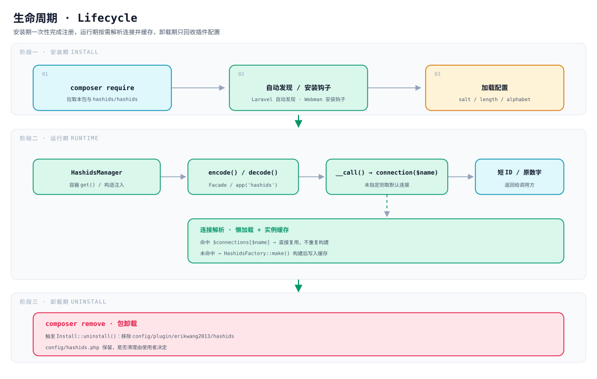

# erikwang2013/hashids

**Languages:** **中文** · [English](docs/i18n/en/README.md) · [한국어](docs/i18n/ko/README.md) · [Русский](docs/i18n/ru/README.md) · [Deutsch](docs/i18n/de/README.md) · [Français](docs/i18n/fr/README.md) · [Español](docs/i18n/es/README.md) · [Português](docs/i18n/pt/README.md) · [हिन्दी](docs/i18n/hi/README.md) · [العربية](docs/i18n/ar/README.md) · [বাংলা](docs/i18n/bn/README.md) · [Bahasa Indonesia](docs/i18n/id/README.md) · [日本語](docs/i18n/ja/README.md)

<p align="center">
  
</p>

<p align="center"><strong>哈希迪 Hashy</strong> — 项目宠物，胸口的 <code>#</code> 是它的招牌</p>

把数据库自增 ID 换成短小、不可猜测的字符串，**一套 API 同时跑在 Laravel、Webman、ThinkPHP、Hyperf 上**。

底层依赖 [`hashids/hashids`](https://github.com/vinkla/hashids) v5；配置与用法对齐 [**vinkla/hashids**](https://github.com/vinkla/laravel-hashids)（多连接、默认连接、`HashidsManager` + 工厂），可平滑替换。

## 项目说明

**Hashids** 是一款短 ID 生成器，可将数字 ID（如数据库主键）编码为短小、唯一且不可猜测的字符串。它不同于 UUID 或雪花 ID——Hashids 更适合用于面向用户的场景（URL、分享码、订单号等），在保持短小可读的同时隐藏原始数字。

本包 `erikwang2013/hashids` 是 Hashids 的 **PHP 多框架集成层**，在设计上参考并对齐了 [vinkla/hashids](https://github.com/vinkla/laravel-hashids) 的 API 风格（多连接、默认连接、Manager + Factory 模式），并扩展支持了国内常用的其他 PHP 框架。

**核心特性：**

- **多框架兼容**：同一套 API 同时支持 Laravel、Webman、ThinkPHP、Hyperf，迁移成本极低。
- **多连接支持**：一个应用可同时配置多套 Salt/Length 组合（如用户 ID 与订单 ID 使用不同盐值），通过 `connection('xxx')` 切换。
- **无框架依赖**：不依赖任何特定框架即可独立使用，直接 `new HashidsManager($config, $factory)` 即可工作。
- **对齐 vinkla/hashids**：Laravel 下 Facade、容器绑定、`config/hashids.php` 格式均与 vinkla/hashids 一致，可平滑替换。
- **框架原生风格**：各框架集成遵循各自的惯用法——Laravel 用 ServiceProvider + Facade，Webman 用 Plugin + Bootstrap，ThinkPHP 用 Service，Hyperf 用 ConfigProvider。

**适用场景：**

| 场景 | 说明 |
|------|------|
| 隐藏数据库自增 ID | 将 `user_id=100` 映射为 `/user/3kTMd`，避免暴露业务规模 |
| 生成短链接/分享码 | 比 UUID 更短，比随机字符串可控 |
| 订单号/流水号 | 可读性好，便于客服沟通与日志排查 |
| 多租户/多模块隔离 | 不同连接使用不同 Salt，确保编码空间相互独立 |

**注意事项：**

- Hashids 是 **编码（encode/decode）而非加密**。Salt 仅增加猜测难度，不可用于安全敏感场景（如 token、密码）。
- 一旦上线后修改 Salt 或 Length，所有已编码的 ID 将变为无效，请提前规划并固定配置。
- **Salt 留空等于没有保护**：空 salt 下编码结果可枚举（`encode(1)`、`encode(2)`… 顺序可预测）。写成
  `env('HASHIDS_SALT', '')` 时，漏配环境变量既不报错也不告警，只是静默降级成空 salt —— 上线前请确认盐已设置。
- **常驻内存框架（Webman / Hyperf）下改配置需要重启进程**：`HashidsManager` 在构造时快照配置并永久缓存连接，
  改 `config/hashids.php`（或用配置中心换盐）不会热生效，`reload` 或重启后才会。

## 项目结构

```
hashids/
├── src/
│   ├── HashidsManager.php                     # 核心：多连接解析、实例缓存、默认连接代理
│   ├── HashidsFactory.php                     # 核心：由连接配置构建 Hashids 实例
│   ├── Mascot.php                             # 项目宠物「哈希迪 Hashy」的 ASCII 版
│   ├── Install.php                            # Webman 安装 / 卸载钩子
│   ├── Laravel/
│   │   ├── HashidsServiceProvider.php         # 容器单例 + 别名 + 配置发布
│   │   └── Facades/Hashids.php                # Facade（默认连接）
│   ├── Webman/
│   │   └── Bootstrap.php                      # 进程启动时注册容器定义
│   ├── ThinkPHP/
│   │   └── HashidsService.php                 # think\Service 注册绑定
│   ├── Hyperf/
│   │   ├── ConfigProvider.php                 # 依赖映射 + 配置发布
│   │   ├── HashidsManagerFactory.php
│   │   └── HashidsClientFactory.php
│   └── config/plugin/erikwang2013/hashids/    # Webman 插件骨架（安装时拷贝到项目）
│       ├── app.php                            # enable 开关
│       └── bootstrap.php                      # 注册 Webman\Bootstrap
├── config/
│   ├── hashids.php                            # 扁平配置：Laravel / Webman / ThinkPHP
│   └── autoload/hashids.php                   # Hyperf 配置（结构同扁平，路径不同）
├── tests/
│   ├── HashidsManagerTest.php                 # 核心行为
│   ├── HashidsFactoryTest.php
│   ├── InstallTest.php
│   ├── MascotTest.php                         # 项目宠物：字形对齐与问候
│   ├── Laravel/ · Webman/ · ThinkPHP/ · Hyperf/   # 各框架适配测试
│   ├── Config/PluginConfigTest.php
│   └── Support/FrameworkStubs.php             # 测试用的框架类替身
├── docs/
│   ├── mascot.svg                             # 项目宠物「哈希迪 Hashy」
│   ├── architecture.svg                       # 架构设计图
│   ├── features.svg                           # 功能设计图
│   └── lifecycle.svg                          # 生命周期图
├── .github/workflows/release.yml              # 推送 main 后自动打 tag 并发 release
├── composer.json
└── phpunit.xml.dist
```

> `vendor/`、`composer.lock` 等依赖产物未列出；`src/config/` 是**插件骨架**，`config/` 是**可发布的配置样例**，两者用途不同。

## 架构设计



**四层单向依赖**，上层依赖下层，反向不成立：

| 层 | 职责 | 位置 |
|----|------|------|
| 应用调用层 | Facade、容器 / 助手函数、构造注入三种入口 | 业务代码 |
| 框架适配层 | 只做接线：容器绑定、配置读取、配置发布 | `src/<Framework>/` |
| 核心层 | 多连接管理与实例构建，**不依赖任何框架** | `src/HashidsManager.php`、`src/HashidsFactory.php` |
| 底层依赖 | 实际编解码实现 | `hashids/hashids` |

核心层是整个包的重心：`HashidsManager` 持有配置，`connection($name)` 按需构建并缓存连接，`__call()` 把未指定连接的方法调用转发到默认连接；`HashidsFactory::make()` 是唯一构造 `Hashids\Hashids` 的地方。四个框架的适配类加起来约 250 行（含 Facade 与两个 Hyperf 工厂）——它们只负责把内核接进各自的容器。

## 功能设计



六个能力分组，全部围绕同一个内核：

- **编解码 API**：`encode()` / `decode()` / `encodeHex()` / `decodeHex()`，经 `__call()` 落到默认连接，无需显式 `connection()`。
- **多连接管理**：`connection('alternative')` 切换；懒加载构建，同一连接只构建一次。
- **多框架适配**：Laravel 用 `ServiceProvider`、Webman 用 `Install` + `Bootstrap`、ThinkPHP 用 `Service`、Hyperf 用 `ConfigProvider`，各自遵循框架惯用法。
- **容器绑定**：类名（`HashidsManager`、`HashidsFactory`、`Hashids\Hashids`）与字符串键（`'hashids'`、`'hashids.factory'`、`'hashids.connection'`）双轨绑定，四框架一致；后两个字符串键与 vinkla/hashids 同名，便于迁移。
- **配置与发布**：四个框架结构一致，都是**扁平数组**（根级 `default` + `connections`），只有文件路径不同。
- **零框架依赖内核**：`new HashidsManager($config, $factory)` 即可工作，`$config` 入参容忍非数组（归一化为空数组）。

## 生命周期



| 阶段 | 发生了什么 |
|------|-----------|
| **安装期** | `composer require` 拉包 → Laravel 自动发现 / Webman 安装钩子拷贝插件骨架 → 加载 `salt` / `length` / `alphabet` |
| **运行期** | 容器解析出 `HashidsManager` → `encode()` / `decode()` → `__call()` 转发到 `connection($name)` → **命中缓存直接复用，未命中才 `HashidsFactory::make()` 构建并写入 `$connections`** → 返回短 ID 或原数字 |
| **卸载期** | `composer remove` 触发 `Install::uninstall()`，移除 `config/plugin/erikwang2013/hashids`；**`config/hashids.php` 会保留**，是否清理由使用者决定 |

连接是**按需构建**的：只调用默认连接的进程，不会为 `alternative` 之类未使用的连接付出任何构建成本。

## 安装

```bash
composer require erikwang2013/hashids
```

> **运行环境**：底层 `hashids/hashids` **必须**有 `ext-bcmath` 或 `ext-gmp`（二选一），否则第一次编码就会抛
> `RuntimeException: Missing math extension for Hashids`。这两个扩展在 `hashids/hashids` 里只列于 `suggest`，
> 而 Composer 2 已不再打印 suggest —— 于是在精简镜像（如 `php:8.3-fpm-alpine`）上安装期毫无提示、运行期才炸，
> 且每个用到 Hashids 的请求都会 500。本包 `composer.json` 的 `suggest` 已补上这两个键，但仍需你确认扩展已启用。

## 配置结构（Laravel / Webman / ThinkPHP）

与仓库 `config/hashids.php` 一致：

- `default`：默认连接名（如 `main`）。
- `connections`：连接名 => `salt`、`length`、可选 `alphabet`。

> **Hyperf** 的配置文件路径不同（`config/autoload/hashids.php`），但结构相同，见下文 Hyperf 小节。

## 无框架用法

可直接实例化管理器：

```php
use Erikwang2013\Hashids\HashidsFactory;
use Erikwang2013\Hashids\HashidsManager;

$manager = new HashidsManager(
    require __DIR__ . '/config/hashids.php',
    new HashidsFactory()
);

$hash = $manager->encode(1, 2, 3);
$ids = $manager->decode($hash);
```

---

## Laravel

与 [vinkla/hashids](https://github.com/vinkla/laravel-hashids) 类似：容器注册 `HashidsManager`，多连接；默认连接支持 Facade 与方法转发。

Laravel 5.5+ 会读取本包 `composer.json` 的 `extra.laravel`，自动注册 `HashidsServiceProvider` 与 Facade 别名 `Hashids`。

**发布配置（可选）**

```bash
php artisan vendor:publish --tag=hashids-config
```

生成 `config/hashids.php`。若不发布，扩展包会在注册阶段合并内置默认配置。

**Facade（默认连接）**

```php
use Erikwang2013\Hashids\Laravel\Facades\Hashids;

$hash = Hashids::encode(1, 2, 3);
$numbers = Hashids::decode($hash);
```

**指定连接**

```php
use Erikwang2013\Hashids\Laravel\Facades\Hashids;

$hash = Hashids::connection('alternative')->encode(100);
```

**依赖注入 `HashidsManager`**

```php
use Erikwang2013\Hashids\HashidsManager;

public function __construct(private HashidsManager $hashids) {}

$this->hashids->encode(1);
$this->hashids->connection('alternative')->encode(2);
```

**注入底层 `Hashids\Hashids`（默认连接）**

```php
use Hashids\Hashids;

public function __construct(private Hashids $hashids) {}
```

运行 Laravel 集成需要项目已安装 `laravel/framework`（含 `illuminate/support` 等）。本包将 `illuminate/*` 列为 **require-dev**，仅供包自身测试。

---

## Webman

通过 **`Install`** 在安装时拷贝 `config/plugin/erikwang2013/hashids` 与根目录 **`config/hashids.php`**，并由插件 **bootstrap** 向 Webman 容器注册 `HashidsManager`。

项目的 `composer.json` 中若已有 `support\Plugin::install` / `update` / `uninstall` 钩子，安装本包时会自动执行安装脚本（`WEBMAN_PLUGIN = true`）。

**安装后文件**

- `config/plugin/erikwang2013/hashids/app.php`：`enable` 开关。
- `config/plugin/erikwang2013/hashids/bootstrap.php`：注册 `Erikwang2013\Hashids\Webman\Bootstrap`。
- `config/hashids.php`：多连接配置（首次安装或确认覆盖时写入）。

若自动拷贝未执行，可从扩展包内手动复制上述路径的示例配置。

**关闭插件**（`config/plugin/erikwang2013/hashids/app.php`）

```php
<?php
return [
    'enable' => false,
];
```

**容器绑定**

- `Erikwang2013\Hashids\HashidsManager` / `'hashids'`
- `Erikwang2013\Hashids\HashidsFactory` / `'hashids.factory'`
- `Hashids\Hashids` / `'hashids.connection'`（默认连接实例）

**控制器示例**

```php
use support\Request;
use Erikwang2013\Hashids\HashidsManager;
use Hashids\Hashids;

class DemoController
{
    public function index(Request $request, HashidsManager $manager)
    {
        $hash = $manager->encode(1, 2, 3);

        $client = \support\Container::instance()->get(Hashids::class);
        $hash2 = $client->encode(4);

        return json(['hash' => $hash, 'hash2' => $hash2]);
    }
}
```

**指定连接**

```php
$manager->connection('alternative')->encode(99);
```

Composer 卸载包时会触发 `Plugin::uninstall`，移除 `config/plugin/erikwang2013/hashids`；**不会**删除 `config/hashids.php`，是否保留由你决定。

---

## ThinkPHP

通过 **自定义服务类** 注册 `HashidsManager`；配置仍为顶层含 `default` 与 `connections` 的 **`config/hashids.php`**。

**注册服务**

在应用 **`config/service.php`**（具体路径随 TP 版本可能不同）的 `services` 中加入：

```php
<?php

return [
    // ...
    \Erikwang2013\Hashids\ThinkPHP\HashidsService::class,
];
```

若使用应用级 `app/AppService.php`，也可在 `register()` 中写入等价绑定。

**配置文件**

将扩展包内 `config/hashids.php` 复制到应用 `config/hashids.php`（或自行合并同名配置）。

```php
<?php
return [
    'default' => 'main',
    'connections' => [
        'main' => [
            'salt' => env('HASHIDS_SALT', ''),
            'length' => (int) env('HASHIDS_LENGTH', 0),
        ],
    ],
];
```

**使用示例**

```php
use Erikwang2013\Hashids\HashidsManager;
use think\facade\App;

$manager = App::make(HashidsManager::class);
$hash = $manager->encode(10, 20);
```

```php
$manager = app('hashids');
```

```php
use Hashids\Hashids;

$client = app(Hashids::class);
$hash = $client->encode(1);
```

```php
app(HashidsManager::class)->connection('alternative')->encode(100);
```

ThinkPHP 集成继承 `think\Service`，需在 **`topthink/framework`** 环境中使用（本包列为 suggest）。

---

## Hyperf

Composer **`extra.hyperf.config`** 会载入 `ConfigProvider`，向容器注册 `HashidsFactory`、`HashidsManager`、默认连接的 `Hashids\Hashids`。

将扩展包内 **`config/autoload/hashids.php`** 复制到项目 **`config/autoload/hashids.php`**（或使用项目的配置发布命令）。

该文件必须返回**扁平数组**（根级 `default` + `connections`）。

Hyperf 的 `ConfigFactory` 按**文件名**归并（`Arr::set($config, 'hashids', require $file)`），所以 `config('hashids')` 返回的就是文件内容本身——**不要再套一层 `'hashids' =>`**。套了的话 `connections` 不可达，取连接时会抛 `Hashids connection [main] is not configured`。

```php
<?php

declare(strict_types=1);

return [
    'default' => 'main',
    'connections' => [
        'main' => [
            'salt' => env('HASHIDS_SALT', ''),
            'length' => (int) env('HASHIDS_LENGTH', 0),
        ],
    ],
];
```

**容器绑定**

| 抽象 | 实现 |
|------|------|
| `Erikwang2013\Hashids\HashidsFactory` / `'hashids.factory'` | 默认构造 |
| `Erikwang2013\Hashids\HashidsManager` / `'hashids'` | `HashidsManagerFactory` |
| `Hashids\Hashids` / `'hashids.connection'` | `HashidsClientFactory`（默认连接） |

**Controller / 构造函数注入**

```php
<?php

declare(strict_types=1);

namespace App\Controller;

use Erikwang2013\Hashids\HashidsManager;
use Hashids\Hashids;

class DemoController
{
    public function index(HashidsManager $manager, Hashids $hashids)
    {
        $h1 = $manager->encode(1, 2, 3);
        $h2 = $hashids->encode(4);
        $alt = $manager->connection('alternative')->encode(99);

        return compact('h1', 'h2', 'alt');
    }
}
```

```php
$manager = \Hyperf\Context\ApplicationContext::getContainer()->get(
    \Erikwang2013\Hashids\HashidsManager::class
);
```

四个框架的配置结构一致（根级 `default` + `connections`），只有文件路径不同：Hyperf 用 **`config/autoload/hashids.php`**，Laravel / Webman / ThinkPHP 用 **`config/hashids.php`**。

---

## 项目宠物

项目宠物是 **哈希迪 Hashy**——一只头顶天线、胸口印着 `#` 的圆角方块小宠物，矢量图见 [`docs/mascot.svg`](docs/mascot.svg)。

终端里没有 SVG，所以代码里留了一份等价的 ASCII 版本（`Erikwang2013\Hashids\Mascot`）：

```php
use Erikwang2013\Hashids\Mascot;

echo Mascot::greet();
```

```
           ●
           │
      ╭─────────╮
      │ ◉     ◉ │
      │    ‿    │
      │    #    │
      ╰──┬───┬──╯
         ╵   ╵
哈希迪 Hashy · 把数据库自增 ID 换成短小、不可猜测的字符串
```

Webman 插件首次发布 `config/hashids.php` 时会顺带打印一次这次问候；配置已存在时（例如重复执行 `composer update`）不会重复打扰。

---

## 开源不易，欢迎支持 / Open Source is Not Easy, Your Support is Welcome

<p align="center">
  
  &nbsp;&nbsp;&nbsp;&nbsp;
  
</p>

<p align="center"><strong>微信 WeChat Pay</strong>&nbsp;&nbsp;&nbsp;&nbsp;&nbsp;&nbsp;&nbsp;&nbsp;&nbsp;&nbsp;&nbsp;&nbsp;&nbsp;&nbsp;&nbsp;&nbsp;<strong>支付宝 Alipay</strong></p>

---


## License

MIT. See [LICENSE](LICENSE).
