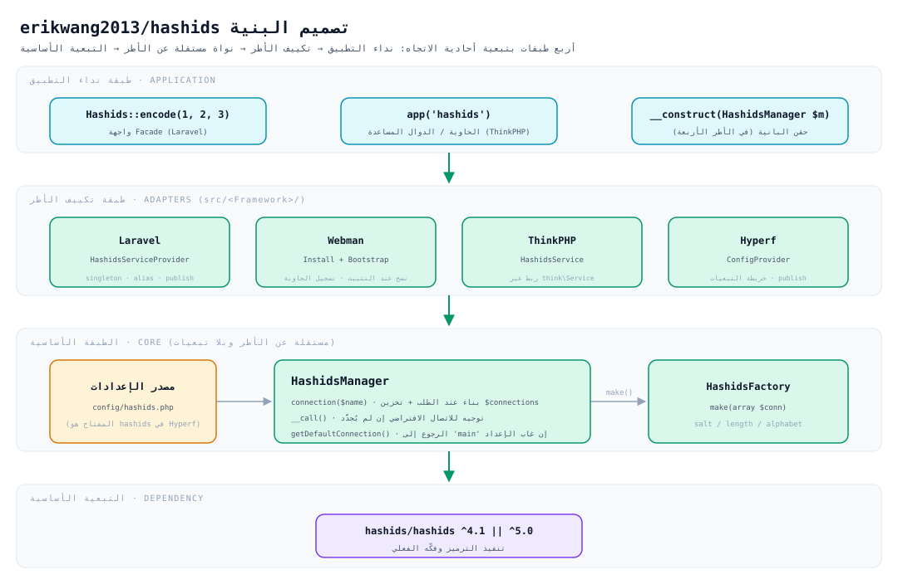
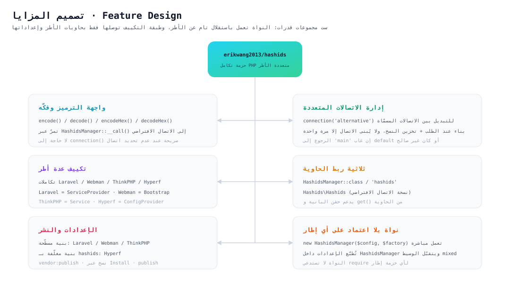
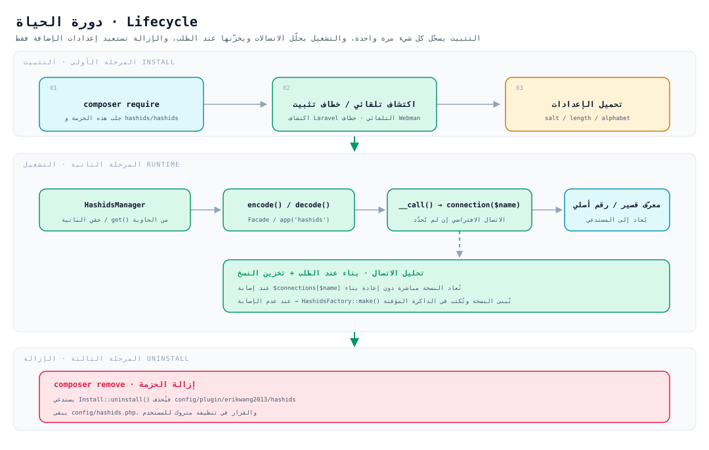

# erikwang2013/hashids

**Languages:** [中文](../../../README.md) · [English](../en/README.md) · [한국어](../ko/README.md) · [Русский](../ru/README.md) · [Deutsch](../de/README.md) · [Français](../fr/README.md) · [Español](../es/README.md) · [Português](../pt/README.md) · [हिन्दी](../hi/README.md) · **العربية** · [বাংলা](../bn/README.md) · [Bahasa Indonesia](../id/README.md) · [日本語](../ja/README.md)

<p align="center">
  
</p>

<p align="center"><strong>حاشيدي Hashy</strong> — التميمة الخاصة بالمشروع، وعلامة <code>#</code> على صدره هي شعاره</p>

حوِّل معرّفات قاعدة البيانات التلقائية إلى نصوص قصيرة يتعذّر تخمينها، **بواجهة API واحدة تعمل في الوقت نفسه على Laravel وWebman وThinkPHP وHyperf**.

يعتمد في الأساس على [`hashids/hashids`](https://github.com/vinkla/hashids) v5؛ وتتوافق تهيئته وطريقة استخدامه مع [**vinkla/hashids**](https://github.com/vinkla/laravel-hashids) (اتصالات متعددة، الاتصال الافتراضي، `HashidsManager` + المصنع)، ما يتيح استبداله بسلاسة.

## وصف المشروع

**Hashids** مولّد للمعرّفات القصيرة، يحوّل المعرّفات الرقمية (مثل المفاتيح الأساسية في قاعدة البيانات) إلى نصوص قصيرة وفريدة يتعذّر تخمينها. وهو يختلف عن UUID أو Snowflake ID: فـ Hashids أنسب للحالات الموجّهة إلى المستخدم (الروابط، رموز المشاركة، أرقام الطلبات…)، إذ يخفي الأرقام الأصلية مع إبقاء الناتج قصيرًا ومقروءًا.

هذه الحزمة `erikwang2013/hashids` هي **طبقة تكامل PHP متعددة الأطر** لـ Hashids، وقد صُمّمت بالرجوع إلى أسلوب API في [vinkla/hashids](https://github.com/vinkla/laravel-hashids) والتوافق معه (اتصالات متعددة، الاتصال الافتراضي، نمط Manager + Factory)، مع دعم أطر PHP أخرى شائعة الاستخدام.

**المزايا الأساسية:**

- **توافق مع عدة أطر**: واجهة API واحدة تدعم Laravel وWebman وThinkPHP وHyperf معًا، بتكلفة انتقال ضئيلة جدًا.
- **دعم اتصالات متعددة**: يمكن للتطبيق الواحد تهيئة عدة تركيبات من Salt/Length (مثل استخدام قيمة ملح مختلفة لمعرّفات المستخدمين ومعرّفات الطلبات)، والتبديل بينها عبر `connection('xxx')`.
- **بلا اعتماد على أي إطار**: يعمل باستقلال دون أي إطار محدد، ويكفي `new HashidsManager($config, $factory)` لتشغيله.
- **توافق مع vinkla/hashids**: في Laravel تكون الـ Facade وربط الحاوية وصيغة `config/hashids.php` مطابقة لـ vinkla/hashids، فيتم الاستبدال بسلاسة.
- **أسلوب أصيل لكل إطار**: يتبع كل تكامل عُرف إطاره — Laravel بـ ServiceProvider + Facade، وWebman بـ Plugin + Bootstrap، وThinkPHP بـ Service، وHyperf بـ ConfigProvider.

**حالات الاستخدام:**

| الحالة | الوصف |
|------|------|
| إخفاء معرّفات قاعدة البيانات التلقائية | تحويل `user_id=100` إلى `/user/3kTMd` لتجنّب كشف حجم النشاط |
| توليد روابط قصيرة / رموز مشاركة | أقصر من UUID وأكثر ضبطًا من نص عشوائي |
| أرقام الطلبات / أرقام التسلسل | مقروئية أفضل، تسهّل تواصل الدعم وتتبّع السجلات |
| عزل المستأجرين / الوحدات | لكل اتصال Salt مختلف لضمان استقلال فضاءات الترميز |

**تنبيهات:**

- Hashids هو **ترميز (encode/decode) وليس تشفيرًا**. الـ Salt يزيد صعوبة التخمين فقط، ولا يصلح للحالات الحساسة أمنيًا (مثل الرموز وكلمات المرور).
- إذا غيّرت الـ Salt أو Length بعد الإطلاق، فستصبح كل المعرّفات المرمّزة غير صالحة، لذا خطِّط مسبقًا وثبّت الإعدادات.
- **ترك الـ Salt فارغًا يعني غياب الحماية**: مع salt فارغ تصبح نتائج الترميز قابلة للتعداد (`encode(1)` و`encode(2)`… بترتيب متوقَّع). وعند كتابته بالشكل
  `env('HASHIDS_SALT', '')` فإن نسيان ضبط متغيّر البيئة لا يُنتج خطأً ولا تحذيرًا، بل يتدهور بصمت إلى salt فارغ — تأكّد من ضبط الـ Salt قبل الإطلاق.
- **تغيير الإعدادات في الأطر المقيمة في الذاكرة (Webman / Hyperf) يتطلّب إعادة تشغيل العملية**: يأخذ `HashidsManager` نسخة من الإعدادات عند البناء ويخزّن الاتصالات تخزينًا دائمًا،
  فتعديل `config/hashids.php` (أو تغيير الـ Salt عبر مركز الإعدادات) لا يسري فورًا، وإنما بعد `reload` أو إعادة التشغيل.

## بنية المشروع

```
hashids/
├── src/
│   ├── HashidsManager.php                     # النواة: تحليل الاتصالات المتعددة، تخزين النسخ، الوكيل عن الاتصال الافتراضي
│   ├── HashidsFactory.php                     # النواة: بناء نسخة Hashids من إعدادات الاتصال
│   ├── Mascot.php                             # نسخة ASCII من التميمة «حاشيدي Hashy»
│   ├── Install.php                            # خطاف التثبيت / الإزالة في Webman
│   ├── Laravel/
│   │   ├── HashidsServiceProvider.php         # نسخة وحيدة في الحاوية + اسم مستعار + نشر الإعدادات
│   │   └── Facades/Hashids.php                # Facade (الاتصال الافتراضي)
│   ├── Webman/
│   │   └── Bootstrap.php                      # تسجيل تعريفات الحاوية عند إقلاع العملية
│   ├── ThinkPHP/
│   │   └── HashidsService.php                 # تسجيل الربط عبر think\Service
│   ├── Hyperf/
│   │   ├── ConfigProvider.php                 # خريطة التبعيات + نشر الإعدادات
│   │   ├── HashidsManagerFactory.php
│   │   └── HashidsClientFactory.php
│   └── config/plugin/erikwang2013/hashids/    # هيكل إضافة Webman (يُنسخ إلى المشروع عند التثبيت)
│       ├── app.php                            # مفتاح enable
│       └── bootstrap.php                      # تسجيل Webman\Bootstrap
├── config/
│   ├── hashids.php                            # إعدادات مسطّحة: Laravel / Webman / ThinkPHP
│   └── autoload/hashids.php                   # إعدادات Hyperf (البنية مسطّحة، المسار مختلف)
├── tests/
│   ├── HashidsManagerTest.php                 # السلوك الأساسي
│   ├── HashidsFactoryTest.php
│   ├── InstallTest.php
│   ├── MascotTest.php                         # التميمة: محاذاة الرسم والتحية
│   ├── Laravel/ · Webman/ · ThinkPHP/ · Hyperf/   # اختبارات تكامل كل إطار
│   ├── Config/PluginConfigTest.php
│   └── Support/FrameworkStubs.php             # بدائل أصناف الأطر المستخدمة في الاختبارات
├── docs/
│   ├── mascot.svg                             # التميمة «حاشيدي Hashy»
│   ├── architecture.svg                       # مخطط تصميم البنية
│   ├── features.svg                           # مخطط تصميم المزايا
│   └── lifecycle.svg                          # مخطط دورة الحياة
├── .github/workflows/release.yml              # وسم تلقائي وإصدار بعد الدفع إلى main
├── composer.json
└── phpunit.xml.dist
```

> لم تُدرَج مخرجات التبعيات مثل `vendor/` و`composer.lock`؛ و`src/config/` هو **هيكل الإضافة**، أما `config/` فهي **نماذج إعدادات قابلة للنشر**، والغرض مختلف.

## تصميم البنية



**أربع طبقات بتبعية أحادية الاتجاه**: الطبقة العليا تعتمد على ما تحتها، والعكس غير صحيح:

| الطبقة | المسؤولية | الموضع |
|----|------|------|
| طبقة نداء التطبيق | ثلاثة منافذ: Facade، الحاوية / الدوال المساعدة، حقن البانية | كود العمل |
| طبقة تكييف الأطر | توصيل فقط: ربط الحاوية، قراءة الإعدادات، نشر الإعدادات | `src/<Framework>/` |
| الطبقة الأساسية | إدارة الاتصالات المتعددة وبناء النسخ، **دون الاعتماد على أي إطار** | `src/HashidsManager.php`، `src/HashidsFactory.php` |
| التبعية الأساسية | تنفيذ الترميز وفكّه فعليًا | `hashids/hashids` |

الطبقة الأساسية هي ثقل الحزمة: `HashidsManager` يحمل الإعدادات، و`connection($name)` يبني الاتصال ويخزّنه عند الطلب، و`__call()` يعيد توجيه نداءات الطرق التي لا تحدّد اتصالًا إلى الاتصال الافتراضي؛ و`HashidsFactory::make()` هو الموضع الوحيد الذي يُنشئ `Hashids\Hashids`. أما أصناف تكييف الأطر الأربعة فمجموع أسطرها نحو 250 سطرًا (مع الـ Facade ومصنعَي Hyperf) — وهي مسؤولة فقط عن وصل النواة بحاويات كل إطار.

## تصميم المزايا



ست مجموعات قدرات، تدور كلها حول النواة ذاتها:

- **واجهة الترميز وفكّه**: `encode()` / `decode()` / `encodeHex()` / `decodeHex()` تمرّ عبر `__call()` إلى الاتصال الافتراضي دون حاجة إلى `connection()` صريحة.
- **إدارة الاتصالات المتعددة**: التبديل عبر `connection('alternative')`؛ بناء عند الطلب، ولا يُبنى الاتصال نفسه إلا مرة واحدة.
- **تكييف عدة أطر**: Laravel بـ `ServiceProvider`، وWebman بـ `Install` + `Bootstrap`، وThinkPHP بـ `Service`، وHyperf بـ `ConfigProvider`، كلٌّ وفق عُرف إطاره.
- **ربط الحاوية**: ربط على مسارين — أسماء الأصناف (`HashidsManager` و`HashidsFactory` و`Hashids\Hashids`) والمفاتيح النصية (`'hashids'` و`'hashids.factory'` و`'hashids.connection'`) — متطابق في الأطر الأربعة؛ والمفتاحان النصيان الأخيران باسم vinkla/hashids نفسه، ما يسهّل الانتقال.
- **الإعدادات والنشر**: الأطر الأربعة متطابقة في البنية، وكلها **مصفوفة مسطّحة** (`default` + `connections` في الجذر)، والفرق في مسار الملف فقط.
- **نواة بلا اعتماد على أي إطار**: تعمل بـ `new HashidsManager($config, $factory)`، والوسيط `$config` يتقبّل غير المصفوفات (يُطبَّع إلى مصفوفة فارغة).

## دورة الحياة



| المرحلة | ما الذي يحدث |
|------|-----------|
| **مرحلة التثبيت** | `composer require` يجلب الحزمة → الاكتشاف التلقائي في Laravel / خطاف التثبيت في Webman ينسخ هيكل الإضافة → تحميل `salt` / `length` / `alphabet` |
| **مرحلة التشغيل** | الحاوية تحلّل `HashidsManager` → `encode()` / `decode()` → `__call()` يعيد التوجيه إلى `connection($name)` → **عند إصابة الذاكرة المؤقتة تُعاد النسخة مباشرة، وعند عدم الإصابة فقط يُبنى الاتصال بـ `HashidsFactory::make()` ويُكتب في `$connections`** → إرجاع المعرّف القصير أو الرقم الأصلي |
| **مرحلة الإزالة** | `composer remove` يستدعي `Install::uninstall()` فتُحذف `config/plugin/erikwang2013/hashids`؛ **ويبقى `config/hashids.php`**، والقرار في تنظيفه متروك للمستخدم |

الاتصالات **تُبنى عند الطلب**: العملية التي تستدعي الاتصال الافتراضي فقط لا تدفع أي كلفة بناء لاتصالات غير مستخدمة مثل `alternative`.

## التثبيت

```bash
composer require erikwang2013/hashids
```

> **بيئة التشغيل**: الحزمة الأساسية `hashids/hashids` **تتطلّب** وجود `ext-bcmath` أو `ext-gmp` (أحدهما)، وإلا فسيُرمى
> `RuntimeException: Missing math extension for Hashids` عند أول عملية ترميز. هذان الامتدادان مذكوران في `hashids/hashids` ضمن `suggest` فقط،
> وComposer 2 لم يعد يطبع اقتراحات suggest — لذا على الصور المصغّرة (مثل `php:8.3-fpm-alpine`) لا يظهر أي تنبيه وقت التثبيت، ولا ينفجر الأمر إلا وقت التشغيل،
> فيردّ كل طلب يستخدم Hashids بالخطأ 500. وقد أُضيف هذان المفتاحان إلى `suggest` في `composer.json` الخاص بهذه الحزمة، لكن لا يزال عليك التأكّد من أن الامتداد مُفعَّل.

## بنية الإعدادات (Laravel / Webman / ThinkPHP)

يُطابق الملف `config/hashids.php` في المستودع:

- `default`: اسم الاتصال الافتراضي (مثل `main`).
- `connections`: اسم الاتصال => `salt` و`length` و`alphabet` اختياريًا.

> مسار ملف الإعدادات في **Hyperf** مختلف (`config/autoload/hashids.php`)، لكن البنية واحدة، انظر قسم Hyperf أدناه.

## الاستخدام بدون إطار

يمكن إنشاء المدير مباشرة:

```php
use Erikwang2013\Hashids\HashidsFactory;
use Erikwang2013\Hashids\HashidsManager;

$manager = new HashidsManager(
    require __DIR__ . '/config/hashids.php',
    new HashidsFactory()
);

$hash = $manager->encode(1, 2, 3);
$ids = $manager->decode($hash);
```

---

## Laravel

مشابه لـ [vinkla/hashids](https://github.com/vinkla/laravel-hashids): تسجيل `HashidsManager` في الحاوية مع اتصالات متعددة؛ والاتصال الافتراضي يدعم الـ Facade وتمرير الطرق.

يقرأ Laravel 5.5+ المفتاح `extra.laravel` من ملف `composer.json` في هذه الحزمة، ويسجّل `HashidsServiceProvider` والاسم المستعار للـ Facade وهو `Hashids` تلقائيًا.

**نشر الإعدادات (اختياري)**

```bash
php artisan vendor:publish --tag=hashids-config
```

ينشئ `config/hashids.php`. وإن لم تنشر، تدمج الحزمة الإعدادات الافتراضية المضمّنة في مرحلة التسجيل.

**الـ Facade (الاتصال الافتراضي)**

```php
use Erikwang2013\Hashids\Laravel\Facades\Hashids;

$hash = Hashids::encode(1, 2, 3);
$numbers = Hashids::decode($hash);
```

**تحديد اتصال**

```php
use Erikwang2013\Hashids\Laravel\Facades\Hashids;

$hash = Hashids::connection('alternative')->encode(100);
```

**حقن التبعية `HashidsManager`**

```php
use Erikwang2013\Hashids\HashidsManager;

public function __construct(private HashidsManager $hashids) {}

$this->hashids->encode(1);
$this->hashids->connection('alternative')->encode(2);
```

**حقن `Hashids\Hashids` الأساسي (الاتصال الافتراضي)**

```php
use Hashids\Hashids;

public function __construct(private Hashids $hashids) {}
```

يتطلب تشغيل تكامل Laravel أن يكون `laravel/framework` مثبّتًا في المشروع (مع `illuminate/support` وغيره). وتُدرج هذه الحزمة `illuminate/*` ضمن **require-dev** لاختباراتها الخاصة فقط.

---

## Webman

عبر **`Install`** تُنسخ عند التثبيت `config/plugin/erikwang2013/hashids` والملف **`config/hashids.php`** في الجذر، ويسجّل **bootstrap** الخاص بالإضافة `HashidsManager` في حاوية Webman.

إذا كان ملف `composer.json` في المشروع يحتوي أصلًا على خطافات `support\Plugin::install` / `update` / `uninstall`، فسيُنفَّذ سكربت التثبيت تلقائيًا عند تثبيت هذه الحزمة (`WEBMAN_PLUGIN = true`).

**الملفات بعد التثبيت**

- `config/plugin/erikwang2013/hashids/app.php`: مفتاح التشغيل `enable`.
- `config/plugin/erikwang2013/hashids/bootstrap.php`: تسجيل `Erikwang2013\Hashids\Webman\Bootstrap`.
- `config/hashids.php`: إعدادات الاتصالات المتعددة (تُكتب عند أول تثبيت أو عند تأكيد الاستبدال).

إن لم تتم النسخ التلقائي، يمكنك نسخ الإعدادات النموذجية من المسارات أعلاه داخل الحزمة يدويًا.

**تعطيل الإضافة** (`config/plugin/erikwang2013/hashids/app.php`)

```php
<?php
return [
    'enable' => false,
];
```

**ربط الحاوية**

- `Erikwang2013\Hashids\HashidsManager` / `'hashids'`
- `Erikwang2013\Hashids\HashidsFactory` / `'hashids.factory'`
- `Hashids\Hashids` / `'hashids.connection'` (نسخة الاتصال الافتراضي)

**مثال في وحدة تحكّم**

```php
use support\Request;
use Erikwang2013\Hashids\HashidsManager;
use Hashids\Hashids;

class DemoController
{
    public function index(Request $request, HashidsManager $manager)
    {
        $hash = $manager->encode(1, 2, 3);

        $client = \support\Container::instance()->get(Hashids::class);
        $hash2 = $client->encode(4);

        return json(['hash' => $hash, 'hash2' => $hash2]);
    }
}
```

**تحديد اتصال**

```php
$manager->connection('alternative')->encode(99);
```

عند إزالة الحزمة عبر Composer يُستدعى `Plugin::uninstall` وتُحذف `config/plugin/erikwang2013/hashids`؛ أما `config/hashids.php` فـ **لن** يُحذف، والقرار في الاحتفاظ به متروك لك.

---

## ThinkPHP

يسجّل `HashidsManager` عبر **صنف خدمة مخصّص**؛ ويبقى الإعداد في **`config/hashids.php`** بالمستوى الأعلى مع `default` و`connections`.

**تسجيل الخدمة**

أضِف في `services` داخل **`config/service.php`** للتطبيق (قد يختلف المسار حسب إصدار TP):

```php
<?php

return [
    // ...
    \Erikwang2013\Hashids\ThinkPHP\HashidsService::class,
];
```

وإذا كنت تستخدم `app/AppService.php` على مستوى التطبيق، يمكنك كتابة الربط المكافئ داخل `register()`.

**ملف الإعدادات**

انسخ `config/hashids.php` من الحزمة إلى `config/hashids.php` في التطبيق (أو ادمج الإعدادات بنفسك).

```php
<?php
return [
    'default' => 'main',
    'connections' => [
        'main' => [
            'salt' => env('HASHIDS_SALT', ''),
            'length' => (int) env('HASHIDS_LENGTH', 0),
        ],
    ],
];
```

**أمثلة الاستخدام**

```php
use Erikwang2013\Hashids\HashidsManager;
use think\facade\App;

$manager = App::make(HashidsManager::class);
$hash = $manager->encode(10, 20);
```

```php
$manager = app('hashids');
```

```php
use Hashids\Hashids;

$client = app(Hashids::class);
$hash = $client->encode(1);
```

```php
app(HashidsManager::class)->connection('alternative')->encode(100);
```

يرث تكامل ThinkPHP الصنف `think\Service`، ويحتاج بيئة **`topthink/framework`** (مدرج في suggest في هذه الحزمة).

---

## Hyperf

يحمّل Composer المفتاح **`extra.hyperf.config`** فيسجّل `ConfigProvider` كلا من `HashidsFactory` و`HashidsManager` و`Hashids\Hashids` الخاص بالاتصال الافتراضي في الحاوية.

انسخ **`config/autoload/hashids.php`** من الحزمة إلى **`config/autoload/hashids.php`** في المشروع (أو استخدم أمر نشر الإعدادات في مشروعك).

يجب أن يعيد الملف **مصفوفة مسطّحة** (`default` + `connections` في الجذر).

يجمع `ConfigFactory` في Hyperf حسب **اسم الملف** (`Arr::set($config, 'hashids', require $file)`)، لذا فإن `config('hashids')` يعيد محتوى الملف نفسه — **لا تُضِف طبقة `'hashids' =>` أخرى**. وإن أضفتها يصبح `connections` غير قابل للوصول، ويُرمى عند جلب الاتصال الخطأ `Hashids connection [main] is not configured`.

```php
<?php

declare(strict_types=1);

return [
    'default' => 'main',
    'connections' => [
        'main' => [
            'salt' => env('HASHIDS_SALT', ''),
            'length' => (int) env('HASHIDS_LENGTH', 0),
        ],
    ],
];
```

**ربط الحاوية**

| التجريد | التنفيذ |
|------|------|
| `Erikwang2013\Hashids\HashidsFactory` / `'hashids.factory'` | البناء الافتراضي |
| `Erikwang2013\Hashids\HashidsManager` / `'hashids'` | `HashidsManagerFactory` |
| `Hashids\Hashids` / `'hashids.connection'` | `HashidsClientFactory` (الاتصال الافتراضي) |

**حقن في Controller / البانية**

```php
<?php

declare(strict_types=1);

namespace App\Controller;

use Erikwang2013\Hashids\HashidsManager;
use Hashids\Hashids;

class DemoController
{
    public function index(HashidsManager $manager, Hashids $hashids)
    {
        $h1 = $manager->encode(1, 2, 3);
        $h2 = $hashids->encode(4);
        $alt = $manager->connection('alternative')->encode(99);

        return compact('h1', 'h2', 'alt');
    }
}
```

```php
$manager = \Hyperf\Context\ApplicationContext::getContainer()->get(
    \Erikwang2013\Hashids\HashidsManager::class
);
```

بنية الإعدادات متطابقة في الأطر الأربعة (`default` + `connections` في الجذر)، والفرق في مسار الملف فقط: Hyperf يستخدم **`config/autoload/hashids.php`**، بينما Laravel / Webman / ThinkPHP فتستخدم **`config/hashids.php`**.

---

## التميمة الخاصة بالمشروع

التميمة الخاصة بالمشروع هي **حاشيدي Hashy** — مخلوق مربّع بزوايا دائرية، له هوائي فوق رأسه وعلامة `#` على صدره، والرسم المتجهي في [`docs/mascot.svg`](../../mascot.svg).

لا يوجد SVG في الطرفية، لذا احتُفظ في الكود بنسخة ASCII مكافئة (`Erikwang2013\Hashids\Mascot`):

```php
use Erikwang2013\Hashids\Mascot;

echo Mascot::greet();
```

```
           ●
           │
      ╭─────────╮
      │ ◉     ◉ │
      │    ‿    │
      │    #    │
      ╰──┬───┬──╯
         ╵   ╵
哈希迪 Hashy · 把数据库自增 ID 换成短小、不可猜测的字符串
```

عند أول نشر لـ `config/hashids.php` من إضافة Webman تُطبَع هذه التحية مرة واحدة؛ وإذا كان الملف موجودًا (مثل تكرار `composer update`) فلن تُزعجك مرة أخرى.

---

## مفتوح المصدر ليس بالأمر السهل، ودعمك مرحّب به

<p align="center">
  
  &nbsp;&nbsp;&nbsp;&nbsp;
  
</p>

<p align="center"><strong>WeChat Pay</strong>&nbsp;&nbsp;&nbsp;&nbsp;&nbsp;&nbsp;&nbsp;&nbsp;&nbsp;&nbsp;&nbsp;&nbsp;&nbsp;&nbsp;&nbsp;&nbsp;<strong>Alipay</strong></p>

---


## License

MIT. راجع [LICENSE](../../../LICENSE).
