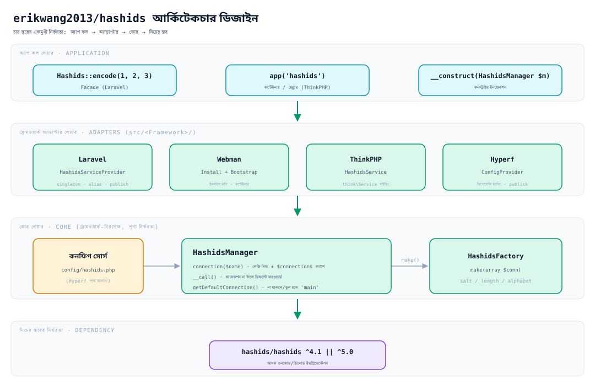
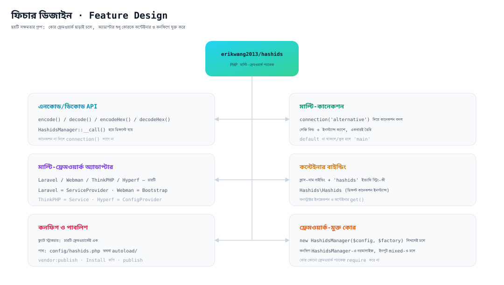
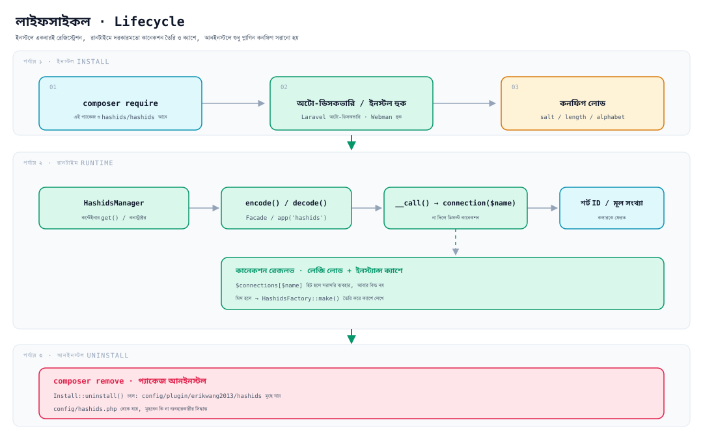

# erikwang2013/hashids

**Languages:** [中文](../../../README.md) · [English](../en/README.md) · [한국어](../ko/README.md) · [Русский](../ru/README.md) · [Deutsch](../de/README.md) · [Français](../fr/README.md) · [Español](../es/README.md) · [Português](../pt/README.md) · [हिन्दी](../hi/README.md) · [العربية](../ar/README.md) · **বাংলা** · [Bahasa Indonesia](../id/README.md) · [日本語](../ja/README.md)

<p align="center">
  
</p>

<p align="center"><strong>হাশিদি Hashy</strong> — প্রকল্পের মাসকট, বুকে <code>#</code>-ই তার পরিচয়</p>

ডেটাবেসের অটো-ইনক্রিমেন্ট ID-কে বদলে দিন ছোট, আন্দাজ করা কঠিন স্ট্রিংয়ে — **একই API একসাথে চলে Laravel, Webman, ThinkPHP ও Hyperf-এ**।

নিচের স্তরে নির্ভরতা [`hashids/hashids`](https://github.com/vinkla/hashids) v5; কনফিগ ও ব্যবহার [**vinkla/hashids**](https://github.com/vinkla/laravel-hashids)-এর সাথে মিলিয়ে রাখা হয়েছে (মাল্টি-কানেকশন, ডিফল্ট কানেকশন, `HashidsManager` + ফ্যাক্টরি), তাই ঝামেলাহীনভাবে বদলে ফেলা যায়।

## প্রকল্প পরিচিতি

**Hashids** হলো একটি শর্ট ID জেনারেটর, যা সংখ্যাসূচক ID (যেমন ডেটাবেসের প্রাইমারি কী) কে ছোট, অনন্য ও আন্দাজ করা কঠিন স্ট্রিংয়ে এনকোড করে। এটি UUID বা স্নোফ্লেক ID থেকে আলাদা — Hashids ব্যবহারকারীর মুখোমুখি কাজে (URL, শেয়ার কোড, অর্ডার নম্বর ইত্যাদি) বেশি মানানসই, কারণ এটি ছোট ও পাঠযোগ্য থাকে, আবার আসল সংখ্যাটি গোপন রাখে।

এই প্যাকেজ `erikwang2013/hashids` হলো Hashids-এর **PHP মাল্টি-ফ্রেমওয়ার্ক ইন্টিগ্রেশন লেয়ার**, যা ডিজাইনে [vinkla/hashids](https://github.com/vinkla/laravel-hashids)-এর API স্টাইল (মাল্টি-কানেকশন, ডিফল্ট কানেকশন, Manager + Factory প্যাটার্ন) অনুসরণ ও মিলিয়ে বানানো, এবং চীনে প্রচলিত অন্যান্য PHP ফ্রেমওয়ার্কেও সাপোর্ট বাড়িয়েছে।

**মূল বৈশিষ্ট্য:**

- **মাল্টি-ফ্রেমওয়ার্ক সাপোর্ট**: একই API একসাথে Laravel, Webman, ThinkPHP ও Hyperf-এ কাজ করে, মাইগ্রেশনের খরচ খুব কম।
- **মাল্টি-কানেকশন**: একটি অ্যাপে একাধিক Salt/Length কম্বিনেশন থাকতে পারে (যেমন ইউজার ID ও অর্ডার ID-এর জন্য আলাদা সল্ট), `connection('xxx')` দিয়ে সুইচ করা হয়।
- **ফ্রেমওয়ার্ক-নিরপেক্ষ**: কোনো নির্দিষ্ট ফ্রেমওয়ার্ক ছাড়াই স্বাধীনভাবে ব্যবহার করা যায়, সরাসরি `new HashidsManager($config, $factory)` লিখলেই চলে।
- **vinkla/hashids-এর সাথে সামঞ্জস্যপূর্ণ**: Laravel-এ Facade, কন্টেইনার বাইন্ডিং ও `config/hashids.php`-এর ফরম্যাট vinkla/hashids-এর মতোই, তাই ঝামেলাহীনভাবে বদলানো যায়।
- **ফ্রেমওয়ার্ক-নেটিভ স্টাইল**: প্রতিটি ইন্টিগ্রেশন নিজের ফ্রেমওয়ার্কের রীতি মেনে চলে — Laravel-এ ServiceProvider + Facade, Webman-এ Plugin + Bootstrap, ThinkPHP-তে Service, Hyperf-এ ConfigProvider।

**কোথায় ব্যবহার করবেন:**

| ক্ষেত্র | বিবরণ |
|------|------|
| ডেটাবেসের অটো-ইনক্রিমেন্ট ID লুকানো | `user_id=100` কে `/user/3kTMd`-এ রূপান্তর, ব্যবসার আকার ফাঁস হয় না |
| শর্ট লিংক / শেয়ার কোড তৈরি | UUID-এর চেয়ে ছোট, র‍্যান্ডম স্ট্রিংয়ের চেয়ে নিয়ন্ত্রিত |
| অর্ডার নম্বর / ট্রানজেকশন নম্বর | পড়তে সহজ, সাপোর্ট টিম ও লগ যাচাইয়ে সুবিধা |
| মাল্টি-টেন্যান্ট / মাল্টি-মডিউল আইসোলেশন | আলাদা কানেকশনে আলাদা Salt, ফলে এনকোডিং স্পেস পরস্পর স্বতন্ত্র |

**লক্ষণীয়:**

- Hashids হলো **এনকোডিং (encode/decode), এনক্রিপশন নয়**। Salt শুধু আন্দাজ করা কঠিন করে; নিরাপত্তা-সংবেদনশীল কাজে (যেমন token, পাসওয়ার্ড) ব্যবহার করা যাবে না।
- একবার প্রোডাকশনে যাওয়ার পর Salt বা Length বদলালে আগের সব এনকোড করা ID অকার্যকর হয়ে যাবে, তাই আগে থেকেই পরিকল্পনা করে কনফিগ স্থির করে নিন।

## প্রকল্প কাঠামো

```
hashids/
├── src/
│   ├── HashidsManager.php                     # কোর: কানেকশন রেজলভ, ইনস্ট্যান্স ক্যাশে, ডিফল্ট প্রক্সি
│   ├── HashidsFactory.php                     # কোর: কানেকশন কনফিগ থেকে Hashids ইনস্ট্যান্স তৈরি
│   ├── Mascot.php                             # মাসকট “হাশিদি Hashy”-এর ASCII সংস্করণ
│   ├── Install.php                            # Webman ইনস্টল / আনইনস্টল হুক
│   ├── Laravel/
│   │   ├── HashidsServiceProvider.php         # কন্টেইনার সিঙ্গলটন + অ্যালিয়াস + কনফিগ পাবলিশ
│   │   └── Facades/Hashids.php                # Facade (ডিফল্ট কানেকশন)
│   ├── Webman/
│   │   └── Bootstrap.php                      # প্রসেস চালু হলে কন্টেইনার ডেফিনিশন রেজিস্টার
│   ├── ThinkPHP/
│   │   └── HashidsService.php                 # think\Service বাইন্ডিং রেজিস্টার
│   ├── Hyperf/
│   │   ├── ConfigProvider.php                 # ডিপেন্ডেন্সি ম্যাপিং + কনফিগ পাবলিশ
│   │   ├── HashidsManagerFactory.php
│   │   └── HashidsClientFactory.php
│   └── config/plugin/erikwang2013/hashids/    # Webman প্লাগিন স্কেলিটন (ইনস্টলে প্রজেক্টে কপি হয়)
│       ├── app.php                            # enable সুইচ
│       └── bootstrap.php                      # Webman\Bootstrap রেজিস্টার
├── config/
│   ├── hashids.php                            # ফ্ল্যাট কনফিগ: Laravel / Webman / ThinkPHP
│   └── autoload/hashids.php                   # Hyperf কনফিগ (স্ট্রাকচার ফ্ল্যাট, পাথ আলাদা)
├── tests/
│   ├── HashidsManagerTest.php                 # কোর আচরণ
│   ├── HashidsFactoryTest.php
│   ├── InstallTest.php
│   ├── MascotTest.php                         # মাসকট: গ্লিফ অ্যালাইনমেন্ট ও গ্রিটিং
│   ├── Laravel/ · Webman/ · ThinkPHP/ · Hyperf/   # প্রতিটি ফ্রেমওয়ার্ক অ্যাডাপ্টার টেস্ট
│   ├── Config/PluginConfigTest.php
│   └── Support/FrameworkStubs.php             # টেস্টের জন্য ফ্রেমওয়ার্ক ক্লাস স্টাব
├── docs/
│   ├── mascot.svg                             # মাসকট “হাশিদি Hashy”
│   ├── architecture.svg                       # আর্কিটেকচার ডায়াগ্রাম
│   ├── features.svg                           # ফিচার ডায়াগ্রাম
│   └── lifecycle.svg                          # লাইফসাইকল ডায়াগ্রাম
├── .github/workflows/release.yml              # main-এ পুশ করলে অটো ট্যাগ ও রিলিজ
├── composer.json
└── phpunit.xml.dist
```

> `vendor/`, `composer.lock` ইত্যাদি ডিপেন্ডেন্সি আর্টিফ্যাক্ট তালিকাভুক্ত নয়; `src/config/` হলো **প্লাগিন স্কেলিটন**, আর `config/` হলো **পাবলিশযোগ্য কনফিগ নমুনা** — দুটির উদ্দেশ্য আলাদা।

## আর্কিটেকচার ডিজাইন



**চার স্তরের একমুখী নির্ভরতা** — উপরের স্তর নিচের স্তরের উপর নির্ভর করে, উল্টোটা নয়:

| স্তর | দায়িত্ব | অবস্থান |
|----|------|------|
| অ্যাপ্লিকেশন কল লেয়ার | Facade, কন্টেইনার / হেল্পার ফাংশন, কনস্ট্রাক্টর ইনজেকশন — তিনটি এন্ট্রি | বিজনেস কোড |
| ফ্রেমওয়ার্ক অ্যাডাপ্টার লেয়ার | শুধু ওয়্যারিং: কন্টেইনার বাইন্ডিং, কনফিগ পড়া, কনফিগ পাবলিশ | `src/<Framework>/` |
| কোর লেয়ার | মাল্টি-কানেকশন ম্যানেজমেন্ট ও ইনস্ট্যান্স তৈরি, **কোনো ফ্রেমওয়ার্কে নির্ভরশীল নয়** | `src/HashidsManager.php`, `src/HashidsFactory.php` |
| নিচের স্তরের নির্ভরতা | আসল এনকোড/ডিকোড ইমপ্লিমেন্টেশন | `hashids/hashids` |

কোর লেয়ার-ই পুরো প্যাকেজের কেন্দ্র: `HashidsManager` কনফিগ ধরে রাখে, `connection($name)` দরকারমতো কানেকশন তৈরি করে ক্যাশে রাখে, আর `__call()` কানেকশন না-দেওয়া মেথড কল ডিফল্ট কানেকশনে পাঠায়; `HashidsFactory::make()` হলো `Hashids\Hashids` তৈরির একমাত্র জায়গা। চারটি ফ্রেমওয়ার্কের অ্যাডাপ্টার ক্লাস মিলিয়ে প্রায় 250 লাইন (Facade ও দুটি Hyperf ফ্যাক্টরিসহ) — এগুলো শুধু কোরকে নিজ নিজ কন্টেইনারে যুক্ত করে।

## ফিচার ডিজাইন



ছয়টি সক্ষমতার গ্রুপ, সবই একই কোরকে ঘিরে:

- **এনকোড/ডিকোড API**: `encode()` / `decode()` / `encodeHex()` / `decodeHex()` — `__call()` হয়ে ডিফল্ট কানেকশনে যায়, আলাদা করে `connection()` লাগে না।
- **মাল্টি-কানেকশন ম্যানেজমেন্ট**: `connection('alternative')` দিয়ে সুইচ; লেজি লোডিং, একই কানেকশন একবারই তৈরি হয়।
- **মাল্টি-ফ্রেমওয়ার্ক অ্যাডাপ্টার**: Laravel-এ `ServiceProvider`, Webman-এ `Install` + `Bootstrap`, ThinkPHP-তে `Service`, Hyperf-এ `ConfigProvider` — প্রতিটি নিজের ফ্রেমওয়ার্কের রীতি মেনে।
- **কন্টেইনার বাইন্ডিং**: ক্লাস-নাম (`HashidsManager`, `HashidsFactory`, `Hashids\Hashids`) ও স্ট্রিং-কী (`'hashids'`, `'hashids.factory'`, `'hashids.connection'`) — দুই ট্র্যাকে বাইন্ডিং, চার ফ্রেমওয়ার্কেই এক; শেষ দুটি স্ট্রিং-কী vinkla/hashids-এর সাথে একই নাম, তাই মাইগ্রেশন সহজ।
- **কনফিগ ও পাবলিশ**: চারটি ফ্রেমওয়ার্কের স্ট্রাকচার একই — **ফ্ল্যাট অ্যারে** (রুটে `default` + `connections`), শুধু ফাইলের পাথ আলাদা।
- **ফ্রেমওয়ার্ক-মুক্ত কোর**: `new HashidsManager($config, $factory)` লিখলেই চলে, `$config` না-অ্যারে হলেও সমস্যা নেই (খালি অ্যারে হিসেবে নরমালাইজ হয়)।

## লাইফসাইকল



| পর্যায় | কী ঘটে |
|------|-----------|
| **ইনস্টল পর্যায়** | `composer require` প্যাকেজ নামায় → Laravel অটো-ডিসকভারি / Webman ইনস্টল হুক প্লাগিন স্কেলিটন কপি করে → `salt` / `length` / `alphabet` লোড হয় |
| **রানটাইম পর্যায়** | কন্টেইনার `HashidsManager` রেজলভ করে → `encode()` / `decode()` → `__call()` `connection($name)`-এ ফরওয়ার্ড করে → **ক্যাশে থাকলে সরাসরি ব্যবহার, না থাকলে `HashidsFactory::make()` দিয়ে তৈরি করে `$connections`-এ লেখে** → শর্ট ID বা আসল সংখ্যা ফেরত দেয় |
| **আনইনস্টল পর্যায়** | `composer remove` → `Install::uninstall()` চলে, `config/plugin/erikwang2013/hashids` মুছে যায়; **`config/hashids.php` থেকে যায়**, মুছবেন কি না তা ব্যবহারকারীর সিদ্ধান্ত |

কানেকশন **প্রয়োজনমতো তৈরি হয়**: যে প্রসেস শুধু ডিফল্ট কানেকশন ব্যবহার করে, সে `alternative`-র মতো অব্যবহৃত কানেকশনের জন্য কোনো খরচ করে না।

## ইনস্টলেশন

```bash
composer require erikwang2013/hashids
```

## কনফিগ কাঠামো (Laravel / Webman / ThinkPHP)

রিপোর `config/hashids.php`-এর সাথে হুবহু এক:

- `default`: ডিফল্ট কানেকশনের নাম (যেমন `main`)।
- `connections`: কানেকশনের নাম => `salt`, `length`, ঐচ্ছিক `alphabet`।

> **Hyperf**-এর কনফিগ ফাইলের **পাথ** আলাদা (`config/autoload/hashids.php`), কিন্তু **স্ট্রাকচার একই** — নিচের Hyperf অংশ দেখুন।

## ফ্রেমওয়ার্ক ছাড়া ব্যবহার

সরাসরি ম্যানেজার ইনস্ট্যান্স তৈরি করা যায়:

```php
use Erikwang2013\Hashids\HashidsFactory;
use Erikwang2013\Hashids\HashidsManager;

$manager = new HashidsManager(
    require __DIR__ . '/config/hashids.php',
    new HashidsFactory()
);

$hash = $manager->encode(1, 2, 3);
$ids = $manager->decode($hash);
```

---

## Laravel

[vinkla/hashids](https://github.com/vinkla/laravel-hashids)-এর মতোই: কন্টেইনারে `HashidsManager` রেজিস্টার হয়, মাল্টি-কানেকশন; ডিফল্ট কানেকশন Facade ও মেথড ফরওয়ার্ডিং সাপোর্ট করে।

Laravel 5.5+ এই প্যাকেজের `composer.json`-এর `extra.laravel` পড়ে `HashidsServiceProvider` ও Facade অ্যালিয়াস `Hashids` অটো-রেজিস্টার করে।

**কনফিগ পাবলিশ (ঐচ্ছিক)**

```bash
php artisan vendor:publish --tag=hashids-config
```

`config/hashids.php` তৈরি হয়। পাবলিশ না করলে প্যাকেজ রেজিস্ট্রেশনের সময় নিজের ডিফল্ট কনফিগ মার্জ করে নেয়।

**Facade (ডিফল্ট কানেকশন)**

```php
use Erikwang2013\Hashids\Laravel\Facades\Hashids;

$hash = Hashids::encode(1, 2, 3);
$numbers = Hashids::decode($hash);
```

**নির্দিষ্ট কানেকশন**

```php
use Erikwang2013\Hashids\Laravel\Facades\Hashids;

$hash = Hashids::connection('alternative')->encode(100);
```

**`HashidsManager` ইনজেকশন**

```php
use Erikwang2013\Hashids\HashidsManager;

public function __construct(private HashidsManager $hashids) {}

$this->hashids->encode(1);
$this->hashids->connection('alternative')->encode(2);
```

**নিচের স্তরের `Hashids\Hashids` ইনজেকশন (ডিফল্ট কানেকশন)**

```php
use Hashids\Hashids;

public function __construct(private Hashids $hashids) {}
```

Laravel ইন্টিগ্রেশন চালাতে প্রজেক্টে `laravel/framework` ইনস্টল থাকতে হবে (`illuminate/support` ইত্যাদিসহ)। এই প্যাকেজ `illuminate/*` কে **require-dev** হিসেবে রেখেছে, শুধু নিজের টেস্টের জন্য।

---

## Webman

**`Install`**-এর মাধ্যমে ইনস্টলের সময় `config/plugin/erikwang2013/hashids` ও রুটের **`config/hashids.php`** কপি হয়, আর প্লাগিনের **bootstrap** Webman কন্টেইনারে `HashidsManager` রেজিস্টার করে।

প্রজেক্টের `composer.json`-এ আগে থেকে `support\Plugin::install` / `update` / `uninstall` হুক থাকলে, এই প্যাকেজ ইনস্টলের সময় ইনস্টল স্ক্রিপ্ট নিজে থেকেই চলে (`WEBMAN_PLUGIN = true`)।

**ইনস্টলের পরের ফাইল**

- `config/plugin/erikwang2013/hashids/app.php`: `enable` সুইচ।
- `config/plugin/erikwang2013/hashids/bootstrap.php`: `Erikwang2013\Hashids\Webman\Bootstrap` রেজিস্টার করে।
- `config/hashids.php`: মাল্টি-কানেকশন কনফিগ (প্রথম ইনস্টলে বা ওভাররাইট নিশ্চিত করলে লেখা হয়)।

অটো কপি না হলে, প্যাকেজের ভেতর থেকে উপরের পাথগুলোর নমুনা কনফিগ হাতে কপি করে নিতে পারেন।

**প্লাগিন বন্ধ করা** (`config/plugin/erikwang2013/hashids/app.php`)

```php
<?php
return [
    'enable' => false,
];
```

**কন্টেইনার বাইন্ডিং**

- `Erikwang2013\Hashids\HashidsManager` / `'hashids'`
- `Erikwang2013\Hashids\HashidsFactory` / `'hashids.factory'`
- `Hashids\Hashids` / `'hashids.connection'` (ডিফল্ট কানেকশন ইনস্ট্যান্স)

**কন্ট্রোলার উদাহরণ**

```php
use support\Request;
use Erikwang2013\Hashids\HashidsManager;
use Hashids\Hashids;

class DemoController
{
    public function index(Request $request, HashidsManager $manager)
    {
        $hash = $manager->encode(1, 2, 3);

        $client = \support\Container::instance()->get(Hashids::class);
        $hash2 = $client->encode(4);

        return json(['hash' => $hash, 'hash2' => $hash2]);
    }
}
```

**নির্দিষ্ট কানেকশন**

```php
$manager->connection('alternative')->encode(99);
```

Composer প্যাকেজ আনইনস্টল করার সময় `Plugin::uninstall` চলে, `config/plugin/erikwang2013/hashids` মুছে যায়; কিন্তু `config/hashids.php` **মুছে না**, রাখবেন কি না আপনার সিদ্ধান্ত।

---

## ThinkPHP

**কাস্টম সার্ভিস ক্লাস** দিয়ে `HashidsManager` রেজিস্টার হয়; কনফিগ আগের মতোই টপ-লেভেলে `default` ও `connections` থাকা **`config/hashids.php`**।

**সার্ভিস রেজিস্টার**

অ্যাপের **`config/service.php`**-এর `services`-এ যোগ করুন (TP সংস্করণভেদে সঠিক পাথ আলাদা হতে পারে):

```php
<?php

return [
    // ...
    \Erikwang2013\Hashids\ThinkPHP\HashidsService::class,
];
```

অ্যাপ-লেভেল `app/AppService.php` ব্যবহার করলে `register()`-এ সমতুল্য বাইন্ডিং লেখা যায়।

**কনফিগ ফাইল**

প্যাকেজের ভেতরের `config/hashids.php` অ্যাপের `config/hashids.php`-এ কপি করুন (বা একই নামের কনফিগ নিজে মার্জ করুন)।

```php
<?php
return [
    'default' => 'main',
    'connections' => [
        'main' => [
            'salt' => env('HASHIDS_SALT', ''),
            'length' => (int) env('HASHIDS_LENGTH', 0),
        ],
    ],
];
```

**ব্যবহারের উদাহরণ**

```php
use Erikwang2013\Hashids\HashidsManager;
use think\facade\App;

$manager = App::make(HashidsManager::class);
$hash = $manager->encode(10, 20);
```

```php
$manager = app('hashids');
```

```php
use Hashids\Hashids;

$client = app(Hashids::class);
$hash = $client->encode(1);
```

```php
app(HashidsManager::class)->connection('alternative')->encode(100);
```

ThinkPHP ইন্টিগ্রেশন `think\Service` থেকে ইনহেরিট করে, **`topthink/framework`** পরিবেশে ব্যবহার করতে হয় (এই প্যাকেজে suggest হিসেবে আছে)।

---

## Hyperf

Composer-এর **`extra.hyperf.config`** `ConfigProvider` লোড করে, যা কন্টেইনারে `HashidsFactory`, `HashidsManager` ও ডিফল্ট কানেকশনের `Hashids\Hashids` রেজিস্টার করে।

প্যাকেজের ভেতরের **`config/autoload/hashids.php`** প্রজেক্টের **`config/autoload/hashids.php`**-এ কপি করুন (বা প্রজেক্টের কনফিগ পাবলিশ কমান্ড ব্যবহার করুন)।

ফাইলটি অবশ্যই **ফ্ল্যাট অ্যারে** রিটার্ন করবে (রুটে `default` + `connections`)।

Hyperf-এর `ConfigFactory` **ফাইলের নাম** অনুযায়ী মার্জ করে (`Arr::set($config, 'hashids', require $file)`), তাই `config('hashids')` রিটার্ন করে ফাইলের কনটেন্টটাই — **আর একটা লেয়ার `'hashids' =>` মুড়বেন না**। মুড়লে `connections` নাগালের বাইরে চলে যায়, কানেকশন নিলে ছোঁড়ে `Hashids connection [main] is not configured`।

```php
<?php

declare(strict_types=1);

return [
    'default' => 'main',
    'connections' => [
        'main' => [
            'salt' => env('HASHIDS_SALT', ''),
            'length' => (int) env('HASHIDS_LENGTH', 0),
        ],
    ],
];
```

**কন্টেইনার বাইন্ডিং**

| অ্যাবস্ট্রাকশন | ইমপ্লিমেন্টেশন |
|------|------|
| `Erikwang2013\Hashids\HashidsFactory` / `'hashids.factory'` | ডিফল্ট কনস্ট্রাক্টর |
| `Erikwang2013\Hashids\HashidsManager` / `'hashids'` | `HashidsManagerFactory` |
| `Hashids\Hashids` / `'hashids.connection'` | `HashidsClientFactory` (ডিফল্ট কানেকশন) |

**Controller / কনস্ট্রাক্টর ইনজেকশন**

```php
<?php

declare(strict_types=1);

namespace App\Controller;

use Erikwang2013\Hashids\HashidsManager;
use Hashids\Hashids;

class DemoController
{
    public function index(HashidsManager $manager, Hashids $hashids)
    {
        $h1 = $manager->encode(1, 2, 3);
        $h2 = $hashids->encode(4);
        $alt = $manager->connection('alternative')->encode(99);

        return compact('h1', 'h2', 'alt');
    }
}
```

```php
$manager = \Hyperf\Context\ApplicationContext::getContainer()->get(
    \Erikwang2013\Hashids\HashidsManager::class
);
```

চারটি ফ্রেমওয়ার্কের কনফিগ স্ট্রাকচার একই (রুটে `default` + `connections`), শুধু ফাইলের পাথ আলাদা: Hyperf ব্যবহার করে **`config/autoload/hashids.php`**, আর Laravel / Webman / ThinkPHP ব্যবহার করে **`config/hashids.php`**।

---

## প্রকল্পের মাসকট

প্রকল্পের মাসকট **হাশিদি Hashy** — মাথায় অ্যান্টেনা, বুকে `#` লেখা এক গোলাকার বর্গাকার মাসকট; ভেক্টর ছবি [`docs/mascot.svg`](../../mascot.svg)।

টার্মিনালে SVG নেই, তাই কোডে সমতুল্য একটি ASCII সংস্করণ রাখা হয়েছে (`Erikwang2013\Hashids\Mascot`):

```php
use Erikwang2013\Hashids\Mascot;

echo Mascot::greet();
```

```
           ●
           │
      ╭─────────╮
      │ ◉     ◉ │
      │    ‿    │
      │    #    │
      ╰──┬───┬──╯
         ╵   ╵
哈希迪 Hashy · 把数据库自增 ID 换成短小、不可猜测的字符串
```

Webman প্লাগিন প্রথমবার `config/hashids.php` পাবলিশ করার সময় একবার এই গ্রিটিং প্রিন্ট করে; কনফিগ আগে থাকলে (যেমন বারবার `composer update`) আর বিরক্ত করে না।

---

## ওপেন সোর্স সহজ নয়, সমর্থন কামনা করি / Open Source is Not Easy, Your Support is Welcome

<p align="center">
  
  &nbsp;&nbsp;&nbsp;&nbsp;
  
</p>

<p align="center"><strong>WeChat Pay</strong>&nbsp;&nbsp;&nbsp;&nbsp;&nbsp;&nbsp;&nbsp;&nbsp;&nbsp;&nbsp;&nbsp;&nbsp;&nbsp;&nbsp;&nbsp;&nbsp;<strong>Alipay</strong></p>

---


## License

MIT. দেখুন [LICENSE](../../../LICENSE)।
