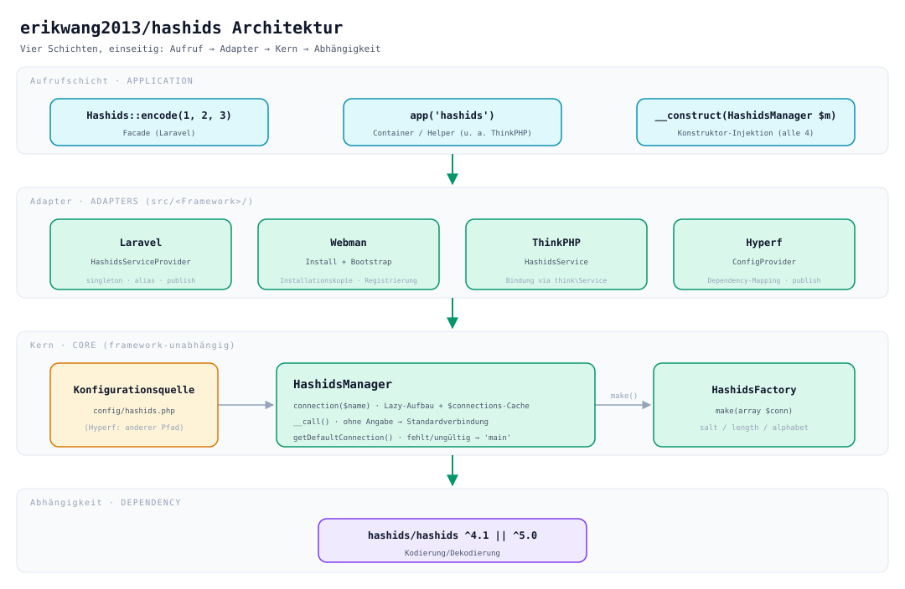
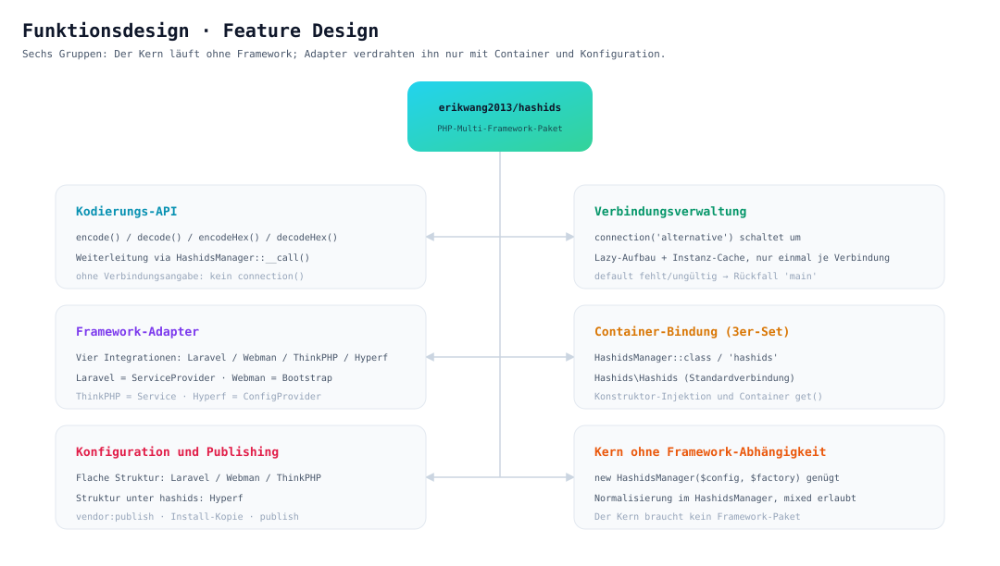
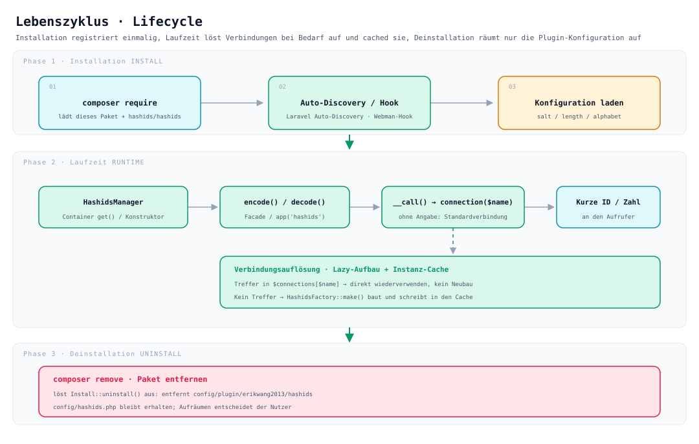

# erikwang2013/hashids

**Languages:** [中文](../../../README.md) · [English](../en/README.md) · [한국어](../ko/README.md) · [Русский](../ru/README.md) · **Deutsch** · [Français](../fr/README.md) · [Español](../es/README.md) · [Português](../pt/README.md) · [हिन्दी](../hi/README.md) · [العربية](../ar/README.md) · [বাংলা](../bn/README.md) · [Bahasa Indonesia](../id/README.md) · [日本語](../ja/README.md)

<p align="center">
  
</p>

<p align="center"><strong>Hashy</strong> — das Projektmaskottchen; das <code>#</code> auf seiner Brust ist sein Markenzeichen</p>

Verwandelt Auto-Increment-IDs aus der Datenbank in kurze, nicht erratbare Strings — **eine API, die zugleich auf Laravel, Webman, ThinkPHP und Hyperf läuft**.

Basiert auf [`hashids/hashids`](https://github.com/vinkla/hashids) v5; Konfiguration und Nutzung folgen [**vinkla/hashids**](https://github.com/vinkla/laravel-hashids) (mehrere Verbindungen, Standardverbindung, `HashidsManager` + Factory) und lassen sich reibungslos austauschen.

## Projektbeschreibung

**Hashids** ist ein Generator für kurze IDs: Er kodiert numerische IDs (etwa Datenbank-Primärschlüssel) in kurze, eindeutige und nicht erratbare Strings. Anders als UUIDs oder Snowflake-IDs eignet sich Hashids besser für nutzernahe Szenarien (URLs, Share-Codes, Bestellnummern usw.), weil es die ursprünglichen Zahlen verbirgt und dabei kurz und lesbar bleibt.

Dieses Paket `erikwang2013/hashids` ist die **PHP-Integrationsschicht für mehrere Frameworks** für Hashids. Im Design orientiert es sich am API-Stil von [vinkla/hashids](https://github.com/vinkla/laravel-hashids) (mehrere Verbindungen, Standardverbindung, Manager-+-Factory-Muster) und unterstützt zusätzlich weitere, in China verbreitete PHP-Frameworks.

**Kernmerkmale:**

- **Multi-Framework-kompatibel**: Dieselbe API unterstützt Laravel, Webman, ThinkPHP und Hyperf zugleich — der Migrationsaufwand ist minimal.
- **Mehrere Verbindungen**: Eine Anwendung kann mehrere Salt/Length-Kombinationen zugleich konfigurieren (z. B. unterschiedliche Salts für Benutzer- und Bestell-IDs) und über `connection('xxx')` umschalten.
- **Ohne Framework-Abhängigkeit**: Lässt sich ohne jedes spezielle Framework eigenständig nutzen — `new HashidsManager($config, $factory)` genügt.
- **Kompatibel zu vinkla/hashids**: Unter Laravel sind Facade, Container-Bindung und das Format von `config/hashids.php` identisch mit vinkla/hashids — ein reibungsloser Austausch ist möglich.
- **Framework-idiomatisch**: Jede Integration folgt den Gepflogenheiten ihres Frameworks — Laravel nutzt ServiceProvider + Facade, Webman Plugin + Bootstrap, ThinkPHP Service, Hyperf ConfigProvider.

**Einsatzszenarien:**

| Szenario | Beschreibung |
|------|------|
| Auto-Increment-IDs verbergen | Bildet `user_id=100` auf `/user/3kTMd` ab und verrät so nicht die Geschäftsgröße |
| Kurzlinks/Share-Codes erzeugen | Kürzer als UUIDs, kontrollierter als Zufallsstrings |
| Bestell-/Vorgangsnummern | Gut lesbar, hilfreich für Support und Log-Analyse |
| Mandanten-/Modul-Isolation | Verschiedene Verbindungen nutzen verschiedene Salts, damit die Kodierungsräume getrennt bleiben |

**Hinweise:**

- Hashids ist **Kodierung (encode/decode), keine Verschlüsselung**. Das Salt erschwert nur das Erraten und taugt nicht für sicherheitskritische Zwecke (z. B. Token, Passwörter).
- Werden Salt oder Length nach dem Livegang geändert, werden alle bereits kodierten IDs ungültig — planen Sie die Konfiguration vorab und halten Sie sie fest.
- **Ein leeres Salt bedeutet keinen Schutz**: Bei leerem Salt ist das Kodierungsergebnis aufzählbar (`encode(1)`, `encode(2)`… die Reihenfolge ist vorhersagbar). Bei
  `env('HASHIDS_SALT', '')` führt eine vergessene Umgebungsvariable weder zu einem Fehler noch zu einer Warnung, sondern still zu einem leeren Salt — prüfen Sie vor dem Livegang, dass das Salt gesetzt ist.
- **Unter dauerhaft laufenden Frameworks (Webman / Hyperf) erfordert eine Konfigurationsänderung einen Prozessneustart**: `HashidsManager` macht beim Konstruieren einen Schnappschuss der Konfiguration und cached Verbindungen dauerhaft;
   eine Änderung an `config/hashids.php` (oder ein Salt-Wechsel über ein Config-Center) wird nicht heiß wirksam, sondern erst nach `reload` oder Neustart.

## Projektstruktur

```
hashids/
├── src/
│   ├── HashidsManager.php                     # Kern: Auflösung mehrerer Verbindungen, Instanz-Cache, Proxy zur Standardverbindung
│   ├── HashidsFactory.php                     # Kern: erzeugt eine Hashids-Instanz aus der Verbindungskonfiguration
│   ├── Mascot.php                             # ASCII-Version des Maskottchens «Hashy»
│   ├── Install.php                            # Webman-Hook für Installation / Deinstallation
│   ├── Laravel/
│   │   ├── HashidsServiceProvider.php         # Container-Singleton + Alias + Konfiguration veröffentlichen
│   │   └── Facades/Hashids.php                # Facade (Standardverbindung)
│   ├── Webman/
│   │   └── Bootstrap.php                      # Registriert die Container-Definition beim Prozessstart
│   ├── ThinkPHP/
│   │   └── HashidsService.php                 # Registrierung und Bindung über think\Service
│   ├── Hyperf/
│   │   ├── ConfigProvider.php                 # Dependency-Mapping + Konfiguration veröffentlichen
│   │   ├── HashidsManagerFactory.php
│   │   └── HashidsClientFactory.php
│   └── config/plugin/erikwang2013/hashids/    # Webman-Plugin-Gerüst (wird bei der Installation ins Projekt kopiert)
│       ├── app.php                            # Der enable-Schalter
│       └── bootstrap.php                      # Registriert Webman\Bootstrap
├── config/
│   ├── hashids.php                            # Flache Konfiguration: Laravel / Webman / ThinkPHP
│   └── autoload/hashids.php                   # Hyperf-Konfiguration (Struktur gleich, Pfad anders)
├── tests/
│   ├── HashidsManagerTest.php                 # Kernverhalten
│   ├── HashidsFactoryTest.php
│   ├── InstallTest.php
│   ├── MascotTest.php                         # Maskottchen: Glyphenausrichtung und Gruß
│   ├── Laravel/ · Webman/ · ThinkPHP/ · Hyperf/   # Adapter-Tests der einzelnen Frameworks
│   ├── Config/PluginConfigTest.php
│   └── Support/FrameworkStubs.php             # Framework-Stubs für die Tests
├── docs/
│   ├── mascot.svg                             # Maskottchen «Hashy»
│   ├── architecture.svg                       # Architekturgrafik
│   ├── features.svg                           # Funktionsgrafik
│   └── lifecycle.svg                          # Lebenszyklusgrafik
├── .github/workflows/release.yml              # Tag und Release automatisch nach Push auf main
├── composer.json
└── phpunit.xml.dist
```

> `vendor/`, `composer.lock` und weitere Abhängigkeitsartefakte sind nicht aufgeführt; `src/config/` ist das **Plugin-Gerüst**, `config/` die **veröffentlichbare Beispielkonfiguration** — beide haben unterschiedliche Zwecke.

## Architektur



**Vier Schichten mit einseitiger Abhängigkeit**: Die obere Schicht hängt von der unteren ab, umgekehrt gilt das nicht:

| Schicht | Aufgabe | Ort |
|----|------|------|
| Aufrufschicht | Drei Einstiege: Facade, Container / Helper-Funktion, Konstruktor-Injektion | Anwendungscode |
| Framework-Adapter | Nur Verdrahtung: Container-Bindung, Konfiguration lesen, Konfiguration veröffentlichen | `src/<Framework>/` |
| Kern | Verwaltung mehrerer Verbindungen und Instanzerzeugung, **ohne jede Framework-Abhängigkeit** | `src/HashidsManager.php`, `src/HashidsFactory.php` |
| Abhängigkeit | Die eigentliche Kodierungs-/Dekodierungsimplementierung | `hashids/hashids` |

Der Kern ist das Herzstück des Pakets: `HashidsManager` hält die Konfiguration, `connection($name)` baut Verbindungen bei Bedarf auf und cached sie, `__call()` leitet Methodenaufrufe ohne Verbindungsangabe an die Standardverbindung weiter; `HashidsFactory::make()` ist die einzige Stelle, die `Hashids\Hashids` erzeugt. Die Adapterklassen der vier Frameworks umfassen zusammen rund 250 Zeilen (inklusive Facade und beider Hyperf-Factories) — sie verdrahten den Kern nur mit dem jeweiligen Container.

## Funktionsdesign



Sechs Fähigkeitsgruppen, alle um denselben Kern herum:

- **Kodierungs-API**: `encode()` / `decode()` / `encodeHex()` / `decodeHex()` landen über `__call()` bei der Standardverbindung — ohne explizites `connection()`.
- **Verwaltung mehrerer Verbindungen**: Umschalten mit `connection('alternative')`; Lazy-Aufbau, eine Verbindung wird nur einmal erzeugt.
- **Multi-Framework-Adapter**: Laravel mit `ServiceProvider`, Webman mit `Install` + `Bootstrap`, ThinkPHP mit `Service`, Hyperf mit `ConfigProvider` — jeweils idiomatisch.
- **Container-Bindung**: Klassennamen (`HashidsManager`, `HashidsFactory`, `Hashids\Hashids`) und String-Schlüssel (`'hashids'`, `'hashids.factory'`, `'hashids.connection'`) sind doppelt gebunden — in allen vier Frameworks gleich; die letzten beiden String-Schlüssel heißen wie bei vinkla/hashids und erleichtern die Migration.
- **Konfiguration und Veröffentlichung**: Alle vier Frameworks haben dieselbe Struktur — ein **flaches Array** (auf oberster Ebene `default` + `connections`); nur der Dateipfad unterscheidet sich.
- **Kern ohne Framework-Abhängigkeit**: `new HashidsManager($config, $factory)` genügt; der `$config`-Parameter verträgt Nicht-Arrays (wird auf ein leeres Array normalisiert).

## Lebenszyklus



| Phase | Was passiert |
|------|-----------|
| **Installationsphase** | `composer require` lädt das Paket → Laravel-Auto-Discovery / Webman-Installationshook kopiert das Plugin-Gerüst → `salt` / `length` / `alphabet` werden geladen |
| **Laufzeit** | Der Container löst `HashidsManager` auf → `encode()` / `decode()` → `__call()` leitet an `connection($name)` weiter → **Cache-Treffer werden direkt wiederverwendet, erst bei einem Miss erzeugt `HashidsFactory::make()` die Instanz und schreibt sie nach `$connections`** → kurze ID oder Originalzahl wird zurückgegeben |
| **Deinstallationsphase** | `composer remove` löst `Install::uninstall()` aus und entfernt `config/plugin/erikwang2013/hashids`; **`config/hashids.php` bleibt erhalten** — über das Aufräumen entscheidet der Nutzer |

Verbindungen werden **bei Bedarf aufgebaut**: Ein Prozess, der nur die Standardverbindung nutzt, zahlt nichts für ungenutzte Verbindungen wie `alternative`.

## Installation

```bash
composer require erikwang2013/hashids
```

> **Laufzeitumgebung**: Das zugrunde liegende `hashids/hashids` **benötigt** `ext-bcmath` oder `ext-gmp` (eines von beiden), sonst wirft bereits die erste Kodierung
> `RuntimeException: Missing math extension for Hashids`. Beide Erweiterungen sind in `hashids/hashids` nur unter `suggest` aufgeführt,
> und Composer 2 gibt suggest nicht mehr aus — auf schlanken Images (etwa `php:8.3-fpm-alpine`) gibt es daher bei der Installation keinen Hinweis und erst zur Laufzeit knallt es,
> und jede Anfrage, die Hashids nutzt, endet mit 500. Das `suggest` in der `composer.json` dieses Pakets wurde um beide Schlüssel ergänzt, dennoch müssen Sie bestätigen, dass die Erweiterungen aktiviert sind.

## Konfigurationsstruktur (Laravel / Webman / ThinkPHP)

Entspricht `config/hashids.php` im Repository:

- `default`: Name der Standardverbindung (z. B. `main`).
- `connections`: Verbindungsname => `salt`, `length`, optional `alphabet`.

> **Hyperf** nutzt einen anderen Dateipfad (`config/autoload/hashids.php`), die Struktur ist aber dieselbe — siehe Abschnitt Hyperf unten.

## Nutzung ohne Framework

Der Manager lässt sich direkt instanziieren:

```php
use Erikwang2013\Hashids\HashidsFactory;
use Erikwang2013\Hashids\HashidsManager;

$manager = new HashidsManager(
    require __DIR__ . '/config/hashids.php',
    new HashidsFactory()
);

$hash = $manager->encode(1, 2, 3);
$ids = $manager->decode($hash);
```

---

## Laravel

Ähnlich wie [vinkla/hashids](https://github.com/vinkla/laravel-hashids): Der Container registriert `HashidsManager` mit mehreren Verbindungen; die Standardverbindung unterstützt Facade und Methodenweiterleitung.

Laravel 5.5+ liest `extra.laravel` aus dem `composer.json` dieses Pakets und registriert `HashidsServiceProvider` sowie den Facade-Alias `Hashids` automatisch.

**Konfiguration veröffentlichen (optional)**

```bash
php artisan vendor:publish --tag=hashids-config
```

Erzeugt `config/hashids.php`. Wird nichts veröffentlicht, mischt das Paket beim Registrieren seine eingebaute Standardkonfiguration ein.

**Facade (Standardverbindung)**

```php
use Erikwang2013\Hashids\Laravel\Facades\Hashids;

$hash = Hashids::encode(1, 2, 3);
$numbers = Hashids::decode($hash);
```

**Verbindung angeben**

```php
use Erikwang2013\Hashids\Laravel\Facades\Hashids;

$hash = Hashids::connection('alternative')->encode(100);
```

**Dependency Injection von `HashidsManager`**

```php
use Erikwang2013\Hashids\HashidsManager;

public function __construct(private HashidsManager $hashids) {}

$this->hashids->encode(1);
$this->hashids->connection('alternative')->encode(2);
```

**Die zugrunde liegende `Hashids\Hashids` injizieren (Standardverbindung)**

```php
use Hashids\Hashids;

public function __construct(private Hashids $hashids) {}
```

Für die Laravel-Integration muss `laravel/framework` (inkl. `illuminate/support` usw.) im Projekt installiert sein. Dieses Paket führt `illuminate/*` als **require-dev** — nur für seine eigenen Tests.

---

## Webman

Beim Installieren kopiert **`Install`** `config/plugin/erikwang2013/hashids` und die **`config/hashids.php`** im Projektstamm; das Plugin-**bootstrap** registriert `HashidsManager` im Webman-Container.

Sind im `composer.json` des Projekts bereits `support\Plugin::install` / `update` / `uninstall`-Hooks vorhanden, wird beim Installieren dieses Pakets das Installationsskript automatisch ausgeführt (`WEBMAN_PLUGIN = true`).

**Dateien nach der Installation**

- `config/plugin/erikwang2013/hashids/app.php`: Der `enable`-Schalter.
- `config/plugin/erikwang2013/hashids/bootstrap.php`: Registriert `Erikwang2013\Hashids\Webman\Bootstrap`.
- `config/hashids.php`: Konfiguration mehrerer Verbindungen (wird bei der ersten Installation oder nach bestätigtem Überschreiben geschrieben).

Falls das automatische Kopieren nicht ausgeführt wurde, lassen sich die Beispielkonfigurationen unter den genannten Pfaden manuell aus dem Paket kopieren.

**Plugin deaktivieren** (`config/plugin/erikwang2013/hashids/app.php`)

```php
<?php
return [
    'enable' => false,
];
```

**Container-Bindungen**

- `Erikwang2013\Hashids\HashidsManager` / `'hashids'`
- `Erikwang2013\Hashids\HashidsFactory` / `'hashids.factory'`
- `Hashids\Hashids` / `'hashids.connection'` (Instanz der Standardverbindung)

**Controller-Beispiel**

```php
use support\Request;
use Erikwang2013\Hashids\HashidsManager;
use Hashids\Hashids;

class DemoController
{
    public function index(Request $request, HashidsManager $manager)
    {
        $hash = $manager->encode(1, 2, 3);

        $client = \support\Container::instance()->get(Hashids::class);
        $hash2 = $client->encode(4);

        return json(['hash' => $hash, 'hash2' => $hash2]);
    }
}
```

**Verbindung angeben**

```php
$manager->connection('alternative')->encode(99);
```

Beim Deinstallieren des Pakets löst Composer `Plugin::uninstall` aus und entfernt `config/plugin/erikwang2013/hashids`; `config/hashids.php` wird **nicht** gelöscht — ob Sie sie behalten, entscheiden Sie.

---

## ThinkPHP

Eine **eigene Service-Klasse** registriert `HashidsManager`; die Konfiguration bleibt die **`config/hashids.php`** mit `default` und `connections` auf oberster Ebene.

**Service registrieren**

In der Anwendung in `services` der **`config/service.php`** (der genaue Pfad kann je nach TP-Version abweichen) ergänzen:

```php
<?php

return [
    // ...
    \Erikwang2013\Hashids\ThinkPHP\HashidsService::class,
];
```

Bei einem anwendungseigenen `app/AppService.php` lässt sich die gleiche Bindung auch in `register()` eintragen.

**Konfigurationsdatei**

Kopieren Sie `config/hashids.php` aus dem Paket in die `config/hashids.php` der Anwendung (oder führen Sie gleichnamige Konfigurationen selbst zusammen).

```php
<?php
return [
    'default' => 'main',
    'connections' => [
        'main' => [
            'salt' => env('HASHIDS_SALT', ''),
            'length' => (int) env('HASHIDS_LENGTH', 0),
        ],
    ],
];
```

**Verwendungsbeispiel**

```php
use Erikwang2013\Hashids\HashidsManager;
use think\facade\App;

$manager = App::make(HashidsManager::class);
$hash = $manager->encode(10, 20);
```

```php
$manager = app('hashids');
```

```php
use Hashids\Hashids;

$client = app(Hashids::class);
$hash = $client->encode(1);
```

```php
app(HashidsManager::class)->connection('alternative')->encode(100);
```

Die ThinkPHP-Integration erbt von `think\Service` und erfordert **`topthink/framework`** (in diesem Paket als suggest geführt).

---

## Hyperf

Composer **`extra.hyperf.config`** lädt den `ConfigProvider` und registriert `HashidsFactory`, `HashidsManager` und das `Hashids\Hashids` der Standardverbindung im Container.

Kopieren Sie **`config/autoload/hashids.php`** aus dem Paket nach **`config/autoload/hashids.php`** im Projekt (oder nutzen Sie den Publish-Befehl des Projekts).

Die Datei muss ein **flaches Array** zurückgeben (auf oberster Ebene `default` + `connections`).

Die `ConfigFactory` von Hyperf führt die Konfiguration über den **Dateinamen** zusammen (`Arr::set($config, 'hashids', require $file)`); `config('hashids')` liefert daher genau den Dateiinhalt selbst — **nicht noch eine Ebene `'hashids' =>` ergänzen**. Sonst ist `connections` nicht erreichbar und beim Holen einer Verbindung fliegt `Hashids connection [main] is not configured`.

```php
<?php

declare(strict_types=1);

return [
    'default' => 'main',
    'connections' => [
        'main' => [
            'salt' => env('HASHIDS_SALT', ''),
            'length' => (int) env('HASHIDS_LENGTH', 0),
        ],
    ],
];
```

**Container-Bindungen**

| Abstraktion | Implementierung |
|------|------|
| `Erikwang2013\Hashids\HashidsFactory` / `'hashids.factory'` | Standardkonstruktor |
| `Erikwang2013\Hashids\HashidsManager` / `'hashids'` | `HashidsManagerFactory` |
| `Hashids\Hashids` / `'hashids.connection'` | `HashidsClientFactory` (Standardverbindung) |

**Controller / Konstruktor-Injektion**

```php
<?php

declare(strict_types=1);

namespace App\Controller;

use Erikwang2013\Hashids\HashidsManager;
use Hashids\Hashids;

class DemoController
{
    public function index(HashidsManager $manager, Hashids $hashids)
    {
        $h1 = $manager->encode(1, 2, 3);
        $h2 = $hashids->encode(4);
        $alt = $manager->connection('alternative')->encode(99);

        return compact('h1', 'h2', 'alt');
    }
}
```

```php
$manager = \Hyperf\Context\ApplicationContext::getContainer()->get(
    \Erikwang2013\Hashids\HashidsManager::class
);
```

Alle vier Frameworks haben dieselbe Konfigurationsstruktur (auf oberster Ebene `default` + `connections`), nur der Dateipfad ist anders: Hyperf nutzt **`config/autoload/hashids.php`**, Laravel / Webman / ThinkPHP nutzen **`config/hashids.php`**.

---

## Projektmaskottchen

Das Maskottchen ist **Hashy** — ein kleines, abgerundetes Quadrat mit Antenne auf dem Kopf und einem `#` auf der Brust; die Vektorgrafik gibt es unter [`docs/mascot.svg`](../../mascot.svg).

Im Terminal gibt es kein SVG, deshalb liegt im Code eine äquivalente ASCII-Version (`Erikwang2013\Hashids\Mascot`):

```php
use Erikwang2013\Hashids\Mascot;

echo Mascot::greet();
```

```
           ●
           │
      ╭─────────╮
      │ ◉     ◉ │
      │    ‿    │
      │    #    │
      ╰──┬───┬──╯
         ╵   ╵
哈希迪 Hashy · 把数据库自增 ID 换成短小、不可猜测的字符串
```

Wenn das Webman-Plugin `config/hashids.php` zum ersten Mal veröffentlicht, gibt es einmalig diesen Gruß aus; existiert die Konfiguration bereits (etwa bei einem erneuten `composer update`), wird nicht erneut gestört.

---

## Open Source ist nicht leicht — Unterstützung ist willkommen

<p align="center">
  
  &nbsp;&nbsp;&nbsp;&nbsp;
  
</p>

<p align="center"><strong>WeChat Pay</strong>&nbsp;&nbsp;&nbsp;&nbsp;&nbsp;&nbsp;&nbsp;&nbsp;&nbsp;&nbsp;&nbsp;&nbsp;&nbsp;&nbsp;&nbsp;&nbsp;<strong>Alipay</strong></p>

---


## Lizenz

MIT. Siehe [LICENSE](../../../LICENSE).
