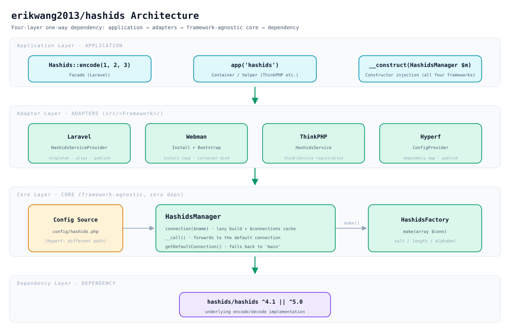
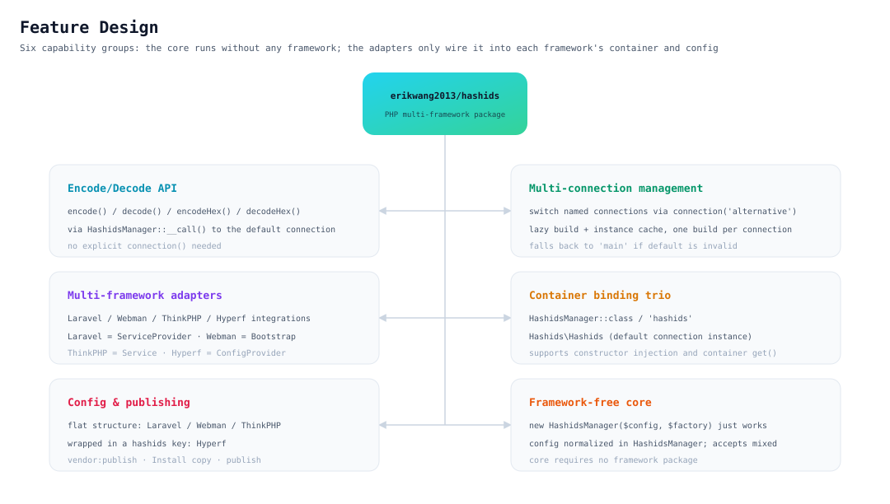
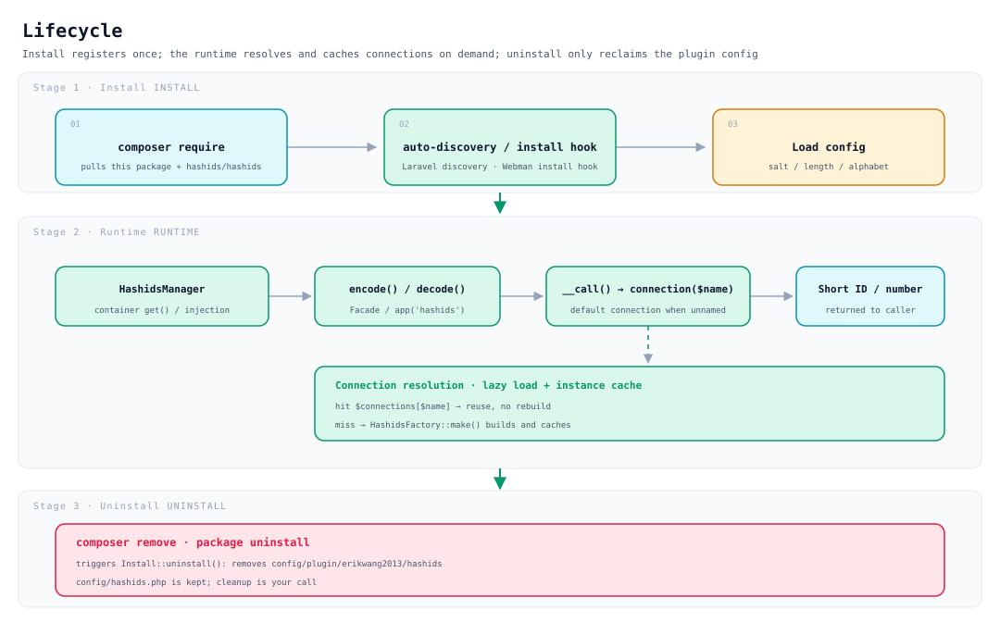

# erikwang2013/hashids

**Languages:** [中文](../../../README.md) · **English** · [한국어](../ko/README.md) · [Русский](../ru/README.md) · [Deutsch](../de/README.md) · [Français](../fr/README.md) · [Español](../es/README.md) · [Português](../pt/README.md) · [हिन्दी](../hi/README.md) · [العربية](../ar/README.md) · [বাংলা](../bn/README.md) · [Bahasa Indonesia](../id/README.md) · [日本語](../ja/README.md)

<p align="center">
  
</p>

<p align="center"><strong>Hashy</strong> — the project mascot, with its signature <code>#</code> on its chest</p>

Turn database auto-increment IDs into short, unguessable strings — **one API that runs on Laravel, Webman, ThinkPHP and Hyperf alike**.

Built on [`hashids/hashids`](https://github.com/vinkla/hashids) v5; the configuration and usage follow [**vinkla/hashids**](https://github.com/vinkla/laravel-hashids) (multiple connections, default connection, `HashidsManager` + factory), so it is a drop-in replacement.

## About

**Hashids** is a short ID generator that encodes numeric IDs (such as database primary keys) into short, unique and unguessable strings. Unlike UUIDs or snowflake IDs, Hashids is better suited to user-facing scenarios (URLs, share codes, order numbers), hiding the raw number while staying short and readable.

This package, `erikwang2013/hashids`, is a **multi-framework integration layer for PHP** built on Hashids. Its design follows and aligns with the API style of [vinkla/hashids](https://github.com/vinkla/laravel-hashids) (multiple connections, default connection, Manager + Factory pattern), and extends that support to other widely used PHP frameworks.

**Core features:**

- **Multi-framework**: one API serves Laravel, Webman, ThinkPHP and Hyperf at once, so migration costs next to nothing.
- **Multiple connections**: a single application can configure several Salt/Length combinations side by side (say, different salts for user IDs and order IDs), switched with `connection('xxx')`.
- **No framework dependency**: usable standalone without any particular framework — `new HashidsManager($config, $factory)` is all it takes.
- **Aligned with vinkla/hashids**: under Laravel the Facade, the container bindings and the `config/hashids.php` format all match vinkla/hashids, so it is a drop-in replacement.
- **Framework-native style**: each framework integration follows that framework's own idioms — Laravel uses a ServiceProvider + Facade, Webman a Plugin + Bootstrap, ThinkPHP a Service, Hyperf a ConfigProvider.

**Use cases:**

| Scenario | Description |
|------|------|
| Hiding database auto-increment IDs | Map `user_id=100` to `/user/3kTMd`, so business scale is not exposed |
| Short links / share codes | Shorter than a UUID, more controllable than a random string |
| Order numbers / serial numbers | Readable, which helps support conversations and log triage |
| Multi-tenant / multi-module isolation | Different connections use different Salts, keeping the encoded spaces independent of one another |

**Caveats:**

- Hashids is **encoding (encode/decode), not encryption**. Salt only makes guessing harder; do not use it for security-sensitive cases (such as tokens or passwords).
- Once in production, changing the Salt or the Length invalidates every ID already encoded, so plan ahead and fix the configuration.

## Project structure

```
hashids/
├── src/
│   ├── HashidsManager.php                     # Core: multi-connection resolution, instance cache, default connection proxy
│   ├── HashidsFactory.php                     # Core: builds a Hashids instance from connection config
│   ├── Mascot.php                             # ASCII version of the mascot, Hashy
│   ├── Install.php                            # Webman install / uninstall hook
│   ├── Laravel/
│   │   ├── HashidsServiceProvider.php         # container singleton + alias + config publishing
│   │   └── Facades/Hashids.php                # Facade (default connection)
│   ├── Webman/
│   │   └── Bootstrap.php                      # registers container definitions at process start
│   ├── ThinkPHP/
│   │   └── HashidsService.php                 # think\Service registration and bindings
│   ├── Hyperf/
│   │   ├── ConfigProvider.php                 # dependency mapping + config publishing
│   │   ├── HashidsManagerFactory.php
│   │   └── HashidsClientFactory.php
│   └── config/plugin/erikwang2013/hashids/    # Webman plugin skeleton (copied into the project on install)
│       ├── app.php                            # the enable switch
│       └── bootstrap.php                      # registers Webman\Bootstrap
├── config/
│   ├── hashids.php                            # flat config: Laravel / Webman / ThinkPHP
│   └── autoload/hashids.php                   # Hyperf config (same flat structure, different path)
├── tests/
│   ├── HashidsManagerTest.php                 # core behaviour
│   ├── HashidsFactoryTest.php
│   ├── InstallTest.php
│   ├── MascotTest.php                         # the mascot: glyph alignment and greeting
│   ├── Laravel/ · Webman/ · ThinkPHP/ · Hyperf/   # per-framework adapter tests
│   ├── Config/PluginConfigTest.php
│   └── Support/FrameworkStubs.php             # framework class stubs for tests
├── docs/
│   ├── mascot.svg                             # the mascot, Hashy
│   ├── architecture.svg                       # architecture diagram
│   ├── features.svg                           # feature design diagram
│   └── lifecycle.svg                          # lifecycle diagram
├── .github/workflows/release.yml              # auto tag + release on push to main
├── composer.json
└── phpunit.xml.dist
```

> Dependency artifacts such as `vendor/` and `composer.lock` are not listed; `src/config/` is the **plugin skeleton** while `config/` holds the **publishable config samples** — the two serve different purposes.

## Architecture



**Four layers, one-way dependency**: each layer depends on the one below it, never the other way round:

| Layer | Responsibility | Location |
|----|------|------|
| Application call layer | Three entry points: Facade, container / helper function, constructor injection | Business code |
| Framework adapter layer | Wiring only: container binding, config reading, config publishing | `src/<Framework>/` |
| Core layer | Multi-connection management and instance construction, **with no framework dependency** | `src/HashidsManager.php`, `src/HashidsFactory.php` |
| Underlying dependency | The actual encode/decode implementation | `hashids/hashids` |

The core layer is the heart of the package: `HashidsManager` holds the configuration, `connection($name)` builds and caches a connection on demand, and `__call()` forwards connection-less method calls to the default connection; `HashidsFactory::make()` is the only place that constructs a `Hashids\Hashids`. The adapter classes for all four frameworks total roughly 250 lines (including the Facade and the two Hyperf factories) — all they do is wire the core into their respective containers.

## Feature design



Six capability groups, all built around the same core:

- **Encode/decode API**: `encode()` / `decode()` / `encodeHex()` / `decodeHex()`, reaching the default connection through `__call()`, with no explicit `connection()` needed.
- **Multi-connection management**: switch with `connection('alternative')`; built lazily, so each connection is constructed only once.
- **Multi-framework adapters**: Laravel uses a `ServiceProvider`, Webman an `Install` + `Bootstrap`, ThinkPHP a `Service`, Hyperf a `ConfigProvider`, each following its framework's idioms.
- **Container bindings**: class names (`HashidsManager`, `HashidsFactory`, `Hashids\Hashids`) and string keys (`'hashids'`, `'hashids.factory'`, `'hashids.connection'`) are bound in tandem, identically across all four frameworks; the latter two string keys share their names with vinkla/hashids, which eases migration.
- **Configuration and publishing**: all four frameworks share the same structure — a **flat array** (root-level `default` + `connections`) — and only the file path differs.
- **Framework-free core**: `new HashidsManager($config, $factory)` just works, and `$config` tolerates non-array input (normalized to an empty array).

## Lifecycle



| Stage | What happens |
|------|-----------|
| **Install** | `composer require` pulls the package → Laravel auto-discovery / the Webman install hook copies the plugin skeleton → `salt` / `length` / `alphabet` are loaded |
| **Runtime** | The container resolves `HashidsManager` → `encode()` / `decode()` → `__call()` forwards to `connection($name)` → **a cache hit is reused as is, and only a miss calls `HashidsFactory::make()` to build and store it in `$connections`** → a short ID or the original number comes back |
| **Uninstall** | `composer remove` triggers `Install::uninstall()`, removing `config/plugin/erikwang2013/hashids`; **`config/hashids.php` is kept**, and whether to clean it up is up to you |

Connections are built **on demand**: a process that only ever uses the default connection pays no construction cost for unused connections such as `alternative`.

## Installation

```bash
composer require erikwang2013/hashids
```

## Configuration structure (Laravel / Webman / ThinkPHP)

Identical to the repository's `config/hashids.php`:

- `default`: the default connection name (e.g. `main`).
- `connections`: connection name => `salt`, `length`, optional `alphabet`.

> **Hyperf**'s config file lives at a different path (`config/autoload/hashids.php`), but the structure is the same; see the Hyperf section below.

## Framework-free usage

You can instantiate the manager directly:

```php
use Erikwang2013\Hashids\HashidsFactory;
use Erikwang2013\Hashids\HashidsManager;

$manager = new HashidsManager(
    require __DIR__ . '/config/hashids.php',
    new HashidsFactory()
);

$hash = $manager->encode(1, 2, 3);
$ids = $manager->decode($hash);
```

---

## Laravel

Similar to [vinkla/hashids](https://github.com/vinkla/laravel-hashids): the container registers `HashidsManager` with multiple connections; the default connection supports the Facade and method forwarding.

Laravel 5.5+ reads the `extra.laravel` key of this package's `composer.json` and automatically registers `HashidsServiceProvider` along with the Facade alias `Hashids`.

**Publishing the config (optional)**

```bash
php artisan vendor:publish --tag=hashids-config
```

This generates `config/hashids.php`. If you do not publish it, the package merges its built-in default configuration during registration.

**Facade (default connection)**

```php
use Erikwang2013\Hashids\Laravel\Facades\Hashids;

$hash = Hashids::encode(1, 2, 3);
$numbers = Hashids::decode($hash);
```

**Specifying a connection**

```php
use Erikwang2013\Hashids\Laravel\Facades\Hashids;

$hash = Hashids::connection('alternative')->encode(100);
```

**Injecting `HashidsManager`**

```php
use Erikwang2013\Hashids\HashidsManager;

public function __construct(private HashidsManager $hashids) {}

$this->hashids->encode(1);
$this->hashids->connection('alternative')->encode(2);
```

**Injecting the underlying `Hashids\Hashids` (default connection)**

```php
use Hashids\Hashids;

public function __construct(private Hashids $hashids) {}
```

Running the Laravel integration requires `laravel/framework` to be installed in the project (including `illuminate/support` and friends). This package lists `illuminate/*` as **require-dev**, purely for its own tests.

---

## Webman

At install time **`Install`** copies `config/plugin/erikwang2013/hashids` and the root **`config/hashids.php`**, and the plugin's **bootstrap** registers `HashidsManager` with the Webman container.

If the project's `composer.json` already has the `support\Plugin::install` / `update` / `uninstall` hooks, the install script runs automatically when this package is installed (`WEBMAN_PLUGIN = true`).

**Files after installation**

- `config/plugin/erikwang2013/hashids/app.php`: the `enable` switch.
- `config/plugin/erikwang2013/hashids/bootstrap.php`: registers `Erikwang2013\Hashids\Webman\Bootstrap`.
- `config/hashids.php`: the multi-connection configuration (written on first install or when an overwrite is confirmed).

If the automatic copy did not run, you can copy the sample config from those paths inside the package by hand.

**Disabling the plugin** (`config/plugin/erikwang2013/hashids/app.php`)

```php
<?php
return [
    'enable' => false,
];
```

**Container bindings**

- `Erikwang2013\Hashids\HashidsManager` / `'hashids'`
- `Erikwang2013\Hashids\HashidsFactory` / `'hashids.factory'`
- `Hashids\Hashids` / `'hashids.connection'` (the default connection instance)

**Controller example**

```php
use support\Request;
use Erikwang2013\Hashids\HashidsManager;
use Hashids\Hashids;

class DemoController
{
    public function index(Request $request, HashidsManager $manager)
    {
        $hash = $manager->encode(1, 2, 3);

        $client = \support\Container::instance()->get(Hashids::class);
        $hash2 = $client->encode(4);

        return json(['hash' => $hash, 'hash2' => $hash2]);
    }
}
```

**Specifying a connection**

```php
$manager->connection('alternative')->encode(99);
```

Composer triggers `Plugin::uninstall` when the package is removed, which deletes `config/plugin/erikwang2013/hashids`; it will **not** delete `config/hashids.php`, and whether to keep it is up to you.

---

## ThinkPHP

A **custom service class** registers `HashidsManager`; the config is still the **`config/hashids.php`** carrying top-level `default` and `connections`.

**Registering the service**

Add the following to `services` in the application's **`config/service.php`** (the exact path may differ between TP versions):

```php
<?php

return [
    // ...
    \Erikwang2013\Hashids\ThinkPHP\HashidsService::class,
];
```

If you use an application-level `app/AppService.php`, you can also write an equivalent binding inside `register()`.

**Config file**

Copy `config/hashids.php` from inside the package to the application's `config/hashids.php` (or merge the same-named config yourself).

```php
<?php
return [
    'default' => 'main',
    'connections' => [
        'main' => [
            'salt' => env('HASHIDS_SALT', ''),
            'length' => (int) env('HASHIDS_LENGTH', 0),
        ],
    ],
];
```

**Usage examples**

```php
use Erikwang2013\Hashids\HashidsManager;
use think\facade\App;

$manager = App::make(HashidsManager::class);
$hash = $manager->encode(10, 20);
```

```php
$manager = app('hashids');
```

```php
use Hashids\Hashids;

$client = app(Hashids::class);
$hash = $client->encode(1);
```

```php
app(HashidsManager::class)->connection('alternative')->encode(100);
```

The ThinkPHP integration extends `think\Service` and must be used in a **`topthink/framework`** environment (listed as suggest by this package).

---

## Hyperf

Composer's **`extra.hyperf.config`** loads `ConfigProvider`, which registers `HashidsFactory`, `HashidsManager` and the default connection's `Hashids\Hashids` with the container.

Copy **`config/autoload/hashids.php`** from inside the package to the project's **`config/autoload/hashids.php`** (or use the project's config publish command).

The file must return a **flat array** (root-level `default` + `connections`).

Hyperf's `ConfigFactory` merges by **file name** (`Arr::set($config, 'hashids', require $file)`), so `config('hashids')` returns the file contents themselves — **do not add another `'hashids' =>` layer**. If you do, `connections` becomes unreachable and resolving a connection throws `Hashids connection [main] is not configured`.

```php
<?php

declare(strict_types=1);

return [
    'default' => 'main',
    'connections' => [
        'main' => [
            'salt' => env('HASHIDS_SALT', ''),
            'length' => (int) env('HASHIDS_LENGTH', 0),
        ],
    ],
];
```

**Container bindings**

| Abstract | Implementation |
|------|------|
| `Erikwang2013\Hashids\HashidsFactory` / `'hashids.factory'` | default construction |
| `Erikwang2013\Hashids\HashidsManager` / `'hashids'` | `HashidsManagerFactory` |
| `Hashids\Hashids` / `'hashids.connection'` | `HashidsClientFactory` (default connection) |

**Controller / constructor injection**

```php
<?php

declare(strict_types=1);

namespace App\Controller;

use Erikwang2013\Hashids\HashidsManager;
use Hashids\Hashids;

class DemoController
{
    public function index(HashidsManager $manager, Hashids $hashids)
    {
        $h1 = $manager->encode(1, 2, 3);
        $h2 = $hashids->encode(4);
        $alt = $manager->connection('alternative')->encode(99);

        return compact('h1', 'h2', 'alt');
    }
}
```

```php
$manager = \Hyperf\Context\ApplicationContext::getContainer()->get(
    \Erikwang2013\Hashids\HashidsManager::class
);
```

All four frameworks share the same configuration structure (root-level `default` + `connections`); only the file path differs: Hyperf uses **`config/autoload/hashids.php`**, while Laravel / Webman / ThinkPHP use **`config/hashids.php`**.

---

## Project mascot

The project mascot is **Hashy** — a little rounded square creature with an antenna on its head and a `#` printed on its chest; the vector art lives in [`docs/mascot.svg`](../../mascot.svg).

Terminals have no SVG, so an equivalent ASCII version ships in the code (`Erikwang2013\Hashids\Mascot`):

```php
use Erikwang2013\Hashids\Mascot;

echo Mascot::greet();
```

```
           ●
           │
      ╭─────────╮
      │ ◉     ◉ │
      │    ‿    │
      │    #    │
      ╰──┬───┬──╯
         ╵   ╵
哈希迪 Hashy · 把数据库自增 ID 换成短小、不可猜测的字符串
```

When the Webman plugin publishes `config/hashids.php` for the first time, it prints this greeting once along the way; if the config already exists (say, on a repeated `composer update`) it will not interrupt you a second time.

---

## Open Source is Not Easy, Your Support is Welcome

<p align="center">
  
  &nbsp;&nbsp;&nbsp;&nbsp;
  
</p>

<p align="center"><strong>WeChat Pay</strong>&nbsp;&nbsp;&nbsp;&nbsp;&nbsp;&nbsp;&nbsp;&nbsp;&nbsp;&nbsp;&nbsp;&nbsp;&nbsp;&nbsp;&nbsp;&nbsp;<strong>Alipay</strong></p>

---


## License

MIT. See [LICENSE](../../../LICENSE).
