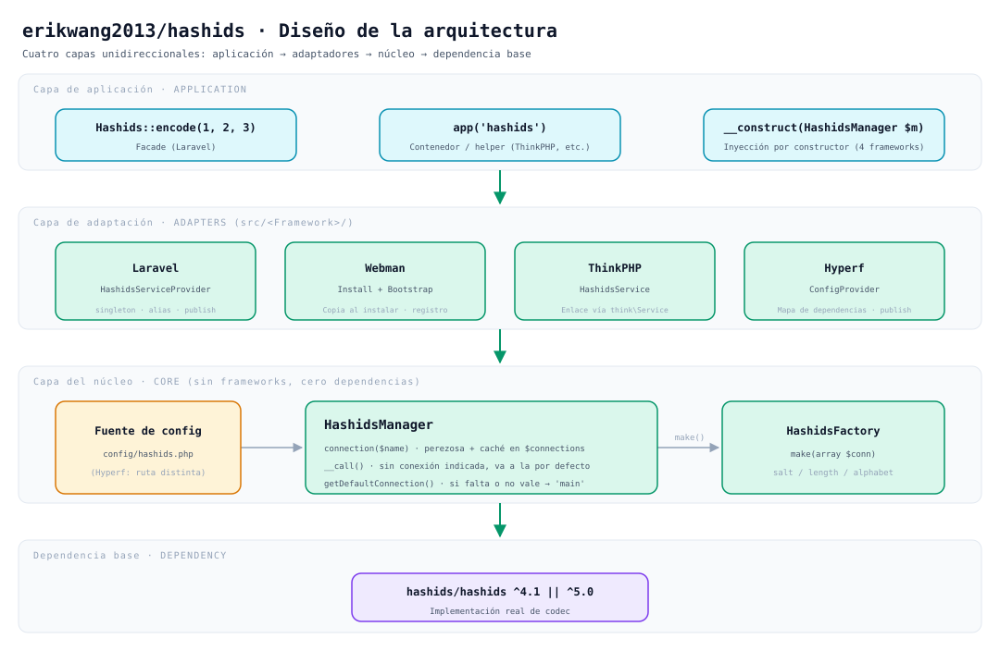
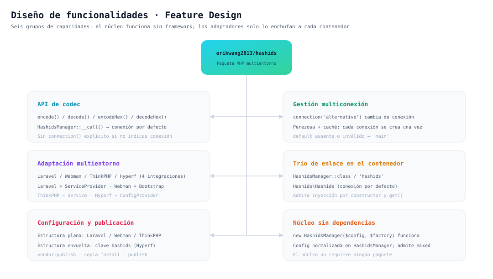
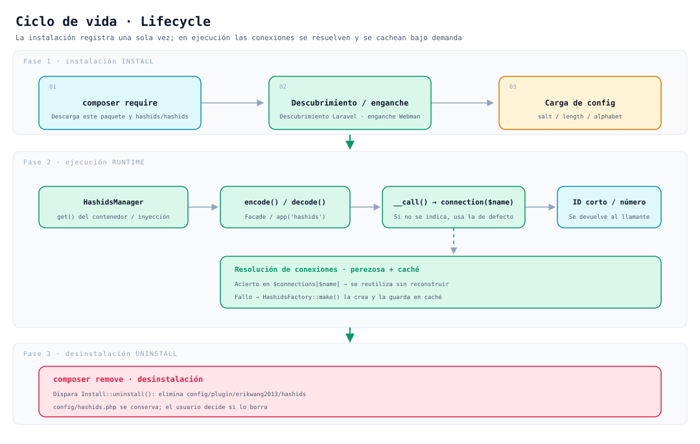

# erikwang2013/hashids

**Languages:** [中文](../../../README.md) · [English](../en/README.md) · [한국어](../ko/README.md) · [Русский](../ru/README.md) · [Deutsch](../de/README.md) · [Français](../fr/README.md) · **Español** · [Português](../pt/README.md) · [हिन्दी](../hi/README.md) · [العربية](../ar/README.md) · [বাংলা](../bn/README.md) · [Bahasa Indonesia](../id/README.md) · [日本語](../ja/README.md)

<p align="center">
  
</p>

<p align="center"><strong>Hashy</strong> — la mascota del proyecto; el <code>#</code> de su pecho es su seña de identidad</p>

Convierte los ID autoincrementales de la base de datos en cadenas cortas e imposibles de adivinar, **con una sola API que corre a la vez en Laravel, Webman, ThinkPHP y Hyperf**.

Se apoya en [`hashids/hashids`](https://github.com/vinkla/hashids) v5; la configuración y el uso siguen a [**vinkla/hashids**](https://github.com/vinkla/laravel-hashids) (múltiples conexiones, conexión por defecto, `HashidsManager` + fábrica), por lo que la sustitución es transparente.

## Descripción del proyecto

**Hashids** es un generador de ID cortos que codifica ID numéricos (como las claves primarias de una base de datos) en cadenas cortas, únicas e imposibles de adivinar. A diferencia de los UUID o los ID de tipo snowflake, Hashids encaja mejor en escenarios de cara al usuario (URL, códigos para compartir, números de pedido, etc.): oculta el número original sin dejar de ser corto y legible.

Este paquete, `erikwang2013/hashids`, es la **capa de integración multientorno PHP** de Hashids: su diseño toma como referencia y se alinea con el estilo de API de [vinkla/hashids](https://github.com/vinkla/laravel-hashids) (múltiples conexiones, conexión por defecto, patrón Manager + Factory) y amplía la compatibilidad a otros frameworks PHP de uso habitual en China.

**Características principales:**

- **Compatibilidad multientorno**: la misma API sirve a la vez para Laravel, Webman, ThinkPHP y Hyperf, con un coste de migración mínimo.
- **Soporte multiconexión**: una aplicación puede configurar varias combinaciones de Salt/Length a la vez (por ejemplo, sales distintas para el ID de usuario y el de pedido) y cambiar entre ellas con `connection('xxx')`.
- **Sin dependencia de frameworks**: se puede usar por sí solo sin depender de ningún framework concreto; basta con `new HashidsManager($config, $factory)`.
- **Alineado con vinkla/hashids**: en Laravel, el Facade, el enlace en el contenedor y el formato de `config/hashids.php` son idénticos a vinkla/hashids, por lo que la sustitución es transparente.
- **Estilo nativo de cada framework**: cada integración sigue las convenciones de su framework: Laravel usa ServiceProvider + Facade, Webman usa Plugin + Bootstrap, ThinkPHP usa Service y Hyperf usa ConfigProvider.

**Casos de uso:**

| Escenario | Descripción |
|------|------|
| Ocultar ID autoincrementales | Asigna `user_id=100` a `/user/3kTMd` y evita revelar la escala del negocio |
| Enlaces cortos y códigos para compartir | Más cortos que un UUID y más controlables que una cadena aleatoria |
| Números de pedido / de operación | Buena legibilidad, lo que facilita la atención al cliente y la revisión de registros |
| Aislamiento multiinquilino / multimódulo | Cada conexión usa un Salt distinto, de modo que los espacios de codificación son independientes entre sí |

**Advertencias:**

- Hashids es **codificación (encode/decode), no cifrado**. El Salt solo dificulta las conjeturas: no lo uses en escenarios sensibles para la seguridad (como tokens o contraseñas).
- Si cambias el Salt o el Length una vez en producción, todos los ID ya codificados dejarán de ser válidos; planifícalo con antelación y fija la configuración.

## Estructura del proyecto

```
hashids/
├── src/
│   ├── HashidsManager.php                     # Núcleo: resolución multiconexión, caché de instancias, proxy a la conexión por defecto
│   ├── HashidsFactory.php                     # Núcleo: crea instancias de Hashids desde la config de conexión
│   ├── Mascot.php                             # Versión ASCII de la mascota del proyecto, "Hashy"
│   ├── Install.php                            # Enganches de instalación / desinstalación de Webman
│   ├── Laravel/
│   │   ├── HashidsServiceProvider.php         # Singleton del contenedor + alias + publicación de config
│   │   └── Facades/Hashids.php                # Facade (conexión por defecto)
│   ├── Webman/
│   │   └── Bootstrap.php                      # Registra las definiciones del contenedor al arrancar el proceso
│   ├── ThinkPHP/
│   │   └── HashidsService.php                 # Registro y enlace vía think\Service
│   ├── Hyperf/
│   │   ├── ConfigProvider.php                 # Mapa de dependencias + publicación de config
│   │   ├── HashidsManagerFactory.php
│   │   └── HashidsClientFactory.php
│   └── config/plugin/erikwang2013/hashids/    # Esqueleto del plugin de Webman (se copia al proyecto al instalar)
│       ├── app.php                            # Interruptor enable
│       └── bootstrap.php                      # Registra Webman\Bootstrap
├── config/
│   ├── hashids.php                            # Config plana: Laravel / Webman / ThinkPHP
│   └── autoload/hashids.php                   # Config de Hyperf (misma estructura plana, otra ruta)
├── tests/
│   ├── HashidsManagerTest.php                 # Comportamiento del núcleo
│   ├── HashidsFactoryTest.php
│   ├── InstallTest.php
│   ├── MascotTest.php                         # Mascota del proyecto: alineación de glifos y saludo
│   ├── Laravel/ · Webman/ · ThinkPHP/ · Hyperf/   # Pruebas de adaptación por framework
│   ├── Config/PluginConfigTest.php
│   └── Support/FrameworkStubs.php             # Dobles de clases de framework para las pruebas
├── docs/
│   ├── mascot.svg                             # La mascota del proyecto, "Hashy"
│   ├── architecture.svg                       # Diagrama de arquitectura
│   ├── features.svg                           # Diagrama de funcionalidades
│   └── lifecycle.svg                          # Diagrama del ciclo de vida
├── .github/workflows/release.yml              # Crea el tag y publica la release al hacer push a main
├── composer.json
└── phpunit.xml.dist
```

> No se listan los artefactos de dependencias como `vendor/` o `composer.lock`; `src/config/` es el **esqueleto del plugin** y `config/` es la **configuración de ejemplo publicable**: son dos cosas distintas.

## Diseño de la arquitectura



**Cuatro capas con dependencia unidireccional**: cada capa superior depende de la inferior, nunca al revés:

| Capa | Responsabilidad | Ubicación |
|----|------|------|
| Capa de llamada desde la aplicación | Tres puntos de entrada: Facade, contenedor / funciones auxiliares e inyección por constructor | Código de negocio |
| Capa de adaptación de frameworks | Solo cablea: enlace en el contenedor, lectura de config, publicación de config | `src/<Framework>/` |
| Capa del núcleo | Gestión multiconexión y construcción de instancias, **sin depender de ningún framework** | `src/HashidsManager.php`, `src/HashidsFactory.php` |
| Dependencia de base | La implementación real de codificación y decodificación | `hashids/hashids` |

La capa del núcleo es el corazón del paquete: `HashidsManager` guarda la configuración, `connection($name)` construye y cachea conexiones bajo demanda y `__call()` redirige a la conexión por defecto las llamadas a métodos en las que no se indica ninguna; `HashidsFactory::make()` es el único sitio donde se construye un `Hashids\Hashids`. Las clases de adaptación de los cuatro frameworks suman unas 250 líneas (Facade incluido y las dos fábricas de Hyperf): su única misión es enchufar el núcleo al contenedor de cada uno.

## Diseño de funcionalidades



Seis grupos de capacidades, todos alrededor del mismo núcleo:

- **API de codificación y decodificación**: `encode()` / `decode()` / `encodeHex()` / `decodeHex()`; pasan por `__call()` hasta la conexión por defecto, sin necesidad de un `connection()` explícito.
- **Gestión multiconexión**: se cambia con `connection('alternative')`; la construcción es perezosa y cada conexión se construye una sola vez.
- **Adaptación multientorno**: Laravel usa `ServiceProvider`, Webman usa `Install` + `Bootstrap`, ThinkPHP usa `Service` y Hyperf usa `ConfigProvider`, cada uno según las convenciones de su framework.
- **Enlace en el contenedor**: doble vía (nombre de clase + clave de tipo string), idéntica en los cuatro frameworks: las clases son `HashidsManager`, `HashidsFactory` y `Hashids\Hashids`, y las claves de tipo string son `'hashids'`, `'hashids.factory'` y `'hashids.connection'`; estas dos últimas tienen el mismo nombre que en vinkla/hashids, lo que facilita la migración.
- **Configuración y publicación**: los cuatro frameworks comparten la misma estructura, un **array plano** (con `default` + `connections` en la raíz); solo cambia la ruta del archivo.
- **Núcleo sin dependencias de frameworks**: funciona con `new HashidsManager($config, $factory)`, y el parámetro `$config` admite valores que no son arrays (se normalizan a un array vacío).

## Ciclo de vida



| Fase | Qué ocurre |
|------|-----------|
| **Instalación** | `composer require` descarga el paquete → descubrimiento automático en Laravel / el enganche de instalación de Webman copia el esqueleto del plugin → se carga `salt` / `length` / `alphabet` |
| **Ejecución** | El contenedor resuelve `HashidsManager` → `encode()` / `decode()` → `__call()` redirige a `connection($name)` → **si acierta en la caché la reutiliza; si no, `HashidsFactory::make()` la construye y la escribe en `$connections`** → devuelve el ID corto o el número original |
| **Desinstalación** | `composer remove` dispara `Install::uninstall()` y elimina `config/plugin/erikwang2013/hashids`; **`config/hashids.php` se conserva**, y es quien use el paquete quien decide si lo borra |

Las conexiones se construyen **bajo demanda**: un proceso que solo usa la conexión por defecto no paga ningún coste de construcción por conexiones que no utiliza, como `alternative`.

## Instalación

```bash
composer require erikwang2013/hashids
```

## Estructura de configuración (Laravel / Webman / ThinkPHP)

Igual que el `config/hashids.php` del repositorio:

- `default`: nombre de la conexión por defecto (como `main`).
- `connections`: nombre de conexión => `salt`, `length` y, opcionalmente, `alphabet`.

> En **Hyperf** la **ruta** del archivo de configuración es distinta (`config/autoload/hashids.php`), pero la estructura es la misma; consulta la sección de Hyperf más abajo.

## Uso sin framework

Puedes instanciar el gestor directamente:

```php
use Erikwang2013\Hashids\HashidsFactory;
use Erikwang2013\Hashids\HashidsManager;

$manager = new HashidsManager(
    require __DIR__ . '/config/hashids.php',
    new HashidsFactory()
);

$hash = $manager->encode(1, 2, 3);
$ids = $manager->decode($hash);
```

---

## Laravel

Similar a [vinkla/hashids](https://github.com/vinkla/laravel-hashids): registra `HashidsManager` en el contenedor, con múltiples conexiones; la conexión por defecto admite Facade y redirección de métodos.

Laravel 5.5+ lee `extra.laravel` del `composer.json` de este paquete y registra automáticamente `HashidsServiceProvider` y el alias de Facade `Hashids`.

**Publicar la configuración (opcional)**

```bash
php artisan vendor:publish --tag=hashids-config
```

Genera `config/hashids.php`. Si no la publicas, el paquete fusiona su configuración por defecto integrada durante la fase de registro.

**Facade (conexión por defecto)**

```php
use Erikwang2013\Hashids\Laravel\Facades\Hashids;

$hash = Hashids::encode(1, 2, 3);
$numbers = Hashids::decode($hash);
```

**Indicar una conexión**

```php
use Erikwang2013\Hashids\Laravel\Facades\Hashids;

$hash = Hashids::connection('alternative')->encode(100);
```

**Inyección de dependencias de `HashidsManager`**

```php
use Erikwang2013\Hashids\HashidsManager;

public function __construct(private HashidsManager $hashids) {}

$this->hashids->encode(1);
$this->hashids->connection('alternative')->encode(2);
```

**Inyectar el `Hashids\Hashids` subyacente (conexión por defecto)**

```php
use Hashids\Hashids;

public function __construct(private Hashids $hashids) {}
```

Para usar la integración con Laravel, el proyecto debe tener instalado `laravel/framework` (incluido `illuminate/support`, etc.). Este paquete lista `illuminate/*` como **require-dev**, solo para sus propias pruebas.

---

## Webman

Mediante **`Install`** se copian durante la instalación `config/plugin/erikwang2013/hashids` y el **`config/hashids.php`** de la raíz, y el **bootstrap** del plugin registra `HashidsManager` en el contenedor de Webman.

Si el `composer.json` del proyecto ya tiene los enganches `support\Plugin::install` / `update` / `uninstall`, al instalar este paquete se ejecutará automáticamente el script de instalación (`WEBMAN_PLUGIN = true`).

**Archivos tras la instalación**

- `config/plugin/erikwang2013/hashids/app.php`: el interruptor `enable`.
- `config/plugin/erikwang2013/hashids/bootstrap.php`: registra `Erikwang2013\Hashids\Webman\Bootstrap`.
- `config/hashids.php`: configuración multiconexión (se escribe en la primera instalación o cuando se confirma sobrescribir).

Si la copia automática no se ejecutó, puedes copiar a mano la configuración de ejemplo de esas rutas desde el interior del paquete.

**Desactivar el plugin** (`config/plugin/erikwang2013/hashids/app.php`)

```php
<?php
return [
    'enable' => false,
];
```

**Enlace en el contenedor**

- `Erikwang2013\Hashids\HashidsManager` / `'hashids'`
- `Erikwang2013\Hashids\HashidsFactory` / `'hashids.factory'`
- `Hashids\Hashids` / `'hashids.connection'` (instancia de la conexión por defecto)

**Ejemplo de controlador**

```php
use support\Request;
use Erikwang2013\Hashids\HashidsManager;
use Hashids\Hashids;

class DemoController
{
    public function index(Request $request, HashidsManager $manager)
    {
        $hash = $manager->encode(1, 2, 3);

        $client = \support\Container::instance()->get(Hashids::class);
        $hash2 = $client->encode(4);

        return json(['hash' => $hash, 'hash2' => $hash2]);
    }
}
```

**Indicar una conexión**

```php
$manager->connection('alternative')->encode(99);
```

Cuando Composer desinstala el paquete se dispara `Plugin::uninstall`, que elimina `config/plugin/erikwang2013/hashids`; **no** borra `config/hashids.php`, así que conservarlo o no depende de ti.

---

## ThinkPHP

Registra `HashidsManager` mediante una **clase de servicio propia**; la configuración sigue siendo **`config/hashids.php`** con `default` y `connections` en el nivel superior.

**Registrar el servicio**

Añade lo siguiente a `services` en el **`config/service.php`** de la aplicación (la ruta exacta puede variar según la versión de TP):

```php
<?php

return [
    // ...
    \Erikwang2013\Hashids\ThinkPHP\HashidsService::class,
];
```

Si usas el `app/AppService.php` de la aplicación, también puedes escribir un enlace equivalente en `register()`.

**Archivo de configuración**

Copia el `config/hashids.php` del paquete al `config/hashids.php` de la aplicación (o fusiona tú mismo la configuración con el mismo nombre).

```php
<?php
return [
    'default' => 'main',
    'connections' => [
        'main' => [
            'salt' => env('HASHIDS_SALT', ''),
            'length' => (int) env('HASHIDS_LENGTH', 0),
        ],
    ],
];
```

**Ejemplos de uso**

```php
use Erikwang2013\Hashids\HashidsManager;
use think\facade\App;

$manager = App::make(HashidsManager::class);
$hash = $manager->encode(10, 20);
```

```php
$manager = app('hashids');
```

```php
use Hashids\Hashids;

$client = app(Hashids::class);
$hash = $client->encode(1);
```

```php
app(HashidsManager::class)->connection('alternative')->encode(100);
```

La integración con ThinkPHP extiende `think\Service`, así que requiere un entorno con **`topthink/framework`** (este paquete lo lista como suggest).

---

## Hyperf

El **`extra.hyperf.config`** de Composer carga `ConfigProvider`, que registra en el contenedor `HashidsFactory`, `HashidsManager` y el `Hashids\Hashids` de la conexión por defecto.

Copia el **`config/autoload/hashids.php`** del paquete al **`config/autoload/hashids.php`** del proyecto (o usa el comando de publicación de configuración del proyecto).

El archivo debe devolver un **array plano** (con `default` + `connections` en la raíz).

El `ConfigFactory` de Hyperf fusiona por **nombre de archivo** (`Arr::set($config, 'hashids', require $file)`), así que `config('hashids')` devuelve el contenido del archivo tal cual: **no añadas un nivel `'hashids' =>`**. Si lo añades, `connections` deja de ser accesible y al pedir una conexión se lanzará `Hashids connection [main] is not configured`.

```php
<?php

declare(strict_types=1);

return [
    'default' => 'main',
    'connections' => [
        'main' => [
            'salt' => env('HASHIDS_SALT', ''),
            'length' => (int) env('HASHIDS_LENGTH', 0),
        ],
    ],
];
```

**Enlace en el contenedor**

| Abstracción | Implementación |
|------|------|
| `Erikwang2013\Hashids\HashidsFactory` / `'hashids.factory'` | Construcción por defecto |
| `Erikwang2013\Hashids\HashidsManager` / `'hashids'` | `HashidsManagerFactory` |
| `Hashids\Hashids` / `'hashids.connection'` | `HashidsClientFactory` (conexión por defecto) |

**Inyección en Controller / constructor**

```php
<?php

declare(strict_types=1);

namespace App\Controller;

use Erikwang2013\Hashids\HashidsManager;
use Hashids\Hashids;

class DemoController
{
    public function index(HashidsManager $manager, Hashids $hashids)
    {
        $h1 = $manager->encode(1, 2, 3);
        $h2 = $hashids->encode(4);
        $alt = $manager->connection('alternative')->encode(99);

        return compact('h1', 'h2', 'alt');
    }
}
```

```php
$manager = \Hyperf\Context\ApplicationContext::getContainer()->get(
    \Erikwang2013\Hashids\HashidsManager::class
);
```

Los cuatro frameworks comparten la misma estructura de configuración (`default` + `connections` en la raíz); solo cambia la ruta del archivo: Hyperf usa **`config/autoload/hashids.php`** y Laravel / Webman / ThinkPHP usan **`config/hashids.php`**.

---

## La mascota del proyecto

La mascota del proyecto es **Hashy**: una pequeña criatura cuadrada de esquinas redondeadas, con una antena en la cabeza y un `#` grabado en el pecho. La imagen vectorial está en [`docs/mascot.svg`](../../mascot.svg).

En el terminal no hay SVG, así que el código incluye una versión ASCII equivalente (`Erikwang2013\Hashids\Mascot`):

```php
use Erikwang2013\Hashids\Mascot;

echo Mascot::greet();
```

```
           ●
           │
      ╭─────────╮
      │ ◉     ◉ │
      │    ‿    │
      │    #    │
      ╰──┬───┬──╯
         ╵   ╵
哈希迪 Hashy · 把数据库自增 ID 换成短小、不可猜测的字符串
```

La primera vez que el plugin de Webman publica `config/hashids.php` imprime este saludo de paso; si la configuración ya existe (por ejemplo, al repetir `composer update`) no vuelve a molestar.

---

## El código abierto no es fácil, tu apoyo es bienvenido

<p align="center">
  
  &nbsp;&nbsp;&nbsp;&nbsp;
  
</p>

<p align="center"><strong>WeChat Pay</strong>&nbsp;&nbsp;&nbsp;&nbsp;&nbsp;&nbsp;&nbsp;&nbsp;&nbsp;&nbsp;&nbsp;&nbsp;&nbsp;&nbsp;&nbsp;&nbsp;<strong>Alipay</strong></p>

---


## Licencia

MIT. Consulta [LICENSE](../../../LICENSE).
