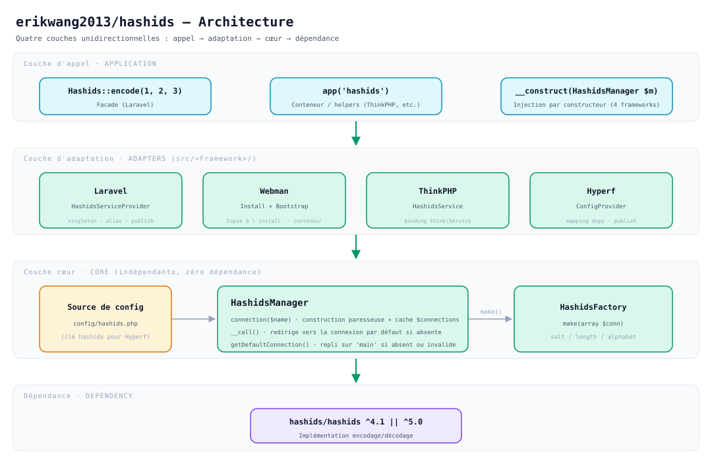
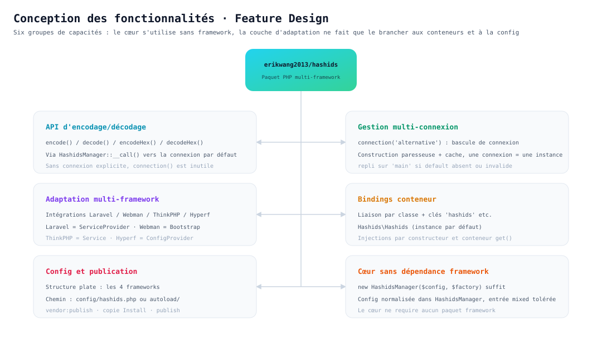
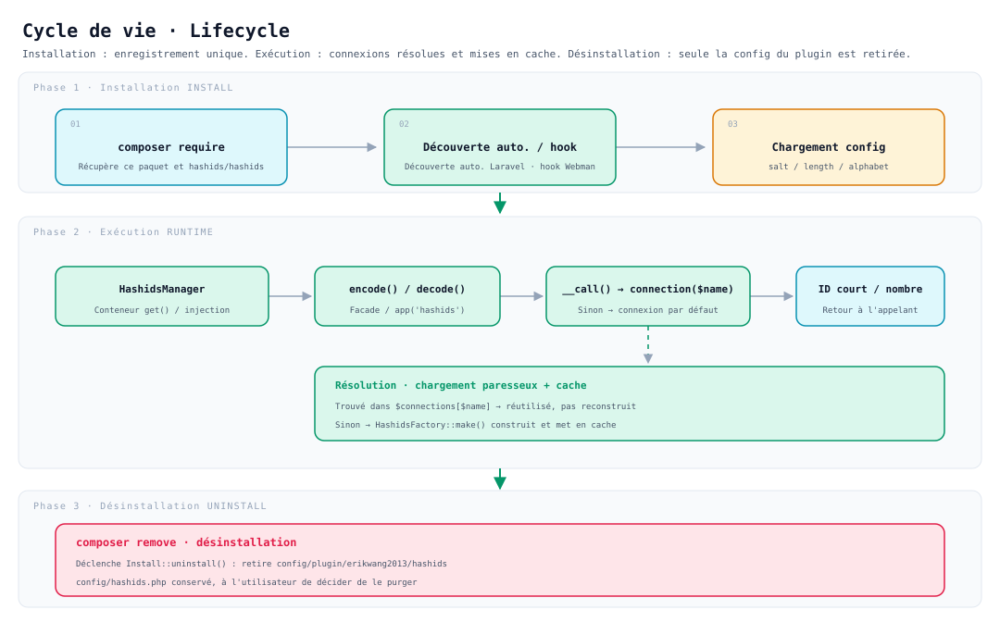

# erikwang2013/hashids

**Languages:** [中文](../../../README.md) · [English](../en/README.md) · [한국어](../ko/README.md) · [Русский](../ru/README.md) · [Deutsch](../de/README.md) · **Français** · [Español](../es/README.md) · [Português](../pt/README.md) · [हिन्दी](../hi/README.md) · [العربية](../ar/README.md) · [বাংলা](../bn/README.md) · [Bahasa Indonesia](../id/README.md) · [日本語](../ja/README.md)

<p align="center">
  
</p>

<p align="center"><strong>Hashy</strong> — mascotte du projet, le <code>#</code> sur son torse est sa signature</p>

Remplacez les ID auto-incrémentés de votre base de données par des chaînes courtes et imprévisibles : **une seule API, sur Laravel, Webman, ThinkPHP et Hyperf à la fois**.

S'appuie sur [`hashids/hashids`](https://github.com/vinkla/hashids) v5 ; la configuration et l'usage s'alignent sur [**vinkla/hashids**](https://github.com/vinkla/laravel-hashids) (connexions multiples, connexion par défaut, `HashidsManager` + factory), pour un remplacement sans friction.

## Présentation du projet

**Hashids** est un générateur d'ID courts : il encode des identifiants numériques (clé primaire de base de données, par exemple) en chaînes courtes, uniques et imprévisibles. Contrairement aux UUID ou aux Snowflake ID, Hashids convient mieux aux usages exposés à l'utilisateur (URL, codes de partage, numéros de commande…) : il masque le nombre d'origine tout en restant court et lisible.

Ce paquet `erikwang2013/hashids` est la **couche d'intégration PHP multi-framework** de Hashids. Sa conception s'inspire et s'aligne sur le style d'API de [vinkla/hashids](https://github.com/vinkla/laravel-hashids) (connexions multiples, connexion par défaut, motif Manager + Factory), en étendant la prise en charge à d'autres frameworks PHP largement utilisés.

**Caractéristiques principales :**

- **Compatibilité multi-framework** : la même API prend en charge Laravel, Webman, ThinkPHP et Hyperf, pour un coût de migration minime.
- **Connexions multiples** : une application peut configurer plusieurs couples Salt/Length (sel différent pour les ID utilisateur et les ID de commande, par exemple), à basculer via `connection('xxx')`.
- **Aucune dépendance à un framework** : utilisable seul, sans aucun framework particulier — `new HashidsManager($config, $factory)` suffit.
- **Aligné sur vinkla/hashids** : sous Laravel, la Facade, le binding conteneur et le format `config/hashids.php` sont identiques à vinkla/hashids, pour un remplacement sans friction.
- **Style natif de chaque framework** : chaque intégration suit les usages de son framework — Laravel avec ServiceProvider + Facade, Webman avec Plugin + Bootstrap, ThinkPHP avec Service, Hyperf avec ConfigProvider.

**Cas d'usage :**

| Cas d'usage | Description |
|------|------|
| Masquer les ID auto-incrémentés | Mapper `user_id=100` vers `/user/3kTMd`, sans divulguer la volumétrie métier |
| Générer des liens courts / codes de partage | Plus court qu'un UUID, plus maîtrisé qu'une chaîne aléatoire |
| Numéros de commande / de transaction | Bonne lisibilité, pratique pour le support et l'analyse des logs |
| Isolation multi-tenant / multi-module | Un Salt différent par connexion, pour des espaces d'encodage indépendants |

**À savoir :**

- Hashids est un **encodage (encode/decode), pas un chiffrement**. Le Salt ne fait que compliquer les devinettes : à éviter sur tout cas sensible (token, mot de passe).
- Modifier le Salt ou la Length après la mise en production invalide tous les ID déjà encodés : planifiez et figez la configuration à l'avance.
- **Un Salt vide n'apporte aucune protection** : avec un salt vide, les résultats d'encodage sont énumérables (`encode(1)`, `encode(2)`… l'ordre est prévisible).
  Écrit `env('HASHIDS_SALT', '')`, une variable oubliée ne lève ni erreur ni avertissement : le Salt retombe silencieusement à vide — vérifiez qu'il est bien défini avant la mise en production.
- **Avec un framework à mémoire persistante (Webman / Hyperf), changer la configuration exige de redémarrer le processus** : `HashidsManager` fige la configuration à la construction et met les connexions en cache définitivement ;
  modifier `config/hashids.php` (ou changer le Salt via un centre de configuration) ne s'applique pas à chaud — il faut un `reload` ou un redémarrage.

## Structure du projet

```
hashids/
├── src/
│   ├── HashidsManager.php                     # Cœur : résolution des connexions, cache d'instances, proxy vers la connexion par défaut
│   ├── HashidsFactory.php                     # Cœur : construit une instance Hashids depuis la config de connexion
│   ├── Mascot.php                             # Version ASCII de la mascotte du projet « Hashy »
│   ├── Install.php                            # Hooks d'installation / désinstallation Webman
│   ├── Laravel/
│   │   ├── HashidsServiceProvider.php         # Singleton du conteneur + alias + publication de la config
│   │   └── Facades/Hashids.php                # Facade (connexion par défaut)
│   ├── Webman/
│   │   └── Bootstrap.php                      # Enregistre les définitions du conteneur au démarrage du processus
│   ├── ThinkPHP/
│   │   └── HashidsService.php                 # Binding enregistré via think\Service
│   ├── Hyperf/
│   │   ├── ConfigProvider.php                 # Mapping des dépendances + publication de la config
│   │   ├── HashidsManagerFactory.php
│   │   └── HashidsClientFactory.php
│   └── config/plugin/erikwang2013/hashids/    # Squelette de plugin Webman (copié dans le projet à l'installation)
│       ├── app.php                            # Interrupteur enable
│       └── bootstrap.php                      # Enregistre Webman\Bootstrap
├── config/
│   ├── hashids.php                            # Config plate : Laravel / Webman / ThinkPHP
│   └── autoload/hashids.php                   # Config Hyperf (même structure plate, chemin différent)
├── tests/
│   ├── HashidsManagerTest.php                 # Comportement du cœur
│   ├── HashidsFactoryTest.php
│   ├── InstallTest.php
│   ├── MascotTest.php                         # Mascotte : alignement des glyphes et message d'accueil
│   ├── Laravel/ · Webman/ · ThinkPHP/ · Hyperf/   # Tests d'adaptation par framework
│   ├── Config/PluginConfigTest.php
│   └── Support/FrameworkStubs.php             # Doublures de classes framework pour les tests
├── docs/
│   ├── mascot.svg                             # Mascotte du projet « Hashy »
│   ├── architecture.svg                       # Schéma d'architecture
│   ├── features.svg                           # Schéma des fonctionnalités
│   └── lifecycle.svg                          # Schéma du cycle de vie
├── .github/workflows/release.yml              # Tag + release automatiques après un push sur main
├── composer.json
└── phpunit.xml.dist
```

> Les artefacts de dépendances comme `vendor/` et `composer.lock` ne sont pas listés ; `src/config/` est le **squelette de plugin**, `config/` un **exemple de configuration publiable** — deux usages différents.

## Architecture



**Quatre couches à dépendance unidirectionnelle** — le haut dépend du bas, l'inverse n'est pas vrai :

| Couche | Rôle | Emplacement |
|----|------|------|
| Couche d'appel applicatif | Trois entrées : Facade, conteneur / helpers, injection par constructeur | Code métier |
| Couche d'adaptation framework | Uniquement le câblage : binding conteneur, lecture de config, publication de config | `src/<Framework>/` |
| Couche cœur | Gestion multi-connexion et construction d'instances, **sans dépendance à un framework** | `src/HashidsManager.php`, `src/HashidsFactory.php` |
| Dépendance de base | Implémentation réelle de l'encodage/décodage | `hashids/hashids` |

La couche cœur est le centre de gravité du paquet : `HashidsManager` détient la configuration, `connection($name)` construit et met en cache les connexions à la demande, `__call()` transfère vers la connexion par défaut les appels sans connexion explicite ; `HashidsFactory::make()` est le seul endroit qui construit un `Hashids\Hashids`. Les classes d'adaptation des quatre frameworks totalisent environ 250 lignes (Facade et deux factories Hyperf incluses) — elles ne font que brancher le cœur dans leurs conteneurs respectifs.

## Conception des fonctionnalités



Six groupes de capacités, tous articulés autour du même cœur :

- **API d'encodage/décodage** : `encode()` / `decode()` / `encodeHex()` / `decodeHex()`, acheminés via `__call()` vers la connexion par défaut, sans `connection()` explicite.
- **Gestion multi-connexion** : bascule via `connection('alternative')` ; construction paresseuse, chaque connexion n'étant construite qu'une seule fois.
- **Adaptation multi-framework** : `ServiceProvider` pour Laravel, `Install` + `Bootstrap` pour Webman, `Service` pour ThinkPHP, `ConfigProvider` pour Hyperf — chacun suivant les usages de son framework.
- **Binding conteneur** : double liaison, identique pour les quatre frameworks — par nom de classe (`HashidsManager`, `HashidsFactory`, `Hashids\Hashids`) et par clé chaîne (`'hashids'`, `'hashids.factory'`, `'hashids.connection'`) ; les deux dernières clés portent les mêmes noms que vinkla/hashids, ce qui facilite la migration.
- **Configuration et publication** : les quatre frameworks partagent la même structure — un **tableau plat** (`default` + `connections` à la racine) ; seul le chemin du fichier change.
- **Cœur sans dépendance à un framework** : `new HashidsManager($config, $factory)` suffit, et `$config` tolère les non-tableaux (normalisés en tableau vide).

## Cycle de vie



| Phase | Ce qui se passe |
|------|-----------|
| **Installation** | `composer require` récupère le paquet → découverte automatique Laravel / hook d'installation Webman copie le squelette de plugin → chargement de `salt` / `length` / `alphabet` |
| **Exécution** | Le conteneur résout `HashidsManager` → `encode()` / `decode()` → `__call()` transfère vers `connection($name)` → **cache touché : réutilisation directe ; sinon `HashidsFactory::make()` construit puis écrit dans `$connections`** → retourne un ID court ou le nombre d'origine |
| **Désinstallation** | `composer remove` déclenche `Install::uninstall()`, qui retire `config/plugin/erikwang2013/hashids` ; **`config/hashids.php` est conservé**, c'est à l'utilisateur de décider de le purger |

Les connexions sont **construites à la demande** : un processus qui n'appelle que la connexion par défaut ne paie aucun coût de construction pour des connexions inutilisées comme `alternative`.

## Installation

```bash
composer require erikwang2013/hashids
```

> **Environnement d'exécution** : le paquet sous-jacent `hashids/hashids` **exige** `ext-bcmath` ou `ext-gmp` (l'un des deux), sinon le premier encodage lève
> `RuntimeException: Missing math extension for Hashids`. Ces deux extensions ne sont listées que dans le `suggest` de `hashids/hashids`, et Composer 2
> n'affiche plus les suggest : sur une image allégée (comme `php:8.3-fpm-alpine`), l'installation ne signale donc rien et la panne ne survient qu'à l'exécution,
> où chaque requête touchant Hashids renvoie une 500. Le `suggest` du `composer.json` de ce paquet a été complété avec ces deux clés, mais il vous reste à vérifier que les extensions sont activées.

## Structure de configuration (Laravel / Webman / ThinkPHP)

Identique au `config/hashids.php` du dépôt :

- `default` : nom de la connexion par défaut (par ex. `main`).
- `connections` : nom de connexion => `salt`, `length`, `alphabet` en option.

> Le **chemin de fichier** de configuration de **Hyperf** est différent (`config/autoload/hashids.php`), mais la structure est identique, voir la section Hyperf ci-dessous.

## Utilisation sans framework

Le gestionnaire peut être instancié directement :

```php
use Erikwang2013\Hashids\HashidsFactory;
use Erikwang2013\Hashids\HashidsManager;

$manager = new HashidsManager(
    require __DIR__ . '/config/hashids.php',
    new HashidsFactory()
);

$hash = $manager->encode(1, 2, 3);
$ids = $manager->decode($hash);
```

---

## Laravel

Semblable à [vinkla/hashids](https://github.com/vinkla/laravel-hashids) : `HashidsManager` est enregistré dans le conteneur, avec plusieurs connexions ; la connexion par défaut prend en charge la Facade et le transfert de méthodes.

Laravel 5.5+ lit `extra.laravel` dans le `composer.json` du paquet et enregistre automatiquement `HashidsServiceProvider` ainsi que l'alias de Facade `Hashids`.

**Publier la configuration (facultatif)**

```bash
php artisan vendor:publish --tag=hashids-config
```

Génère `config/hashids.php`. Sans publication, le paquet fusionne sa configuration par défaut intégrée lors de l'enregistrement.

**Facade (connexion par défaut)**

```php
use Erikwang2013\Hashids\Laravel\Facades\Hashids;

$hash = Hashids::encode(1, 2, 3);
$numbers = Hashids::decode($hash);
```

**Connexion explicite**

```php
use Erikwang2013\Hashids\Laravel\Facades\Hashids;

$hash = Hashids::connection('alternative')->encode(100);
```

**Injection de `HashidsManager`**

```php
use Erikwang2013\Hashids\HashidsManager;

public function __construct(private HashidsManager $hashids) {}

$this->hashids->encode(1);
$this->hashids->connection('alternative')->encode(2);
```

**Injecter le `Hashids\Hashids` sous-jacent (connexion par défaut)**

```php
use Hashids\Hashids;

public function __construct(private Hashids $hashids) {}
```

Faire tourner l'intégration Laravel suppose que le projet a installé `laravel/framework` (avec `illuminate/support`, etc.). Ce paquet liste `illuminate/*` en **require-dev**, uniquement pour ses propres tests.

---

## Webman

**`Install`** copie à l'installation `config/plugin/erikwang2013/hashids` ainsi que, à la racine, **`config/hashids.php`** ; le **bootstrap** du plugin enregistre ensuite `HashidsManager` dans le conteneur Webman.

Si le `composer.json` du projet contient déjà les hooks `support\Plugin::install` / `update` / `uninstall`, le script d'installation s'exécute automatiquement à l'installation de ce paquet (`WEBMAN_PLUGIN = true`).

**Fichiers après installation**

- `config/plugin/erikwang2013/hashids/app.php` : interrupteur `enable`.
- `config/plugin/erikwang2013/hashids/bootstrap.php` : enregistre `Erikwang2013\Hashids\Webman\Bootstrap`.
- `config/hashids.php` : configuration multi-connexion (écrite à la première installation ou après confirmation d'écrasement).

Si la copie automatique n'a pas eu lieu, copiez manuellement depuis le paquet les exemples de configuration à ces chemins.

**Désactiver le plugin** (`config/plugin/erikwang2013/hashids/app.php`)

```php
<?php
return [
    'enable' => false,
];
```

**Bindings du conteneur**

- `Erikwang2013\Hashids\HashidsManager` / `'hashids'`
- `Erikwang2013\Hashids\HashidsFactory` / `'hashids.factory'`
- `Hashids\Hashids` / `'hashids.connection'` (instance de la connexion par défaut)

**Exemple de contrôleur**

```php
use support\Request;
use Erikwang2013\Hashids\HashidsManager;
use Hashids\Hashids;

class DemoController
{
    public function index(Request $request, HashidsManager $manager)
    {
        $hash = $manager->encode(1, 2, 3);

        $client = \support\Container::instance()->get(Hashids::class);
        $hash2 = $client->encode(4);

        return json(['hash' => $hash, 'hash2' => $hash2]);
    }
}
```

**Connexion explicite**

```php
$manager->connection('alternative')->encode(99);
```

La désinstallation via Composer déclenche `Plugin::uninstall`, qui retire `config/plugin/erikwang2013/hashids` ; **il ne supprime pas** `config/hashids.php`, à vous de décider si vous le gardez.

---

## ThinkPHP

Enregistrement de `HashidsManager` via une **classe de service personnalisée** ; la configuration reste le **`config/hashids.php`** dont la racine contient `default` et `connections`.

**Enregistrer le service**

Dans le **`config/service.php`** de l'application (le chemin exact peut varier selon la version de TP), ajoutez dans `services` :

```php
<?php

return [
    // ...
    \Erikwang2013\Hashids\ThinkPHP\HashidsService::class,
];
```

Si vous utilisez `app/AppService.php` au niveau de l'application, le binding équivalent peut aussi être écrit dans `register()`.

**Fichier de configuration**

Copiez le `config/hashids.php` du paquet vers le `config/hashids.php` de l'application (ou fusionnez vous-même la configuration du même nom).

```php
<?php
return [
    'default' => 'main',
    'connections' => [
        'main' => [
            'salt' => env('HASHIDS_SALT', ''),
            'length' => (int) env('HASHIDS_LENGTH', 0),
        ],
    ],
];
```

**Exemples d'utilisation**

```php
use Erikwang2013\Hashids\HashidsManager;
use think\facade\App;

$manager = App::make(HashidsManager::class);
$hash = $manager->encode(10, 20);
```

```php
$manager = app('hashids');
```

```php
use Hashids\Hashids;

$client = app(Hashids::class);
$hash = $client->encode(1);
```

```php
app(HashidsManager::class)->connection('alternative')->encode(100);
```

L'intégration ThinkPHP hérite de `think\Service` et nécessite l'environnement **`topthink/framework`** (listé en suggest par ce paquet).

---

## Hyperf

Composer charge **`extra.hyperf.config`**, qui enregistre `HashidsFactory`, `HashidsManager` et le `Hashids\Hashids` de la connexion par défaut dans le conteneur.

Copiez le **`config/autoload/hashids.php`** du paquet vers le **`config/autoload/hashids.php`** du projet (ou utilisez la commande de publication de configuration du projet).

Ce fichier doit retourner un **tableau plat** (racine `default` + `connections`).

Le `ConfigFactory` de Hyperf fusionne la configuration par **nom de fichier** (`Arr::set($config, 'hashids', require $file)`), donc `config('hashids')` retourne le contenu du fichier lui-même — **ne pas ajouter de couche `'hashids' =>`**. Sinon `connections` devient inaccessible et la récupération d'une connexion lève `Hashids connection [main] is not configured`.

```php
<?php

declare(strict_types=1);

return [
    'default' => 'main',
    'connections' => [
        'main' => [
            'salt' => env('HASHIDS_SALT', ''),
            'length' => (int) env('HASHIDS_LENGTH', 0),
        ],
    ],
];
```

**Bindings du conteneur**

| Abstraction | Implémentation |
|------|------|
| `Erikwang2013\Hashids\HashidsFactory` / `'hashids.factory'` | Construction par défaut |
| `Erikwang2013\Hashids\HashidsManager` / `'hashids'` | `HashidsManagerFactory` |
| `Hashids\Hashids` / `'hashids.connection'` | `HashidsClientFactory` (connexion par défaut) |

**Controller / injection par constructeur**

```php
<?php

declare(strict_types=1);

namespace App\Controller;

use Erikwang2013\Hashids\HashidsManager;
use Hashids\Hashids;

class DemoController
{
    public function index(HashidsManager $manager, Hashids $hashids)
    {
        $h1 = $manager->encode(1, 2, 3);
        $h2 = $hashids->encode(4);
        $alt = $manager->connection('alternative')->encode(99);

        return compact('h1', 'h2', 'alt');
    }
}
```

```php
$manager = \Hyperf\Context\ApplicationContext::getContainer()->get(
    \Erikwang2013\Hashids\HashidsManager::class
);
```

Les quatre frameworks partagent la même structure de configuration (`default` + `connections` à la racine) ; seul le chemin du fichier diffère : Hyperf utilise **`config/autoload/hashids.php`**, Laravel / Webman / ThinkPHP utilisent **`config/hashids.php`**.

---

## Mascotte du projet

La mascotte du projet est **Hashy** — une petite créature carrée aux coins arrondis, une antenne sur la tête et un `#` sur le torse ; le vecteur est ici : [`docs/mascot.svg`](../../mascot.svg).

Le terminal n'affiche pas de SVG, une version ASCII équivalente est donc conservée dans le code (`Erikwang2013\Hashids\Mascot`) :

```php
use Erikwang2013\Hashids\Mascot;

echo Mascot::greet();
```

```
           ●
           │
      ╭─────────╮
      │ ◉     ◉ │
      │    ‿    │
      │    #    │
      ╰──┬───┬──╯
         ╵   ╵
哈希迪 Hashy · 把数据库自增 ID 换成短小、不可猜测的字符串
```

Le plugin Webman imprime ce message une seule fois lors de la première publication de `config/hashids.php` ; si la configuration existe déjà (par exemple lors d'un `composer update` répété), il ne vous dérange pas une seconde fois.

---

## L'open source, ce n'est pas facile — votre soutien est bienvenu

<p align="center">
  
  &nbsp;&nbsp;&nbsp;&nbsp;
  
</p>

<p align="center"><strong>WeChat Pay</strong>&nbsp;&nbsp;&nbsp;&nbsp;&nbsp;&nbsp;&nbsp;&nbsp;&nbsp;&nbsp;&nbsp;&nbsp;&nbsp;&nbsp;&nbsp;&nbsp;<strong>Alipay</strong></p>

---


## License

MIT. Voir [LICENSE](../../../LICENSE).
