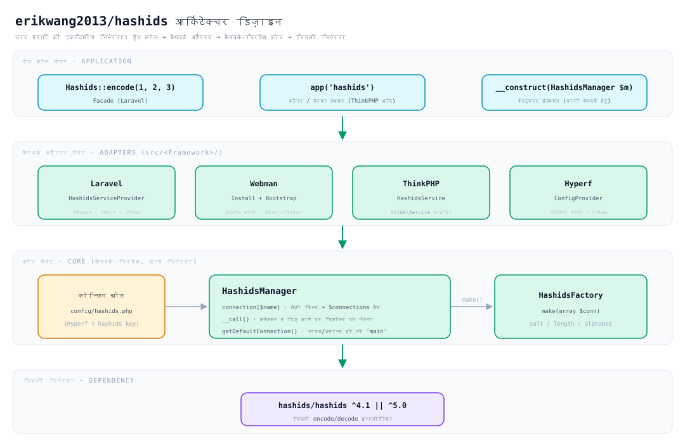
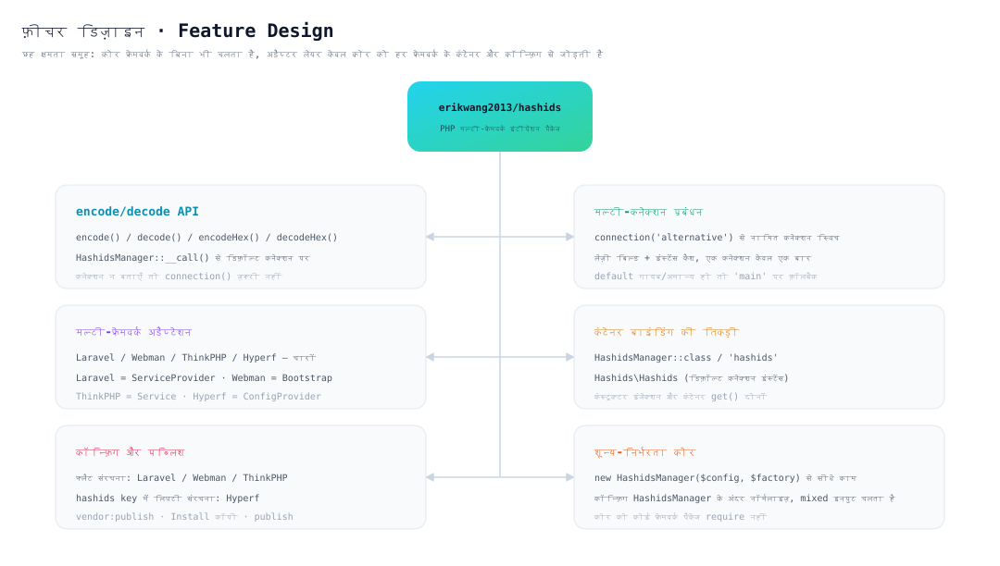
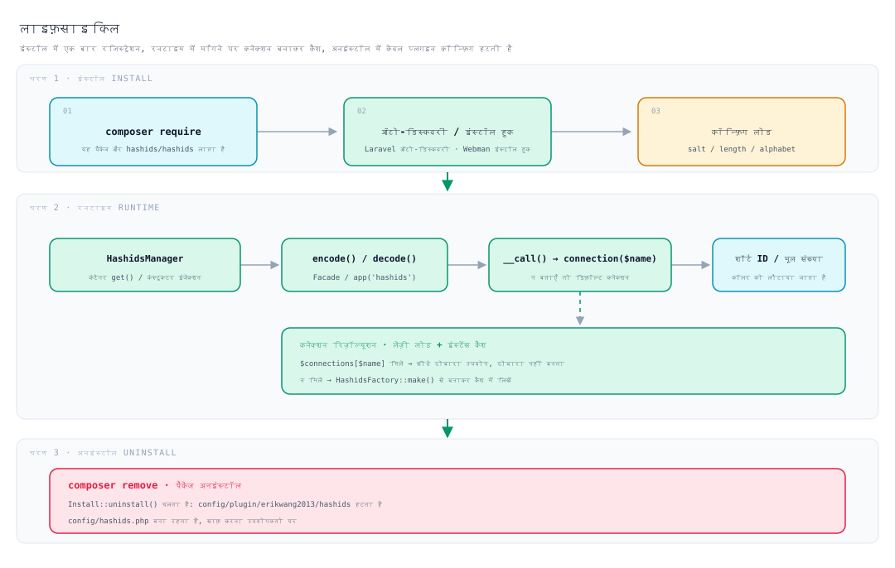

# erikwang2013/hashids

**Languages:** [中文](../../../README.md) · [English](../en/README.md) · [한국어](../ko/README.md) · [Русский](../ru/README.md) · [Deutsch](../de/README.md) · [Français](../fr/README.md) · [Español](../es/README.md) · [Português](../pt/README.md) · **हिन्दी** · [العربية](../ar/README.md) · [বাংলা](../bn/README.md) · [Bahasa Indonesia](../id/README.md) · [日本語](../ja/README.md)

<p align="center">
  
</p>

<p align="center"><strong>हैशी Hashy</strong> — प्रोजेक्ट मस्कॉट, सीने पर बना <code>#</code> इसकी पहचान है</p>

डेटाबेस के ऑटो-इंक्रीमेंट ID को छोटे, अनुमान-रहित स्ट्रिंग में बदलें — **एक ही API Laravel, Webman, ThinkPHP और Hyperf पर एक साथ चलती है**।

अंदर से [`hashids/hashids`](https://github.com/vinkla/hashids) v5 पर निर्भर; कॉन्फ़िगरेशन और उपयोग [**vinkla/hashids**](https://github.com/vinkla/laravel-hashids) के अनुरूप (मल्टी-कनेक्शन, डिफ़ॉल्ट कनेक्शन, `HashidsManager` + फ़ैक्टरी), इसलिए सहज प्रतिस्थापन संभव है।

## परियोजना परिचय

**Hashids** एक शॉर्ट ID जनरेटर है, जो संख्यात्मक ID (जैसे डेटाबेस प्राइमरी की) को छोटे, अद्वितीय और अनुमान-रहित स्ट्रिंग में encode करता है। यह UUID या Snowflake ID से अलग है — Hashids उपयोगकर्ता-मुखी परिदृश्यों (URL, शेयर कोड, ऑर्डर नंबर आदि) के लिए अधिक उपयुक्त है, जहाँ छोटा और पठनीय बनाए रखते हुए मूल संख्या छिपाई जाती है।

यह पैकेज `erikwang2013/hashids` Hashids के लिए एक **PHP मल्टी-फ्रेमवर्क इंटीग्रेशन लेयर** है। इसका डिज़ाइन [vinkla/hashids](https://github.com/vinkla/laravel-hashids) की API शैली (मल्टी-कनेक्शन, डिफ़ॉल्ट कनेक्शन, Manager + Factory पैटर्न) को संदर्भित करता है और उससे मेल खाता है, तथा इसमें अन्य प्रचलित PHP फ्रेमवर्क के लिए समर्थन भी जोड़ा गया है।

**मुख्य विशेषताएँ:**

- **मल्टी-फ्रेमवर्क संगतता**: एक ही API Laravel, Webman, ThinkPHP और Hyperf पर एक साथ चलती है, माइग्रेशन लागत न्यूनतम।
- **मल्टी-कनेक्शन समर्थन**: एक ही ऐप में Salt/Length के कई सेट एक साथ कॉन्फ़िगर किए जा सकते हैं (जैसे यूज़र ID और ऑर्डर ID के लिए अलग salt), और `connection('xxx')` से स्विच किया जा सकता है।
- **फ्रेमवर्क-निरपेक्ष**: किसी विशेष फ्रेमवर्क पर निर्भरता के बिना स्वतंत्र रूप से उपयोग किया जा सकता है; सीधे `new HashidsManager($config, $factory)` से काम चलता है।
- **vinkla/hashids के अनुरूप**: Laravel में Facade, कंटेनर बाइंडिंग और `config/hashids.php` का प्रारूप vinkla/hashids के समान है, इसलिए सहज प्रतिस्थापन संभव है।
- **फ्रेमवर्क-मूल शैली**: हर फ्रेमवर्क इंटीग्रेशन अपनी परंपरागत शैली का पालन करता है — Laravel में ServiceProvider + Facade, Webman में Plugin + Bootstrap, ThinkPHP में Service, Hyperf में ConfigProvider।

**उपयुक्त परिदृश्य:**

| परिदृश्य | विवरण |
|------|------|
| डेटाबेस ऑटो-इंक्रीमेंट ID छिपाना | `user_id=100` को `/user/3kTMd` में मैप करें, जिससे बिज़नेस का आकार उजागर न हो |
| शॉर्ट लिंक / शेयर कोड बनाना | UUID से छोटा, रैंडम स्ट्रिंग से अधिक नियंत्रित |
| ऑर्डर नंबर / ट्रांज़ैक्शन नंबर | पठनीयता अच्छी, सपोर्ट टीम और लॉग जाँच में सुविधाजनक |
| मल्टी-टेनेंट / मल्टी-मॉड्यूल आइसोलेशन | अलग-अलग कनेक्शन में अलग Salt, जिससे encode स्पेस एक-दूसरे से स्वतंत्र रहे |

**ध्यान दें:**

- Hashids **encode/decode है, एन्क्रिप्शन नहीं**। Salt केवल अनुमान लगाना कठिन बनाता है; इसे सुरक्षा-संवेदनशील परिदृश्यों (जैसे token, पासवर्ड) में उपयोग न करें।
- लाइव जाने के बाद Salt या Length बदलने पर पहले से encode किए गए सभी ID अमान्य हो जाएँगे; कृपया पहले से योजना बनाएँ और कॉन्फ़िगरेशन स्थिर रखें।

## परियोजना संरचना

```
hashids/
├── src/
│   ├── HashidsManager.php                     # कोर: मल्टी-कनेक्शन रिज़ॉल्यूशन, इंस्टेंस कैश, डिफ़ॉल्ट कनेक्शन प्रॉक्सी
│   ├── HashidsFactory.php                     # कोर: कनेक्शन कॉन्फ़िग से Hashids इंस्टेंस बनाना
│   ├── Mascot.php                             # प्रोजेक्ट मस्कॉट "हैशी Hashy" का ASCII संस्करण
│   ├── Install.php                            # Webman इंस्टॉल / अनइंस्टॉल हुक
│   ├── Laravel/
│   │   ├── HashidsServiceProvider.php         # कंटेनर सिंगलटन + उपनाम + कॉन्फ़िग पब्लिश
│   │   └── Facades/Hashids.php                # Facade (डिफ़ॉल्ट कनेक्शन)
│   ├── Webman/
│   │   └── Bootstrap.php                      # प्रोसेस स्टार्ट पर कंटेनर डेफ़िनिशन रजिस्टर करना
│   ├── ThinkPHP/
│   │   └── HashidsService.php                 # think\Service पंजीकरण बाइंडिंग
│   ├── Hyperf/
│   │   ├── ConfigProvider.php                 # डिपेंडेंसी मैपिंग + कॉन्फ़िग पब्लिश
│   │   ├── HashidsManagerFactory.php
│   │   └── HashidsClientFactory.php
│   └── config/plugin/erikwang2013/hashids/    # Webman प्लगइन स्केलेटन (इंस्टॉल पर प्रोजेक्ट में कॉपी होता है)
│       ├── app.php                            # enable स्विच
│       └── bootstrap.php                      # Webman\Bootstrap रजिस्टर करना
├── config/
│   ├── hashids.php                            # फ्लैट कॉन्फ़िग: Laravel / Webman / ThinkPHP
│   └── autoload/hashids.php                   # Hyperf कॉन्फ़िग (बाहरी लेयर में hashids key)
├── tests/
│   ├── HashidsManagerTest.php                 # कोर व्यवहार
│   ├── HashidsFactoryTest.php
│   ├── InstallTest.php
│   ├── MascotTest.php                         # प्रोजेक्ट मस्कॉट: ग्लिफ़ संरेखण और अभिवादन
│   ├── Laravel/ · Webman/ · ThinkPHP/ · Hyperf/   # विभिन्न फ्रेमवर्क के अडैप्टर टेस्ट
│   ├── Config/PluginConfigTest.php
│   └── Support/FrameworkStubs.php             # टेस्ट के लिए फ्रेमवर्क क्लास स्टब
├── docs/
│   ├── mascot.svg                             # प्रोजेक्ट मस्कॉट "हैशी Hashy"
│   ├── architecture.svg                       # आर्किटेक्चर डिज़ाइन आरेख
│   ├── features.svg                           # फ़ीचर डिज़ाइन आरेख
│   └── lifecycle.svg                          # लाइफ़साइकिल आरेख
├── .github/workflows/release.yml              # main पर push करने पर स्वतः tag और release
├── composer.json
└── phpunit.xml.dist
```

> `vendor/`, `composer.lock` जैसे डिपेंडेंसी आर्टिफ़ैक्ट सूचीबद्ध नहीं हैं; `src/config/` **प्लगइन स्केलेटन** है और `config/` **पब्लिश करने योग्य कॉन्फ़िग नमूना** — दोनों का उद्देश्य अलग है।

## आर्किटेक्चर डिज़ाइन



**चार परतों की एकदिशीय निर्भरता** — ऊपरी परत निचली परत पर निर्भर करती है, उल्टा नहीं:

| परत | ज़िम्मेदारी | स्थान |
|----|------|------|
| ऐप कॉल लेयर | Facade, कंटेनर / हेल्पर फ़ंक्शन, कंस्ट्रक्टर इंजेक्शन — तीन प्रवेश द्वार | बिज़नेस कोड |
| फ्रेमवर्क अडैप्टर लेयर | केवल वायरिंग: कंटेनर बाइंडिंग, कॉन्फ़िग पढ़ना, कॉन्फ़िग पब्लिश | `src/<Framework>/` |
| कोर लेयर | मल्टी-कनेक्शन प्रबंधन और इंस्टेंस निर्माण, **किसी भी फ्रेमवर्क पर निर्भर नहीं** | `src/HashidsManager.php`, `src/HashidsFactory.php` |
| निचली निर्भरता | वास्तविक encode/decode इम्प्लीमेंटेशन | `hashids/hashids` |

कोर लेयर पूरे पैकेज का केंद्र है: `HashidsManager` कॉन्फ़िग रखता है, `connection($name)` माँगने पर कनेक्शन बनाकर कैश करता है, और `__call()` बिना कनेक्शन बताए गए मेथड कॉल को डिफ़ॉल्ट कनेक्शन पर भेज देता है; `HashidsFactory::make()` ही एकमात्र जगह है जहाँ `Hashids\Hashids` बनता है। चारों फ्रेमवर्क की अडैप्टर क्लासें मिलाकर लगभग 250 लाइन हैं (Facade और दो Hyperf फ़ैक्टरी सहित) — इनका काम केवल कोर को अपने-अपने कंटेनर से जोड़ना है।

## फ़ीचर डिज़ाइन



छह क्षमता समूह, सब एक ही कोर के इर्द-गिर्द:

- **encode/decode API**: `encode()` / `decode()` / `encodeHex()` / `decodeHex()`, जो `__call()` से डिफ़ॉल्ट कनेक्शन पर पहुँचते हैं — अलग से `connection()` की ज़रूरत नहीं।
- **मल्टी-कनेक्शन प्रबंधन**: `connection('alternative')` से स्विच; लेज़ी लोडिंग, एक ही कनेक्शन केवल एक बार बनता है।
- **मल्टी-फ्रेमवर्क अडैप्टेशन**: Laravel में `ServiceProvider`, Webman में `Install` + `Bootstrap`, ThinkPHP में `Service`, Hyperf में `ConfigProvider` — हर एक अपने फ्रेमवर्क की परंपरा का पालन करता है।
- **कंटेनर बाइंडिंग**: `HashidsManager::class`, `'hashids'`, `Hashids\Hashids` (डिफ़ॉल्ट कनेक्शन इंस्टेंस) — यह तिकड़ी चारों फ्रेमवर्क में एक जैसी है।
- **कॉन्फ़िग और पब्लिश**: Laravel/Webman/ThinkPHP में फ्लैट संरचना, Hyperf में `hashids` key के अंदर लिपटी संरचना।
- **शून्य-फ्रेमवर्क-निर्भर कोर**: `new HashidsManager($config, $factory)` से सीधे काम चलता है; `$config` में नॉन-ऐरे भी स्वीकार्य है (खाली ऐरे में नॉर्मलाइज़ हो जाता है)।

## लाइफ़साइकिल



| चरण | क्या होता है |
|------|-----------|
| **इंस्टॉल चरण** | `composer require` पैकेज लाता है → Laravel ऑटो-डिस्कवरी / Webman इंस्टॉल हुक प्लगइन स्केलेटन कॉपी करता है → `salt` / `length` / `alphabet` लोड होते हैं |
| **रनटाइम चरण** | कंटेनर `HashidsManager` रिज़ॉल्व करता है → `encode()` / `decode()` → `__call()` इसे `connection($name)` पर भेजता है → **कैश में मिले तो सीधे दोबारा उपयोग, न मिले तो `HashidsFactory::make()` से बनाकर `$connections` में लिखा जाता है** → शॉर्ट ID या मूल संख्या लौटती है |
| **अनइंस्टॉल चरण** | `composer remove` `Install::uninstall()` को ट्रिगर करता है, जो `config/plugin/erikwang2013/hashids` हटा देता है; **`config/hashids.php` बना रहता है** — साफ़ करना है या नहीं, यह उपयोगकर्ता तय करे |

कनेक्शन **माँगने पर ही बनते हैं**: जो प्रोसेस केवल डिफ़ॉल्ट कनेक्शन इस्तेमाल करती है, वह `alternative` जैसे अनुपयोगी कनेक्शन के निर्माण की कोई कीमत नहीं चुकाती।

## इंस्टॉलेशन

```bash
composer require erikwang2013/hashids
```

## कॉन्फ़िग संरचना (Laravel / Webman / ThinkPHP)

रिपॉज़िटरी की `config/hashids.php` के समान:

- `default`: डिफ़ॉल्ट कनेक्शन का नाम (जैसे `main`)।
- `connections`: कनेक्शन नाम => `salt`, `length`, वैकल्पिक `alphabet`।

> **Hyperf** अलग कॉन्फ़िग फ़ाइल प्रारूप इस्तेमाल करता है (बाहरी key `hashids` है), नीचे Hyperf अनुभाग देखें।

## बिना फ्रेमवर्क के उपयोग

मैनेजर को सीधे इंस्टैंशिएट किया जा सकता है:

```php
use Erikwang2013\Hashids\HashidsFactory;
use Erikwang2013\Hashids\HashidsManager;

$manager = new HashidsManager(
    require __DIR__ . '/config/hashids.php',
    new HashidsFactory()
);

$hash = $manager->encode(1, 2, 3);
$ids = $manager->decode($hash);
```

---

## Laravel

[vinkla/hashids](https://github.com/vinkla/laravel-hashids) की तरह: कंटेनर में `HashidsManager` रजिस्टर होता है, मल्टी-कनेक्शन; डिफ़ॉल्ट कनेक्शन Facade और मेथड फ़ॉरवर्डिंग दोनों का समर्थन करता है।

Laravel 5.5+ इस पैकेज के `composer.json` में `extra.laravel` पढ़कर `HashidsServiceProvider` और Facade उपनाम `Hashids` स्वतः रजिस्टर कर देता है।

**कॉन्फ़िग पब्लिश करना (वैकल्पिक)**

```bash
php artisan vendor:publish --tag=hashids-config
```

यह `config/hashids.php` बनाता है। पब्लिश न करने पर पैकेज रजिस्ट्रेशन के समय अपनी अंतर्निहित डिफ़ॉल्ट कॉन्फ़िग मर्ज कर देता है।

**Facade (डिफ़ॉल्ट कनेक्शन)**

```php
use Erikwang2013\Hashids\Laravel\Facades\Hashids;

$hash = Hashids::encode(1, 2, 3);
$numbers = Hashids::decode($hash);
```

**कनेक्शन निर्दिष्ट करना**

```php
use Erikwang2013\Hashids\Laravel\Facades\Hashids;

$hash = Hashids::connection('alternative')->encode(100);
```

**`HashidsManager` का डिपेंडेंसी इंजेक्शन**

```php
use Erikwang2013\Hashids\HashidsManager;

public function __construct(private HashidsManager $hashids) {}

$this->hashids->encode(1);
$this->hashids->connection('alternative')->encode(2);
```

**निचली लेयर `Hashids\Hashids` का इंजेक्शन (डिफ़ॉल्ट कनेक्शन)**

```php
use Hashids\Hashids;

public function __construct(private Hashids $hashids) {}
```

Laravel इंटीग्रेशन चलाने के लिए प्रोजेक्ट में `laravel/framework` (और `illuminate/support` आदि) इंस्टॉल होना चाहिए। यह पैकेज `illuminate/*` को **require-dev** में रखता है, केवल अपने टेस्ट के लिए।

---

## Webman

इंस्टॉल के समय **`Install`** `config/plugin/erikwang2013/hashids` और रूट की **`config/hashids.php`** कॉपी करता है, तथा प्लगइन **bootstrap** Webman कंटेनर में `HashidsManager` रजिस्टर करता है।

अगर प्रोजेक्ट के `composer.json` में पहले से `support\Plugin::install` / `update` / `uninstall` हुक हैं, तो यह पैकेज इंस्टॉल करते समय इंस्टॉल स्क्रिप्ट स्वतः चल जाती है (`WEBMAN_PLUGIN = true`)।

**इंस्टॉल के बाद की फ़ाइलें**

- `config/plugin/erikwang2013/hashids/app.php`: `enable` स्विच।
- `config/plugin/erikwang2013/hashids/bootstrap.php`: `Erikwang2013\Hashids\Webman\Bootstrap` रजिस्टर करता है।
- `config/hashids.php`: मल्टी-कनेक्शन कॉन्फ़िग (पहली बार इंस्टॉल करने या ओवरराइट की पुष्टि करने पर लिखा जाता है)।

अगर स्वतः कॉपी नहीं हुई, तो पैकेज के अंदर से इन्हीं पथों की उदाहरण कॉन्फ़िग मैन्युअली कॉपी कर सकते हैं।

**प्लगइन बंद करना** (`config/plugin/erikwang2013/hashids/app.php`)

```php
<?php
return [
    'enable' => false,
];
```

**कंटेनर बाइंडिंग**

- `Erikwang2013\Hashids\HashidsManager`
- `'hashids'`
- `Hashids\Hashids` (डिफ़ॉल्ट कनेक्शन इंस्टेंस)

**कंट्रोलर उदाहरण**

```php
use support\Request;
use Erikwang2013\Hashids\HashidsManager;
use Hashids\Hashids;

class DemoController
{
    public function index(Request $request, HashidsManager $manager)
    {
        $hash = $manager->encode(1, 2, 3);

        $client = \support\Container::instance()->get(Hashids::class);
        $hash2 = $client->encode(4);

        return json(['hash' => $hash, 'hash2' => $hash2]);
    }
}
```

**कनेक्शन निर्दिष्ट करना**

```php
$manager->connection('alternative')->encode(99);
```

Composer से पैकेज अनइंस्टॉल करने पर `Plugin::uninstall` चलता है, जो `config/plugin/erikwang2013/hashids` हटा देता है; `config/hashids.php` **नहीं** हटेगा — रखना है या नहीं, यह आप तय करें।

---

## ThinkPHP

**कस्टम सर्विस क्लास** के ज़रिए `HashidsManager` रजिस्टर होता है; कॉन्फ़िग वही **`config/hashids.php`** रहती है, जिसमें टॉप लेवल पर `default` और `connections` होते हैं।

**सर्विस रजिस्टर करना**

ऐप की **`config/service.php`** (TP संस्करण के अनुसार पथ बदल सकता है) के `services` में जोड़ें:

```php
<?php

return [
    // ...
    \Erikwang2013\Hashids\ThinkPHP\HashidsService::class,
];
```

अगर ऐप-लेवल `app/AppService.php` इस्तेमाल करते हैं, तो `register()` में समतुल्य बाइंडिंग लिख सकते हैं।

**कॉन्फ़िग फ़ाइल**

पैकेज के अंदर की `config/hashids.php` को ऐप की `config/hashids.php` में कॉपी करें (या उसी नाम की कॉन्फ़िग स्वयं मर्ज करें)।

```php
<?php
return [
    'default' => 'main',
    'connections' => [
        'main' => [
            'salt' => env('HASHIDS_SALT', ''),
            'length' => (int) env('HASHIDS_LENGTH', 0),
        ],
    ],
];
```

**उपयोग उदाहरण**

```php
use Erikwang2013\Hashids\HashidsManager;
use think\facade\App;

$manager = App::make(HashidsManager::class);
$hash = $manager->encode(10, 20);
```

```php
$manager = app('hashids');
```

```php
use Hashids\Hashids;

$client = app(Hashids::class);
$hash = $client->encode(1);
```

```php
app(HashidsManager::class)->connection('alternative')->encode(100);
```

ThinkPHP इंटीग्रेशन `think\Service` से विरासत लेता है, इसलिए इसे **`topthink/framework`** वातावरण में उपयोग करें (यह पैकेज इसे suggest में रखता है)।

---

## Hyperf

Composer का **`extra.hyperf.config`** `ConfigProvider` लोड करता है, जो कंटेनर में `HashidsFactory`, `HashidsManager` और डिफ़ॉल्ट कनेक्शन का `Hashids\Hashids` रजिस्टर करता है।

पैकेज के अंदर की **`config/autoload/hashids.php`** को प्रोजेक्ट की **`config/autoload/hashids.php`** में कॉपी करें (या प्रोजेक्ट का कॉन्फ़िग पब्लिश कमांड इस्तेमाल करें)।

इस फ़ाइल में यह होना चाहिए: **टॉप-लेवल key `hashids`**, जिसे `ConfigInterface::get('hashids')` पढ़ता है।

```php
<?php

declare(strict_types=1);

return [
    'hashids' => [
        'default' => 'main',
        'connections' => [
            'main' => [
                'salt' => env('HASHIDS_SALT', ''),
                'length' => (int) env('HASHIDS_LENGTH', 0),
            ],
        ],
    ],
];
```

**कंटेनर बाइंडिंग**

| एब्स्ट्रैक्ट | इम्प्लीमेंटेशन |
|------|------|
| `Erikwang2013\Hashids\HashidsFactory` | डिफ़ॉल्ट कंस्ट्रक्ट |
| `Erikwang2013\Hashids\HashidsManager` | `HashidsManagerFactory` |
| `Hashids\Hashids` | `HashidsClientFactory` (डिफ़ॉल्ट कनेक्शन) |

**Controller / कंस्ट्रक्टर इंजेक्शन**

```php
<?php

declare(strict_types=1);

namespace App\Controller;

use Erikwang2013\Hashids\HashidsManager;
use Hashids\Hashids;

class DemoController
{
    public function index(HashidsManager $manager, Hashids $hashids)
    {
        $h1 = $manager->encode(1, 2, 3);
        $h2 = $hashids->encode(4);
        $alt = $manager->connection('alternative')->encode(99);

        return compact('h1', 'h2', 'alt');
    }
}
```

```php
$manager = \Hyperf\Context\ApplicationContext::getContainer()->get(
    \Erikwang2013\Hashids\HashidsManager::class
);
```

Hyperf **`config/autoload/hashids.php`** इस्तेमाल करता है और कॉन्फ़िग **`hashids`** key के अंदर रहती है; Laravel / Webman / ThinkPHP फ्लैट संरचना इस्तेमाल करते हैं (रूट लेवल पर `default` + `connections`)। दोनों प्रारूपों को मिलाएँ नहीं।

---

## प्रोजेक्ट मस्कॉट

प्रोजेक्ट मस्कॉट **हैशी Hashy** है — सिर पर एंटीना और सीने पर `#` लिए एक गोल-कोने वाला छोटा ब्लॉक कैरेक्टर; वेक्टर चित्र देखें [`docs/mascot.svg`](../../mascot.svg)।

टर्मिनल में SVG नहीं दिखता, इसलिए कोड में इसका समतुल्य ASCII संस्करण रखा गया है (`Erikwang2013\Hashids\Mascot`):

```php
use Erikwang2013\Hashids\Mascot;

echo Mascot::greet();
```

```
           ●
           │
      ╭─────────╮
      │ ◉     ◉ │
      │    ‿    │
      │    #    │
      ╰──┬───┬──╯
         ╵   ╵
哈希迪 Hashy · 把数据库自增 ID 换成短小、不可猜测的字符串
```

Webman प्लगइन पहली बार `config/hashids.php` पब्लिश करते समय यह अभिवादन एक बार प्रिंट करता है; कॉन्फ़िग पहले से मौजूद हो (जैसे बार-बार `composer update` चलाने पर) तो दोबारा परेशान नहीं करता।

---

## ओपन सोर्स आसान नहीं है, आपके समर्थन का स्वागत है

<p align="center">
  
  &nbsp;&nbsp;&nbsp;&nbsp;
  
</p>

<p align="center"><strong>WeChat Pay</strong>&nbsp;&nbsp;&nbsp;&nbsp;&nbsp;&nbsp;&nbsp;&nbsp;&nbsp;&nbsp;&nbsp;&nbsp;&nbsp;&nbsp;&nbsp;&nbsp;<strong>Alipay</strong></p>

---


## License

MIT. See [LICENSE](../../../LICENSE).
