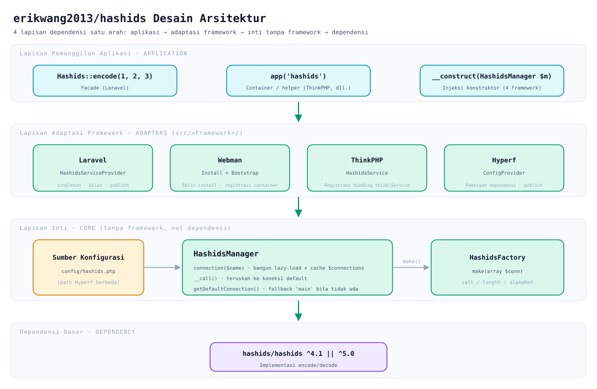
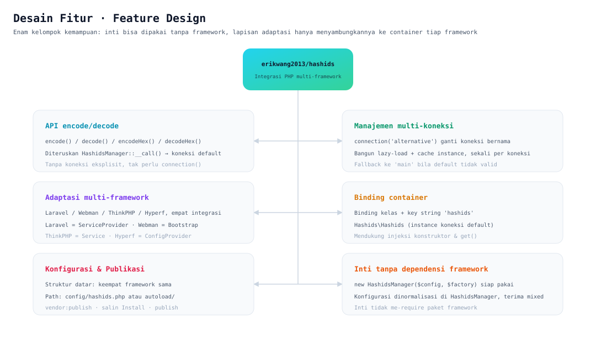
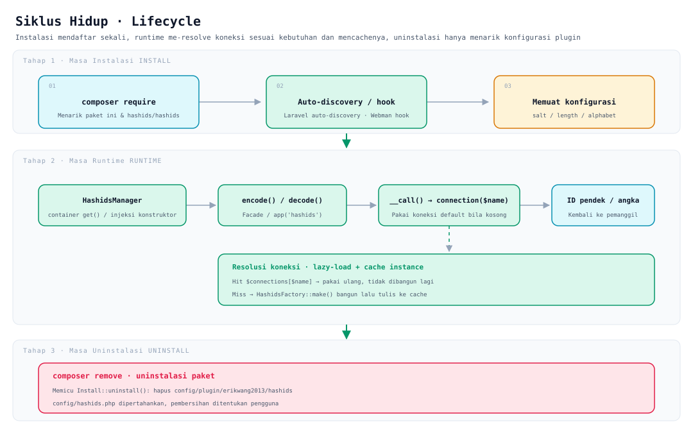

# erikwang2013/hashids

**Languages:** [中文](../../../README.md) · [English](../en/README.md) · [한국어](../ko/README.md) · [Русский](../ru/README.md) · [Deutsch](../de/README.md) · [Français](../fr/README.md) · [Español](../es/README.md) · [Português](../pt/README.md) · [हिन्दी](../hi/README.md) · [العربية](../ar/README.md) · [বাংলা](../bn/README.md) · **Bahasa Indonesia** · [日本語](../ja/README.md)

<p align="center">
  
</p>

<p align="center"><strong>Hashy</strong> — maskot proyek; tanda <code>#</code> di dadanya adalah ciri khasnya</p>

Ubah ID auto-increment basis data menjadi string pendek yang sulit ditebak — **satu API yang sama berjalan di Laravel, Webman, ThinkPHP, dan Hyperf**.

Lapisan bawahnya bergantung pada [`hashids/hashids`](https://github.com/vinkla/hashids) v5; konfigurasi dan cara pakainya selaras dengan [**vinkla/hashids**](https://github.com/vinkla/laravel-hashids) (multi-koneksi, koneksi default, `HashidsManager` + factory), sehingga bisa digantikan dengan mulus.

## Tentang Proyek

**Hashids** adalah pembuat ID pendek yang mengodekan ID numerik (misalnya primary key basis data) menjadi string pendek, unik, dan sulit ditebak. Berbeda dari UUID atau snowflake ID — Hashids lebih cocok untuk skenario yang berhadapan langsung dengan pengguna (URL, kode berbagi, nomor pesanan, dan sebagainya), menyembunyikan angka asli sambil tetap pendek dan mudah dibaca.

Paket `erikwang2013/hashids` ini adalah **lapisan integrasi multi-framework PHP** untuk Hashids; desainnya mengacu dan menyelaraskan diri dengan gaya API [vinkla/hashids](https://github.com/vinkla/laravel-hashids) (multi-koneksi, koneksi default, pola Manager + Factory), lalu diperluas untuk mendukung framework PHP lain yang umum dipakai.

**Fitur utama:**

- **Kompatibel multi-framework**: satu API yang sama mendukung Laravel, Webman, ThinkPHP, dan Hyperf sekaligus, biaya migrasinya sangat rendah.
- **Dukungan multi-koneksi**: satu aplikasi dapat mengonfigurasi beberapa kombinasi Salt/Length sekaligus (misalnya ID pengguna dan ID pesanan memakai salt berbeda), beralih lewat `connection('xxx')`.
- **Tanpa ketergantungan framework**: bisa dipakai mandiri tanpa framework apa pun; cukup `new HashidsManager($config, $factory)` dan langsung bekerja.
- **Selaras dengan vinkla/hashids**: di Laravel, Facade, binding container, dan format `config/hashids.php` semuanya sama dengan vinkla/hashids, jadi bisa digantikan dengan mulus.
- **Gaya asli tiap framework**: setiap integrasi mengikuti kebiasaan framework masing-masing — Laravel memakai ServiceProvider + Facade, Webman memakai Plugin + Bootstrap, ThinkPHP memakai Service, Hyperf memakai ConfigProvider.

**Skenario penggunaan:**

| Skenario | Keterangan |
|------|------|
| Menyembunyikan ID auto-increment | Memetakan `user_id=100` menjadi `/user/3kTMd`, agar skala bisnis tidak terekspos |
| Membuat tautan pendek / kode berbagi | Lebih pendek daripada UUID, lebih terkendali daripada string acak |
| Nomor pesanan / nomor transaksi | Mudah dibaca, memudahkan komunikasi dengan dukungan pelanggan dan penelusuran log |
| Isolasi multi-tenant / multi-modul | Koneksi berbeda memakai Salt berbeda, sehingga ruang pengodeannya saling independen |

**Perhatian:**

- Hashids adalah **pengodean (encode/decode), bukan enkripsi**. Salt hanya menambah kesulitan menebak, dan tidak boleh dipakai untuk skenario yang sensitif terhadap keamanan (seperti token atau kata sandi).
- Jika Salt atau Length diubah setelah aplikasi rilis, semua ID yang sudah dikodekan menjadi tidak valid; rencanakan dan tetapkan konfigurasinya sejak awal.

## Struktur Proyek

```
hashids/
├── src/
│   ├── HashidsManager.php                     # Inti: resolusi multi-koneksi, cache instance, proxy koneksi default
│   ├── HashidsFactory.php                     # Inti: bangun instance Hashids dari konfigurasi koneksi
│   ├── Mascot.php                             # Versi ASCII maskot proyek "Hashy"
│   ├── Install.php                            # Hook instalasi / uninstalasi Webman
│   ├── Laravel/
│   │   ├── HashidsServiceProvider.php         # Singleton container + alias + publikasi konfigurasi
│   │   └── Facades/Hashids.php                # Facade (koneksi default)
│   ├── Webman/
│   │   └── Bootstrap.php                      # Daftarkan definisi container saat proses start
│   ├── ThinkPHP/
│   │   └── HashidsService.php                 # Registrasi binding think\Service
│   ├── Hyperf/
│   │   ├── ConfigProvider.php                 # Pemetaan dependensi + publikasi konfigurasi
│   │   ├── HashidsManagerFactory.php
│   │   └── HashidsClientFactory.php
│   └── config/plugin/erikwang2013/hashids/    # Kerangka plugin Webman (disalin ke proyek saat instalasi)
│       ├── app.php                            # Sakelar enable
│       └── bootstrap.php                      # Daftarkan Webman\Bootstrap
├── config/
│   ├── hashids.php                            # Konfigurasi datar: Laravel / Webman / ThinkPHP
│   └── autoload/hashids.php                   # Konfigurasi Hyperf (struktur sama, path berbeda)
├── tests/
│   ├── HashidsManagerTest.php                 # Perilaku inti
│   ├── HashidsFactoryTest.php
│   ├── InstallTest.php
│   ├── MascotTest.php                         # Maskot proyek: perataan glyph dan sapaan
│   ├── Laravel/ · Webman/ · ThinkPHP/ · Hyperf/   # Tes adaptasi tiap framework
│   ├── Config/PluginConfigTest.php
│   └── Support/FrameworkStubs.php             # Stub kelas framework untuk pengujian
├── docs/
│   ├── mascot.svg                             # Maskot proyek "Hashy"
│   ├── architecture.svg                       # Diagram desain arsitektur
│   ├── features.svg                           # Diagram desain fitur
│   └── lifecycle.svg                          # Diagram siklus hidup
├── .github/workflows/release.yml              # Otomatis membuat tag dan release setelah push ke main
├── composer.json
└── phpunit.xml.dist
```

> Artefak dependensi seperti `vendor/` dan `composer.lock` tidak dicantumkan; `src/config/` adalah **kerangka plugin**, sedangkan `config/` adalah **contoh konfigurasi yang bisa dipublikasikan** — keduanya berbeda kegunaan.

## Desain Arsitektur



**Empat lapisan dengan dependensi satu arah**: lapisan atas bergantung pada lapisan bawah, tidak berlaku sebaliknya:

| Lapisan | Tanggung jawab | Lokasi |
|----|------|------|
| Lapisan pemanggilan aplikasi | Tiga pintu masuk: Facade, container / helper, injeksi konstruktor | Kode bisnis |
| Lapisan adaptasi framework | Hanya menyambungkan: binding container, pembacaan konfigurasi, publikasi konfigurasi | `src/<Framework>/` |
| Lapisan inti | Manajemen multi-koneksi dan pembangunan instance, **tidak bergantung pada framework apa pun** | `src/HashidsManager.php`, `src/HashidsFactory.php` |
| Dependensi dasar | Implementasi encode/decode sesungguhnya | `hashids/hashids` |

Lapisan inti adalah jantung paket ini: `HashidsManager` menyimpan konfigurasi, `connection($name)` membangun dan mencache koneksi sesuai kebutuhan, `__call()` meneruskan pemanggilan metode tanpa koneksi eksplisit ke koneksi default; `HashidsFactory::make()` adalah satu-satunya tempat `Hashids\Hashids` dikonstruksi. Kelas adaptasi keempat framework bila dijumlahkan hanya sekitar 250 baris (termasuk Facade dan dua factory Hyperf) — semuanya hanya bertugas menyambungkan inti ke container masing-masing.

## Desain Fitur



Enam kelompok kemampuan, semuanya berpusat pada satu inti yang sama:

- **API encode/decode**: `encode()` / `decode()` / `encodeHex()` / `decodeHex()`, lewat `__call()` bermuara ke koneksi default, tanpa perlu `connection()` eksplisit.
- **Manajemen multi-koneksi**: beralih dengan `connection('alternative')`; dibangun secara lazy-load, satu koneksi hanya dibangun sekali.
- **Adaptasi multi-framework**: Laravel memakai `ServiceProvider`, Webman memakai `Install` + `Bootstrap`, ThinkPHP memakai `Service`, Hyperf memakai `ConfigProvider`; masing-masing mengikuti kebiasaan framework-nya.
- **Binding container**: binding dua jalur — nama kelas (`HashidsManager`, `HashidsFactory`, `Hashids\Hashids`) dan key string (`'hashids'`, `'hashids.factory'`, `'hashids.connection'`) — konsisten di keempat framework; dua key string terakhir sama dengan vinkla/hashids, memudahkan migrasi.
- **Konfigurasi dan publikasi**: struktur keempat framework sama, semuanya **array datar** (`default` + `connections` di tingkat akar), hanya path file yang berbeda.
- **Inti tanpa ketergantungan framework**: `new HashidsManager($config, $factory)` langsung bekerja; parameter `$config` toleran terhadap nilai non-array (dinormalisasi menjadi array kosong).

## Siklus Hidup



| Tahap | Yang terjadi |
|------|-----------|
| **Masa instalasi** | `composer require` menarik paket → auto-discovery Laravel / hook instalasi Webman menyalin kerangka plugin → memuat `salt` / `length` / `alphabet` |
| **Masa runtime** | Container me-resolve `HashidsManager` → `encode()` / `decode()` → `__call()` meneruskan ke `connection($name)` → **cache hit langsung dipakai ulang, hanya saat miss `HashidsFactory::make()` membangun lalu menulis ke `$connections`** → mengembalikan ID pendek atau angka asli |
| **Masa uninstalasi** | `composer remove` memicu `Install::uninstall()`, menghapus `config/plugin/erikwang2013/hashids`; **`config/hashids.php` tetap dipertahankan**, apakah dibersihkan ditentukan pengguna |

Koneksi dibangun **sesuai kebutuhan**: proses yang hanya memanggil koneksi default tidak menanggung biaya pembangunan apa pun untuk koneksi tak terpakai seperti `alternative`.

## Instalasi

```bash
composer require erikwang2013/hashids
```

## Struktur Konfigurasi (Laravel / Webman / ThinkPHP)

Sama dengan `config/hashids.php` di repositori:

- `default`: nama koneksi default (misalnya `main`).
- `connections`: nama koneksi => `salt`, `length`, opsional `alphabet`.

> **Hyperf** path file konfigurasinya berbeda (`config/autoload/hashids.php`), tetapi strukturnya sama; lihat bagian Hyperf di bawah.

## Penggunaan Tanpa Framework

Manajer dapat diinstansiasi secara langsung:

```php
use Erikwang2013\Hashids\HashidsFactory;
use Erikwang2013\Hashids\HashidsManager;

$manager = new HashidsManager(
    require __DIR__ . '/config/hashids.php',
    new HashidsFactory()
);

$hash = $manager->encode(1, 2, 3);
$ids = $manager->decode($hash);
```

---

## Laravel

Mirip dengan [vinkla/hashids](https://github.com/vinkla/laravel-hashids): mendaftarkan `HashidsManager` ke container, multi-koneksi; koneksi default mendukung Facade dan penerusan metode.

Laravel 5.5+ membaca `extra.laravel` pada `composer.json` paket ini, lalu otomatis mendaftarkan `HashidsServiceProvider` dan alias Facade `Hashids`.

**Publikasi konfigurasi (opsional)**

```bash
php artisan vendor:publish --tag=hashids-config
```

Menghasilkan `config/hashids.php`. Jika tidak dipublikasikan, paket akan menggabungkan konfigurasi default bawaannya pada tahap registrasi.

**Facade (koneksi default)**

```php
use Erikwang2013\Hashids\Laravel\Facades\Hashids;

$hash = Hashids::encode(1, 2, 3);
$numbers = Hashids::decode($hash);
```

**Menentukan koneksi**

```php
use Erikwang2013\Hashids\Laravel\Facades\Hashids;

$hash = Hashids::connection('alternative')->encode(100);
```

**Injeksi dependensi `HashidsManager`**

```php
use Erikwang2013\Hashids\HashidsManager;

public function __construct(private HashidsManager $hashids) {}

$this->hashids->encode(1);
$this->hashids->connection('alternative')->encode(2);
```

**Injeksi `Hashids\Hashids` lapisan dasar (koneksi default)**

```php
use Hashids\Hashids;

public function __construct(private Hashids $hashids) {}
```

Menjalankan integrasi Laravel memerlukan `laravel/framework` yang sudah terpasang di proyek (termasuk `illuminate/support` dan sebagainya). Paket ini mencantumkan `illuminate/*` sebagai **require-dev**, hanya untuk pengujian paket itu sendiri.

---

## Webman

Melalui **`Install`**, saat instalasi paket menyalin `config/plugin/erikwang2013/hashids` beserta **`config/hashids.php`** di direktori akar, lalu **bootstrap** plugin mendaftarkan `HashidsManager` ke container Webman.

Jika `composer.json` proyek sudah memiliki hook `support\Plugin::install` / `update` / `uninstall`, skrip instalasi akan dijalankan otomatis saat paket ini dipasang (`WEBMAN_PLUGIN = true`).

**Berkas setelah instalasi**

- `config/plugin/erikwang2013/hashids/app.php`: sakelar `enable`.
- `config/plugin/erikwang2013/hashids/bootstrap.php`: mendaftarkan `Erikwang2013\Hashids\Webman\Bootstrap`.
- `config/hashids.php`: konfigurasi multi-koneksi (ditulis saat instalasi pertama atau saat penimpaan dikonfirmasi).

Jika penyalinan otomatis tidak dijalankan, contoh konfigurasi pada path di atas dapat disalin manual dari dalam paket.

**Menonaktifkan plugin** (`config/plugin/erikwang2013/hashids/app.php`)

```php
<?php
return [
    'enable' => false,
];
```

**Binding container**

- `Erikwang2013\Hashids\HashidsManager` / `'hashids'`
- `Erikwang2013\Hashids\HashidsFactory` / `'hashids.factory'`
- `Hashids\Hashids` / `'hashids.connection'` (instance koneksi default)

**Contoh controller**

```php
use support\Request;
use Erikwang2013\Hashids\HashidsManager;
use Hashids\Hashids;

class DemoController
{
    public function index(Request $request, HashidsManager $manager)
    {
        $hash = $manager->encode(1, 2, 3);

        $client = \support\Container::instance()->get(Hashids::class);
        $hash2 = $client->encode(4);

        return json(['hash' => $hash, 'hash2' => $hash2]);
    }
}
```

**Menentukan koneksi**

```php
$manager->connection('alternative')->encode(99);
```

Saat paket di-uninstall, Composer memicu `Plugin::uninstall` dan menghapus `config/plugin/erikwang2013/hashids`; **tidak** menghapus `config/hashids.php` — keputusan menyimpannya ada di tangan Anda.

---

## ThinkPHP

Mendaftarkan `HashidsManager` melalui **kelas service kustom**; konfigurasinya tetap **`config/hashids.php`** dengan `default` dan `connections` di tingkat teratas.

**Mendaftarkan service**

Tambahkan ke `services` pada **`config/service.php`** aplikasi (path persisnya bisa berbeda tergantung versi TP):

```php
<?php

return [
    // ...
    \Erikwang2013\Hashids\ThinkPHP\HashidsService::class,
];
```

Jika memakai `app/AppService.php` tingkat aplikasi, binding yang setara juga bisa ditulis di dalam `register()`.

**Berkas konfigurasi**

Salin `config/hashids.php` dari dalam paket ke `config/hashids.php` aplikasi (atau gabungkan sendiri konfigurasi bernama sama).

```php
<?php
return [
    'default' => 'main',
    'connections' => [
        'main' => [
            'salt' => env('HASHIDS_SALT', ''),
            'length' => (int) env('HASHIDS_LENGTH', 0),
        ],
    ],
];
```

**Contoh penggunaan**

```php
use Erikwang2013\Hashids\HashidsManager;
use think\facade\App;

$manager = App::make(HashidsManager::class);
$hash = $manager->encode(10, 20);
```

```php
$manager = app('hashids');
```

```php
use Hashids\Hashids;

$client = app(Hashids::class);
$hash = $client->encode(1);
```

```php
app(HashidsManager::class)->connection('alternative')->encode(100);
```

Integrasi ThinkPHP mewarisi `think\Service` dan harus dipakai di lingkungan **`topthink/framework`** (paket ini mencantumkannya sebagai suggest).

---

## Hyperf

Composer memuat `ConfigProvider` melalui **`extra.hyperf.config`**, lalu mendaftarkan `HashidsFactory`, `HashidsManager`, dan `Hashids\Hashids` untuk koneksi default ke dalam container.

Salin **`config/autoload/hashids.php`** dari dalam paket ke **`config/autoload/hashids.php`** proyek (atau gunakan perintah publikasi konfigurasi milik proyek).

File tersebut harus mengembalikan **array datar** (`default` + `connections` di tingkat akar).

`ConfigFactory` Hyperf menggabungkan berdasarkan **nama file** (`Arr::set($config, 'hashids', require $file)`), jadi `config('hashids')` mengembalikan isi file itu sendiri — **jangan menambahkan lapisan `'hashids' =>` lagi**. Jika ditambahkan, `connections` menjadi tidak terjangkau dan saat mengambil koneksi akan melempar `Hashids connection [main] is not configured`.

```php
<?php

declare(strict_types=1);

return [
    'default' => 'main',
    'connections' => [
        'main' => [
            'salt' => env('HASHIDS_SALT', ''),
            'length' => (int) env('HASHIDS_LENGTH', 0),
        ],
    ],
];
```

**Binding container**

| Abstraksi | Implementasi |
|------|------|
| `Erikwang2013\Hashids\HashidsFactory` / `'hashids.factory'` | Konstruksi default |
| `Erikwang2013\Hashids\HashidsManager` / `'hashids'` | `HashidsManagerFactory` |
| `Hashids\Hashids` / `'hashids.connection'` | `HashidsClientFactory` (koneksi default) |

**Controller / injeksi konstruktor**

```php
<?php

declare(strict_types=1);

namespace App\Controller;

use Erikwang2013\Hashids\HashidsManager;
use Hashids\Hashids;

class DemoController
{
    public function index(HashidsManager $manager, Hashids $hashids)
    {
        $h1 = $manager->encode(1, 2, 3);
        $h2 = $hashids->encode(4);
        $alt = $manager->connection('alternative')->encode(99);

        return compact('h1', 'h2', 'alt');
    }
}
```

```php
$manager = \Hyperf\Context\ApplicationContext::getContainer()->get(
    \Erikwang2013\Hashids\HashidsManager::class
);
```

Struktur konfigurasi keempat framework sama (`default` + `connections` di tingkat akar); hanya path filenya yang berbeda: Hyperf memakai **`config/autoload/hashids.php`**, sedangkan Laravel / Webman / ThinkPHP memakai **`config/hashids.php`**.

---

## Maskot Proyek

Maskot proyek ini adalah **Hashy** — makhluk kotak bersudut tumpul dengan antena di kepala dan tanda `#` di dadanya; gambar vektornya ada di [`docs/mascot.svg`](../../mascot.svg).

Terminal tidak mendukung SVG, jadi tersedia versi ASCII yang setara di dalam kode (`Erikwang2013\Hashids\Mascot`):

```php
use Erikwang2013\Hashids\Mascot;

echo Mascot::greet();
```

```
           ●
           │
      ╭─────────╮
      │ ◉     ◉ │
      │    ‿    │
      │    #    │
      ╰──┬───┬──╯
         ╵   ╵
哈希迪 Hashy · 把数据库自增 ID 换成短小、不可猜测的字符串
```

Plugin Webman mencetak sapaan ini sekali saat pertama kali mempublikasikan `config/hashids.php`; bila konfigurasi sudah ada (misalnya saat `composer update` dijalankan ulang), sapaan tidak diulang.

---

## Open Source Tidak Mudah, Dukungan Anda Sangat Kami Harapkan

<p align="center">
  
  &nbsp;&nbsp;&nbsp;&nbsp;
  
</p>

<p align="center"><strong>WeChat Pay</strong>&nbsp;&nbsp;&nbsp;&nbsp;&nbsp;&nbsp;&nbsp;&nbsp;&nbsp;&nbsp;&nbsp;&nbsp;&nbsp;&nbsp;&nbsp;&nbsp;<strong>Alipay</strong></p>

---


## Lisensi

MIT. See [LICENSE](../../../LICENSE).
