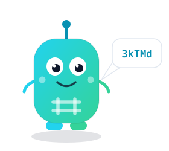
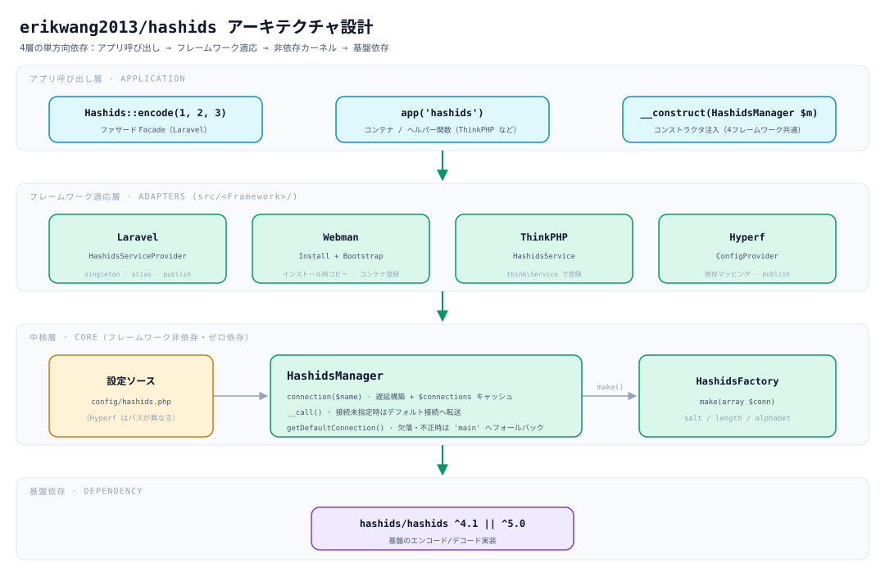
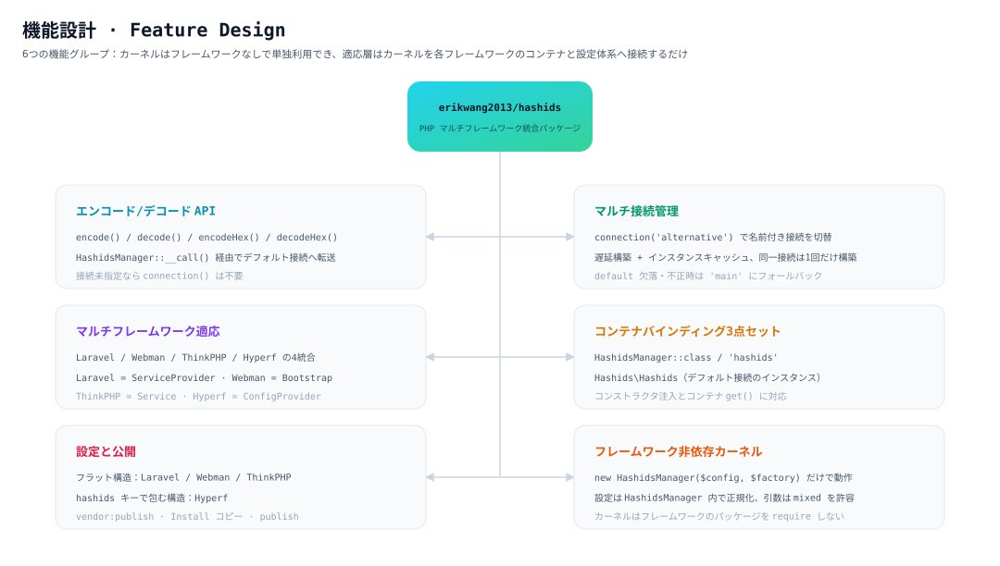
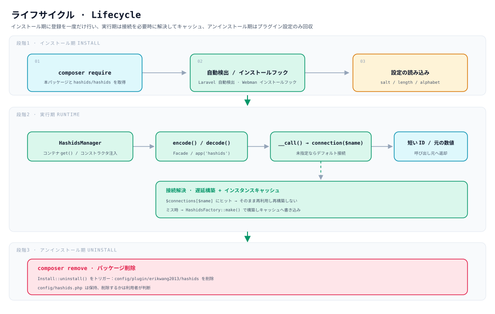

# erikwang2013/hashids

**Languages:** [中文](../../../README.md) · [English](../en/README.md) · [한국어](../ko/README.md) · [Русский](../ru/README.md) · [Deutsch](../de/README.md) · [Français](../fr/README.md) · [Español](../es/README.md) · [Português](../pt/README.md) · [हिन्दी](../hi/README.md) · [العربية](../ar/README.md) · [বাংলা](../bn/README.md) · [Bahasa Indonesia](../id/README.md) · **日本語**

<p align="center">
  
</p>

<p align="center"><strong>ハシディ Hashy</strong> — プロジェクトマスコット。胸の <code>#</code> がトレードマークです</p>

データベースの自動採番 ID を、短くて推測しにくい文字列に置き換えます。**ひとつの API が Laravel、Webman、ThinkPHP、Hyperf で同時に動作します**。

基盤として [`hashids/hashids`](https://github.com/vinkla/hashids) v5 に依存しています。設定と使い方は [**vinkla/hashids**](https://github.com/vinkla/laravel-hashids)（マルチ接続、デフォルト接続、`HashidsManager` + ファクトリ）に合わせてあり、スムーズに置き換えられます。

## プロジェクト概要

**Hashids** は短い ID のジェネレータで、数値 ID（データベースの主キーなど）を短く・一意で・推測しにくい文字列にエンコードします。UUID や Snowflake ID とは異なり、Hashids はユーザーに見える場面（URL、共有コード、注文番号など）に適しており、短く読みやすいまま元の数値を隠せます。

本パッケージ `erikwang2013/hashids` は Hashids の **PHP マルチフレームワーク統合レイヤー**です。設計は [vinkla/hashids](https://github.com/vinkla/laravel-hashids) の API スタイル（マルチ接続、デフォルト接続、Manager + Factory パターン）を参考に合わせつつ、中国でよく使われる他の PHP フレームワークへの対応を追加しています。

**主な特徴：**

- **マルチフレームワーク対応**：同一の API で Laravel、Webman、ThinkPHP、Hyperf を同時にサポートし、移行コストはごくわずかです。
- **マルチ接続対応**：1 つのアプリで複数の Salt/Length の組み合わせを同時に設定でき（ユーザー ID と注文 ID で別のソルトを使うなど）、`connection('xxx')` で切り替えられます。
- **フレームワーク非依存**：特定のフレームワークに依存せず単独で使え、`new HashidsManager($config, $factory)` だけで動作します。
- **vinkla/hashids との整合**：Laravel における Facade、コンテナバインディング、`config/hashids.php` の形式はいずれも vinkla/hashids と一致し、スムーズに置き換えられます。
- **フレームワーク本来の流儀**：各フレームワークの統合はそれぞれの慣用法に従います——Laravel は ServiceProvider + Facade、Webman は Plugin + Bootstrap、ThinkPHP は Service、Hyperf は ConfigProvider です。

**想定される用途：**

| 用途 | 説明 |
|------|------|
| データベースの自動採番 ID を隠す | `user_id=100` を `/user/3kTMd` にマッピングし、事業規模の露出を防ぎます |
| 短縮リンク / 共有コードの生成 | UUID より短く、ランダム文字列より制御しやすい |
| 注文番号 / 連番 | 可読性が高く、サポート対応やログ調査が容易 |
| マルチテナント / マルチモジュールの分離 | 接続ごとに異なる Salt を使い、エンコード空間を互いに独立させます |

**注意事項：**

- Hashids は **暗号化ではなくエンコード（encode/decode）** です。Salt は推測を難しくするだけで、セキュリティが重要な場面（トークン、パスワードなど）には使えません。
- リリース後に Salt や Length を変更すると、エンコード済みの ID はすべて無効になります。事前に設計して設定を固定してください。

## プロジェクト構成

```
hashids/
├── src/
│   ├── HashidsManager.php                     # コア：マルチ接続の解決、インスタンスキャッシュ、デフォルト接続の代理
│   ├── HashidsFactory.php                     # コア：接続設定から Hashids インスタンスを構築
│   ├── Mascot.php                             # プロジェクトマスコット「ハシディ Hashy」の ASCII 版
│   ├── Install.php                            # Webman のインストール / アンインストールフック
│   ├── Laravel/
│   │   ├── HashidsServiceProvider.php         # コンテナのシングルトン + エイリアス + 設定の公開
│   │   └── Facades/Hashids.php                # Facade（デフォルト接続）
│   ├── Webman/
│   │   └── Bootstrap.php                      # プロセス起動時にコンテナ定義を登録
│   ├── ThinkPHP/
│   │   └── HashidsService.php                 # think\Service の登録バインディング
│   ├── Hyperf/
│   │   ├── ConfigProvider.php                 # 依存マッピング + 設定の公開
│   │   ├── HashidsManagerFactory.php
│   │   └── HashidsClientFactory.php
│   └── config/plugin/erikwang2013/hashids/    # Webman プラグインの骨組み（インストール時にプロジェクトへコピー）
│       ├── app.php                            # enable スイッチ
│       └── bootstrap.php                      # Webman\Bootstrap を登録
├── config/
│   ├── hashids.php                            # フラット設定：Laravel / Webman / ThinkPHP
│   └── autoload/hashids.php                   # Hyperf 設定（外側を hashids キーで包む）
├── tests/
│   ├── HashidsManagerTest.php                 # コアの振る舞い
│   ├── HashidsFactoryTest.php
│   ├── InstallTest.php
│   ├── MascotTest.php                         # プロジェクトマスコット：字形の整列とあいさつ
│   ├── Laravel/ · Webman/ · ThinkPHP/ · Hyperf/   # 各フレームワークのアダプタテスト
│   ├── Config/PluginConfigTest.php
│   └── Support/FrameworkStubs.php             # テスト用のフレームワーククラス代替
├── docs/
│   ├── mascot.svg                             # プロジェクトマスコット「ハシディ Hashy」
│   ├── architecture.svg                       # アーキテクチャ設計図
│   ├── features.svg                           # 機能設計図
│   └── lifecycle.svg                          # ライフサイクル図
├── .github/workflows/release.yml              # main へのプッシュで自動的にタグを打ち release を作成
├── composer.json
└── phpunit.xml.dist
```

> `vendor/`、`composer.lock` などの依存生成物は記載していません。`src/config/` は**プラグインの骨組み**、`config/` は**公開用の設定サンプル**で、用途が異なります。

## アーキテクチャ設計



**4 層の単方向依存**で、上位層が下位層に依存し、逆方向は成立しません：

| 層 | 役割 | 場所 |
|----|------|------|
| アプリ呼び出し層 | Facade、コンテナ / ヘルパー関数、コンストラクタ注入の 3 つの入口 | 業務コード |
| フレームワーク適応層 | 配線のみ：コンテナバインディング、設定の読み込み、設定の公開 | `src/<Framework>/` |
| コア層 | マルチ接続管理とインスタンス構築、**フレームワークに一切依存しない** | `src/HashidsManager.php`、`src/HashidsFactory.php` |
| 基盤依存 | 実際のエンコード / デコード実装 | `hashids/hashids` |

コア層はこのパッケージの中心です：`HashidsManager` が設定を保持し、`connection($name)` が必要に応じて接続を構築してキャッシュし、`__call()` が接続を指定しないメソッド呼び出しをデフォルト接続へ転送します。`HashidsFactory::make()` は `Hashids\Hashids` を構築する唯一の場所です。4 つのフレームワークの適応クラスを合計しても約 250 行（Facade と Hyperf の 2 つのファクトリを含む）で、カーネルを各コンテナに接続することだけを担います。

## 機能設計



6 つの機能グループがあり、すべてが同じカーネルを中心にしています：

- **エンコード / デコード API**：`encode()` / `decode()` / `encodeHex()` / `decodeHex()` は `__call()` を経由してデフォルト接続に到達するため、`connection()` を明示する必要はありません。
- **マルチ接続管理**：`connection('alternative')` で切り替え。遅延構築で、同じ接続は一度だけ構築されます。
- **マルチフレームワーク適応**：Laravel は `ServiceProvider`、Webman は `Install` + `Bootstrap`、ThinkPHP は `Service`、Hyperf は `ConfigProvider` と、それぞれの慣用法に従います。
- **コンテナバインディング**：`HashidsManager::class`、`'hashids'`、`Hashids\Hashids`（デフォルト接続のインスタンス）の 3 点セットで、4 フレームワーク共通です。
- **設定と公開**：Laravel/Webman/ThinkPHP はフラット構造、Hyperf は `hashids` キーで包む構造です。
- **フレームワーク非依存カーネル**：`new HashidsManager($config, $factory)` だけで動作し、`$config` の引数は非配列も許容します（空配列に正規化）。

## ライフサイクル



| 段階 | 何が起こるか |
|------|-----------|
| **インストール期** | `composer require` でパッケージを取得 → Laravel の自動検出 / Webman のインストールフックがプラグインの骨組みをコピー → `salt` / `length` / `alphabet` を読み込み |
| **実行期** | コンテナが `HashidsManager` を解決 → `encode()` / `decode()` → `__call()` が `connection($name)` へ転送 → **キャッシュにヒットすればそのまま再利用し、ミスしたときだけ `HashidsFactory::make()` で構築して `$connections` に書き込み** → 短い ID または元の数値を返却 |
| **アンインストール期** | `composer remove` が `Install::uninstall()` をトリガーし、`config/plugin/erikwang2013/hashids` を削除；**`config/hashids.php` は保持され**、削除するかは利用者が判断 |

接続は**必要になったときにだけ構築**されます。デフォルト接続しか呼ばないプロセスは、`alternative` のような未使用の接続のために構築コストを払うことはありません。

## インストール

```bash
composer require erikwang2013/hashids
```

## 設定構造（Laravel / Webman / ThinkPHP）

リポジトリの `config/hashids.php` と一致します：

- `default`：デフォルトの接続名（例：`main`）。
- `connections`：接続名 => `salt`、`length`、任意で `alphabet`。

> **Hyperf** は別の設定ファイル形式（外側のキーが `hashids`）を使います。後述の Hyperf の節を参照してください。

## フレームワークなしでの使い方

マネージャを直接インスタンス化できます：

```php
use Erikwang2013\Hashids\HashidsFactory;
use Erikwang2013\Hashids\HashidsManager;

$manager = new HashidsManager(
    require __DIR__ . '/config/hashids.php',
    new HashidsFactory()
);

$hash = $manager->encode(1, 2, 3);
$ids = $manager->decode($hash);
```

---

## Laravel

[vinkla/hashids](https://github.com/vinkla/laravel-hashids) と同様です：コンテナに `HashidsManager` を登録し、マルチ接続に対応します。デフォルト接続では Facade とメソッド転送が使えます。

Laravel 5.5+ は本パッケージの `composer.json` の `extra.laravel` を読み取り、`HashidsServiceProvider` と Facade エイリアス `Hashids` を自動登録します。

**設定の公開（任意）**

```bash
php artisan vendor:publish --tag=hashids-config
```

`config/hashids.php` を生成します。公開しない場合、パッケージは登録段階で内蔵のデフォルト設定をマージします。

**Facade（デフォルト接続）**

```php
use Erikwang2013\Hashids\Laravel\Facades\Hashids;

$hash = Hashids::encode(1, 2, 3);
$numbers = Hashids::decode($hash);
```

**接続を指定する**

```php
use Erikwang2013\Hashids\Laravel\Facades\Hashids;

$hash = Hashids::connection('alternative')->encode(100);
```

**`HashidsManager` の依存注入**

```php
use Erikwang2013\Hashids\HashidsManager;

public function __construct(private HashidsManager $hashids) {}

$this->hashids->encode(1);
$this->hashids->connection('alternative')->encode(2);
```

**基盤の `Hashids\Hashids` を注入する（デフォルト接続）**

```php
use Hashids\Hashids;

public function __construct(private Hashids $hashids) {}
```

Laravel 統合を動作させるには、プロジェクトに `laravel/framework`（`illuminate/support` などを含む）がインストールされている必要があります。本パッケージは `illuminate/*` を **require-dev** としており、パッケージ自身のテスト専用です。

---

## Webman

インストール時に **`Install`** が `config/plugin/erikwang2013/hashids` とルートの **`config/hashids.php`** をコピーし、プラグインの **bootstrap** が Webman コンテナに `HashidsManager` を登録します。

プロジェクトの `composer.json` に `support\Plugin::install` / `update` / `uninstall` フックがすでにある場合、本パッケージのインストール時にインストールスクリプトが自動実行されます（`WEBMAN_PLUGIN = true`）。

**インストール後のファイル**

- `config/plugin/erikwang2013/hashids/app.php`：`enable` スイッチ。
- `config/plugin/erikwang2013/hashids/bootstrap.php`：`Erikwang2013\Hashids\Webman\Bootstrap` を登録。
- `config/hashids.php`：マルチ接続の設定（初回インストール時、または上書きを確認したときに書き込み）。

自動コピーが実行されなかった場合は、パッケージ内から上記パスのサンプル設定を手動でコピーしてください。

**プラグインを無効化する**（`config/plugin/erikwang2013/hashids/app.php`）

```php
<?php
return [
    'enable' => false,
];
```

**コンテナバインディング**

- `Erikwang2013\Hashids\HashidsManager`
- `'hashids'`
- `Hashids\Hashids`（デフォルト接続のインスタンス）

**コントローラの例**

```php
use support\Request;
use Erikwang2013\Hashids\HashidsManager;
use Hashids\Hashids;

class DemoController
{
    public function index(Request $request, HashidsManager $manager)
    {
        $hash = $manager->encode(1, 2, 3);

        $client = \support\Container::instance()->get(Hashids::class);
        $hash2 = $client->encode(4);

        return json(['hash' => $hash, 'hash2' => $hash2]);
    }
}
```

**接続を指定する**

```php
$manager->connection('alternative')->encode(99);
```

Composer でパッケージを削除すると `Plugin::uninstall` がトリガーされ、`config/plugin/erikwang2013/hashids` が削除されます；`config/hashids.php` は**削除されません**。残すかどうかはご自身で判断してください。

---

## ThinkPHP

**独自のサービスクラス**で `HashidsManager` を登録します。設定は引き続き、最上位に `default` と `connections` を持つ **`config/hashids.php`** です。

**サービスの登録**

アプリケーションの **`config/service.php`**（正確なパスは TP のバージョンによって異なる場合があります）の `services` に追加します：

```php
<?php

return [
    // ...
    \Erikwang2013\Hashids\ThinkPHP\HashidsService::class,
];
```

アプリケーション単位の `app/AppService.php` を使う場合は、`register()` に同等のバインディングを書くこともできます。

**設定ファイル**

パッケージ内の `config/hashids.php` をアプリケーションの `config/hashids.php` にコピーします（同名の設定を自分でマージしてもかまいません）。

```php
<?php
return [
    'default' => 'main',
    'connections' => [
        'main' => [
            'salt' => env('HASHIDS_SALT', ''),
            'length' => (int) env('HASHIDS_LENGTH', 0),
        ],
    ],
];
```

**使用例**

```php
use Erikwang2013\Hashids\HashidsManager;
use think\facade\App;

$manager = App::make(HashidsManager::class);
$hash = $manager->encode(10, 20);
```

```php
$manager = app('hashids');
```

```php
use Hashids\Hashids;

$client = app(Hashids::class);
$hash = $client->encode(1);
```

```php
app(HashidsManager::class)->connection('alternative')->encode(100);
```

ThinkPHP 統合は `think\Service` を継承しているため、**`topthink/framework`** 環境で使う必要があります（本パッケージでは suggest に指定）。

---

## Hyperf

Composer の **`extra.hyperf.config`** が `ConfigProvider` を読み込み、コンテナに `HashidsFactory`、`HashidsManager`、デフォルト接続の `Hashids\Hashids` を登録します。

パッケージ内の **`config/autoload/hashids.php`** をプロジェクトの **`config/autoload/hashids.php`** にコピーします（またはプロジェクトの設定公開コマンドを使います）。

このファイルは **最上位のキーを `hashids`** にする必要があり、`ConfigInterface::get('hashids')` で読み取られます。

```php
<?php

declare(strict_types=1);

return [
    'hashids' => [
        'default' => 'main',
        'connections' => [
            'main' => [
                'salt' => env('HASHIDS_SALT', ''),
                'length' => (int) env('HASHIDS_LENGTH', 0),
            ],
        ],
    ],
];
```

**コンテナバインディング**

| 抽象 | 実装 |
|------|------|
| `Erikwang2013\Hashids\HashidsFactory` | デフォルトのコンストラクタ |
| `Erikwang2013\Hashids\HashidsManager` | `HashidsManagerFactory` |
| `Hashids\Hashids` | `HashidsClientFactory`（デフォルト接続） |

**Controller / コンストラクタ注入**

```php
<?php

declare(strict_types=1);

namespace App\Controller;

use Erikwang2013\Hashids\HashidsManager;
use Hashids\Hashids;

class DemoController
{
    public function index(HashidsManager $manager, Hashids $hashids)
    {
        $h1 = $manager->encode(1, 2, 3);
        $h2 = $hashids->encode(4);
        $alt = $manager->connection('alternative')->encode(99);

        return compact('h1', 'h2', 'alt');
    }
}
```

```php
$manager = \Hyperf\Context\ApplicationContext::getContainer()->get(
    \Erikwang2013\Hashids\HashidsManager::class
);
```

Hyperf は **`config/autoload/hashids.php`** を使い、設定は **`hashids`** キーの下に置きます。Laravel / Webman / ThinkPHP はフラット構造（ルート直下の `default` + `connections`）です。形式を混在させないでください。

---

## プロジェクトマスコット

プロジェクトマスコットは **ハシディ Hashy**——頭の上にアンテナ、胸に `#` がプリントされた角丸の四角いマスコットで、ベクター画像は [`docs/mascot.svg`](../../mascot.svg) にあります。

ターミナルでは SVG を表示できないため、コード内に同等の ASCII 版（`Erikwang2013\Hashids\Mascot`）を用意しています：

```php
use Erikwang2013\Hashids\Mascot;

echo Mascot::greet();
```

```
           ●
           │
      ╭─────────╮
      │ ◉     ◉ │
      │    ‿    │
      │    #    │
      ╰──┬───┬──╯
         ╵   ╵
哈希迪 Hashy · 把数据库自增 ID 换成短小、不可猜测的字符串
```

Webman プラグインが `config/hashids.php` を初めて公開するときに、この挨拶を一度だけ一緒に出力します。設定がすでに存在する場合（`composer update` の再実行など）は繰り返し表示しません。

---

## オープンソースは容易ではありません、ご支援いただければ幸いです / Open Source is Not Easy, Your Support is Welcome

<p align="center">
  
  &nbsp;&nbsp;&nbsp;&nbsp;
  
</p>

<p align="center"><strong>WeChat Pay</strong>&nbsp;&nbsp;&nbsp;&nbsp;&nbsp;&nbsp;&nbsp;&nbsp;&nbsp;&nbsp;&nbsp;&nbsp;&nbsp;&nbsp;&nbsp;&nbsp;<strong>Alipay</strong></p>

---


## ライセンス

MIT ライセンスです。詳細は [LICENSE](../../../LICENSE) を参照してください。
