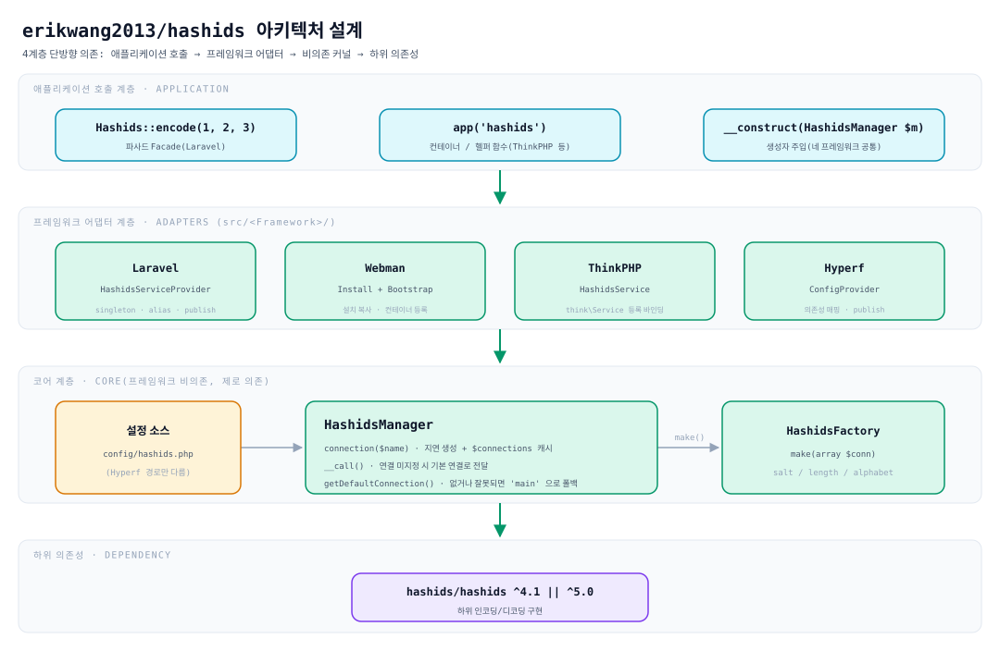
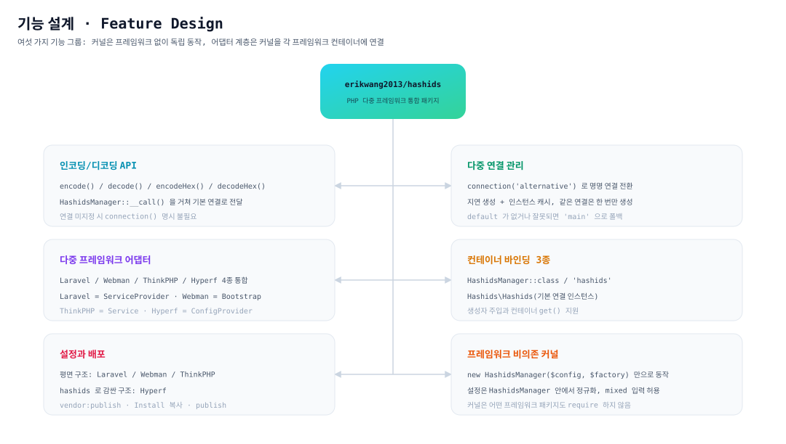
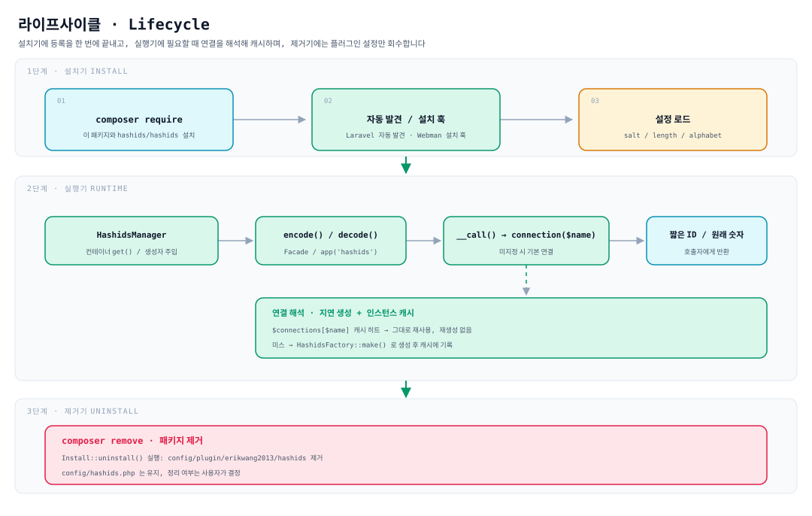

# erikwang2013/hashids

**Languages:** [中文](../../../README.md) · [English](../en/README.md) · **한국어** · [Русский](../ru/README.md) · [Deutsch](../de/README.md) · [Français](../fr/README.md) · [Español](../es/README.md) · [Português](../pt/README.md) · [हिन्दी](../hi/README.md) · [العربية](../ar/README.md) · [বাংলা](../bn/README.md) · [Bahasa Indonesia](../id/README.md) · [日本語](../ja/README.md)

<p align="center">
  
</p>

<p align="center"><strong>해시디 Hashy</strong> — 프로젝트 펫, 가슴의 <code>#</code> 가 트레이드마크</p>

데이터베이스 자동 증가 ID를 짧고 추측하기 어려운 문자열로 바꿉니다. **하나의 API로 Laravel, Webman, ThinkPHP, Hyperf에서 동시에 동작합니다**.

내부적으로 [`hashids/hashids`](https://github.com/vinkla/hashids) v5에 의존하며, 설정과 사용법은 [**vinkla/hashids**](https://github.com/vinkla/laravel-hashids)(다중 연결, 기본 연결, `HashidsManager` + 팩토리)에 맞춰져 있어 매끄럽게 교체할 수 있습니다.

## 프로젝트 소개

**Hashids** 는 숫자 ID(예: 데이터베이스 기본 키)를 짧고 고유하며 추측하기 어려운 문자열로 인코딩하는 숏 ID 생성기입니다. UUID나 스노우플레이크 ID와 달리 Hashids는 사용자에게 노출되는 영역(URL, 공유 코드, 주문 번호 등)에 더 적합하며, 짧고 읽기 쉬운 형태를 유지하면서 원래 숫자를 감춥니다.

이 패키지 `erikwang2013/hashids` 는 Hashids의 **PHP 다중 프레임워크 통합 계층** 으로, 설계상 [vinkla/hashids](https://github.com/vinkla/laravel-hashids) 의 API 스타일(다중 연결, 기본 연결, Manager + Factory 패턴)을 참고해 맞췄고, 그 밖에 널리 쓰이는 PHP 프레임워크까지 지원을 넓혔습니다.

**핵심 특징:**

- **다중 프레임워크 호환**: 동일한 API로 Laravel, Webman, ThinkPHP, Hyperf를 한 번에 지원해 마이그레이션 비용이 매우 낮습니다.
- **다중 연결 지원**: 하나의 애플리케이션에 여러 Salt/Length 조합을 동시에 설정할 수 있으며(예: 사용자 ID와 주문 ID에 서로 다른 솔트 사용), `connection('xxx')` 로 전환합니다.
- **프레임워크 비의존**: 특정 프레임워크 없이 독립적으로 사용할 수 있고, `new HashidsManager($config, $factory)` 만으로 동작합니다.
- **vinkla/hashids 정렬**: Laravel에서 Facade, 컨테이너 바인딩, `config/hashids.php` 형식이 모두 vinkla/hashids와 동일해 매끄럽게 교체할 수 있습니다.
- **프레임워크 네이티브 스타일**: 각 프레임워크 통합은 해당 관용구를 따릅니다 — Laravel은 ServiceProvider + Facade, Webman은 Plugin + Bootstrap, ThinkPHP는 Service, Hyperf는 ConfigProvider.

**적용 시나리오:**

| 시나리오 | 설명 |
|------|------|
| 데이터베이스 자동 증가 ID 숨기기 | `user_id=100` 을 `/user/3kTMd` 로 매핑해 비즈니스 규모 노출을 막습니다 |
| 단축 링크/공유 코드 생성 | UUID보다 짧고 무작위 문자열보다 통제 가능 |
| 주문 번호/거래 번호 | 가독성이 좋아 고객 응대와 로그 추적에 유리 |
| 멀티 테넌트/다중 모듈 격리 | 연결마다 다른 Salt를 써서 인코딩 공간을 서로 독립적으로 유지 |

**주의 사항:**

- Hashids는 **암호화가 아니라 인코딩(encode/decode)** 입니다. Salt는 추측 난이도만 높일 뿐이며, 보안에 민감한 용도(token, 비밀번호 등)에는 쓸 수 없습니다.
- 서비스 출시 후 Salt나 Length를 바꾸면 이미 인코딩된 모든 ID가 무효가 되므로, 미리 계획해 설정을 고정하세요.
- **Salt 를 비워 두면 보호가 없습니다**: 빈 salt 에서는 인코딩 결과를 열거할 수 있습니다(`encode(1)`, `encode(2)`… 순서가 예측 가능).
  `env('HASHIDS_SALT', '')` 로 쓸 때 환경 변수를 빠뜨려도 오류도 경고도 없이 조용히 빈 salt 로 내려갈 뿐이므로, 배포 전에 salt 가 설정되어 있는지 확인하세요.
- **상주 메모리 프레임워크(Webman / Hyperf)에서는 설정을 바꿔도 프로세스를 재시작해야 합니다**: `HashidsManager` 는 생성 시점에 설정을 스냅샷하고
  연결을 영구 캐시하므로, `config/hashids.php` 를 바꿔도(또는 설정 센터로 salt 를 교체해도) 핫 리로드되지 않고 `reload` 나 재시작 후에야 반영됩니다.

## 프로젝트 구조

```
hashids/
├── src/
│   ├── HashidsManager.php                     # 핵심: 다중 연결 해석, 인스턴스 캐시, 기본 연결 프록시
│   ├── HashidsFactory.php                     # 핵심: 연결 설정으로 Hashids 인스턴스 생성
│   ├── Mascot.php                             # 프로젝트 펫 「해시디 Hashy」의 ASCII 버전
│   ├── Install.php                            # Webman 설치 / 제거 훅
│   ├── Laravel/
│   │   ├── HashidsServiceProvider.php         # 컨테이너 싱글턴 + 별칭 + 설정 배포
│   │   └── Facades/Hashids.php                # Facade(기본 연결)
│   ├── Webman/
│   │   └── Bootstrap.php                      # 프로세스 시작 시 컨테이너 정의 등록
│   ├── ThinkPHP/
│   │   └── HashidsService.php                 # think\Service 등록 바인딩
│   ├── Hyperf/
│   │   ├── ConfigProvider.php                 # 의존성 매핑 + 설정 배포
│   │   ├── HashidsManagerFactory.php
│   │   └── HashidsClientFactory.php
│   └── config/plugin/erikwang2013/hashids/    # Webman 플러그인 스캐폴드(설치 시 프로젝트로 복사)
│       ├── app.php                            # enable 스위치
│       └── bootstrap.php                      # Webman\Bootstrap 등록
├── config/
│   ├── hashids.php                            # 평면 설정: Laravel / Webman / ThinkPHP
│   └── autoload/hashids.php                   # Hyperf 설정(구조는 동일, 경로만 다름)
├── tests/
│   ├── HashidsManagerTest.php                 # 핵심 동작
│   ├── HashidsFactoryTest.php
│   ├── InstallTest.php
│   ├── MascotTest.php                         # 프로젝트 펫: 글리프 정렬과 인사
│   ├── Laravel/ · Webman/ · ThinkPHP/ · Hyperf/   # 각 프레임워크 어댑터 테스트
│   ├── Config/PluginConfigTest.php
│   └── Support/FrameworkStubs.php             # 테스트용 프레임워크 클래스 스텁
├── docs/
│   ├── mascot.svg                             # 프로젝트 펫 「해시디 Hashy」
│   ├── architecture.svg                       # 아키텍처 설계도
│   ├── features.svg                           # 기능 설계도
│   └── lifecycle.svg                          # 라이프사이클 다이어그램
├── .github/workflows/release.yml              # main 푸시 후 자동 태그 및 릴리스
├── composer.json
└── phpunit.xml.dist
```

> `vendor/`, `composer.lock` 등 의존성 산출물은 나열하지 않았습니다. `src/config/` 는 **플러그인 스캐폴드**, `config/` 는 **배포 가능한 설정 예시** 로 용도가 다릅니다.

## 아키텍처 설계



**4계층 단방향 의존** — 상위 계층이 하위 계층에 의존하며 그 반대는 성립하지 않습니다:

| 계층 | 역할 | 위치 |
|----|------|------|
| 애플리케이션 호출 계층 | Facade, 컨테이너 / 헬퍼 함수, 생성자 주입 세 가지 진입점 | 비즈니스 코드 |
| 프레임워크 어댑터 계층 | 배선만 담당: 컨테이너 바인딩, 설정 읽기, 설정 배포 | `src/<Framework>/` |
| 코어 계층 | 다중 연결 관리와 인스턴스 생성, **어떤 프레임워크에도 의존하지 않음** | `src/HashidsManager.php`, `src/HashidsFactory.php` |
| 하위 의존성 | 실제 인코딩/디코딩 구현 | `hashids/hashids` |

코어 계층이 이 패키지의 중심입니다: `HashidsManager` 가 설정을 보유하고, `connection($name)` 이 필요할 때 연결을 만들어 캐시하며, `__call()` 이 연결을 지정하지 않은 메서드 호출을 기본 연결로 넘깁니다. `HashidsFactory::make()` 는 `Hashids\Hashids` 를 생성하는 유일한 지점입니다. 네 프레임워크의 어댑터 클래스를 모두 합쳐도 약 250줄(Facade와 Hyperf 팩토리 2개 포함)에 불과하며, 이들은 커널을 각자의 컨테이너에 연결하는 일만 합니다.

## 기능 설계



여섯 개의 기능 그룹이 모두 하나의 커널을 중심으로 묶여 있습니다:

- **인코딩/디코딩 API**: `encode()` / `decode()` / `encodeHex()` / `decodeHex()` 가 `__call()` 을 거쳐 기본 연결로 전달되므로 `connection()` 을 명시할 필요가 없습니다.
- **다중 연결 관리**: `connection('alternative')` 로 전환하며, 지연 생성 방식이라 같은 연결은 한 번만 만들어집니다.
- **다중 프레임워크 어댑터**: Laravel은 `ServiceProvider`, Webman은 `Install` + `Bootstrap`, ThinkPHP는 `Service`, Hyperf는 `ConfigProvider` 를 쓰며 각 프레임워크의 관용구를 따릅니다.
- **컨테이너 바인딩**: 클래스 이름(`HashidsManager`, `HashidsFactory`, `Hashids\Hashids`)과 문자열 키(`'hashids'`, `'hashids.factory'`, `'hashids.connection'`)의 이중 트랙 바인딩으로 네 프레임워크가 동일하며, 뒤의 두 문자열 키는 vinkla/hashids와 이름이 같아 마이그레이션이 쉽습니다.
- **설정과 배포**: 네 프레임워크의 구조가 동일하며 모두 **평면 배열**(루트 레벨 `default` + `connections`)이고, 파일 경로만 다릅니다.
- **프레임워크 비의존 커널**: `new HashidsManager($config, $factory)` 만으로 동작하며, `$config` 인자는 배열이 아니어도 허용됩니다(빈 배열로 정규화).

## 라이프사이클



| 단계 | 무슨 일이 일어나는가 |
|------|-----------|
| **설치기** | `composer require` 로 패키지 설치 → Laravel 자동 발견 / Webman 설치 훅이 플러그인 스캐폴드 복사 → `salt` / `length` / `alphabet` 로드 |
| **실행기** | 컨테이너가 `HashidsManager` 를 해석 → `encode()` / `decode()` → `__call()` 이 `connection($name)` 으로 전달 → **캐시에 있으면 그대로 재사용, 없을 때만 `HashidsFactory::make()` 로 만들어 `$connections` 에 기록** → 짧은 ID 또는 원래 숫자 반환 |
| **제거기** | `composer remove` 가 `Install::uninstall()` 을 실행해 `config/plugin/erikwang2013/hashids` 를 삭제; **`config/hashids.php` 는 남으며** 정리 여부는 사용자가 결정 |

연결은 **필요할 때 만들어집니다**: 기본 연결만 호출하는 프로세스는 `alternative` 처럼 쓰지 않는 연결에 아무런 생성 비용도 치르지 않습니다.

## 설치

```bash
composer require erikwang2013/hashids
```

> **실행 환경**: 하위 `hashids/hashids` 에는 `ext-bcmath` 또는 `ext-gmp` 중 하나가 **반드시** 필요하며, 없으면 첫 인코딩에서
> `RuntimeException: Missing math extension for Hashids` 가 발생합니다. 이 두 확장은 `hashids/hashids` 에서 `suggest` 에만 기재되어
> 있는데 Composer 2 는 suggest 를 더 이상 출력하지 않습니다 — 그래서 슬림 이미지(예: `php:8.3-fpm-alpine`)에서는 설치 시점에
> 아무 경고도 없다가 실행 시점에 터지고, Hashids 를 쓰는 모든 요청이 500 이 됩니다. 이 패키지 `composer.json` 의 `suggest` 에 두 키를 추가했지만, 확장이 활성화되어 있는지는 직접 확인해야 합니다.

## 설정 구조(Laravel / Webman / ThinkPHP)

저장소의 `config/hashids.php` 와 동일합니다:

- `default`: 기본 연결 이름(예: `main`).
- `connections`: 연결 이름 => `salt`, `length`, 선택적 `alphabet`.

> **Hyperf** 는 설정 파일 경로가 다를 뿐(`config/autoload/hashids.php`), 구조는 같습니다. 아래 Hyperf 절을 참고하세요.

## 프레임워크 없이 사용

관리자를 직접 인스턴스화할 수 있습니다:

```php
use Erikwang2013\Hashids\HashidsFactory;
use Erikwang2013\Hashids\HashidsManager;

$manager = new HashidsManager(
    require __DIR__ . '/config/hashids.php',
    new HashidsFactory()
);

$hash = $manager->encode(1, 2, 3);
$ids = $manager->decode($hash);
```

---

## Laravel

[vinkla/hashids](https://github.com/vinkla/laravel-hashids) 와 비슷합니다: 컨테이너에 `HashidsManager` 를 등록하고 다중 연결을 지원하며, 기본 연결은 Facade와 메서드 전달을 지원합니다.

Laravel 5.5+ 는 이 패키지 `composer.json` 의 `extra.laravel` 을 읽어 `HashidsServiceProvider` 와 Facade 별칭 `Hashids` 를 자동 등록합니다.

**설정 배포(선택)**

```bash
php artisan vendor:publish --tag=hashids-config
```

`config/hashids.php` 를 생성합니다. 배포하지 않으면 패키지가 등록 단계에서 내장 기본 설정을 병합합니다.

**Facade(기본 연결)**

```php
use Erikwang2013\Hashids\Laravel\Facades\Hashids;

$hash = Hashids::encode(1, 2, 3);
$numbers = Hashids::decode($hash);
```

**연결 지정**

```php
use Erikwang2013\Hashids\Laravel\Facades\Hashids;

$hash = Hashids::connection('alternative')->encode(100);
```

**`HashidsManager` 의존성 주입**

```php
use Erikwang2013\Hashids\HashidsManager;

public function __construct(private HashidsManager $hashids) {}

$this->hashids->encode(1);
$this->hashids->connection('alternative')->encode(2);
```

**하위 `Hashids\Hashids` 주입(기본 연결)**

```php
use Hashids\Hashids;

public function __construct(private Hashids $hashids) {}
```

Laravel 통합을 쓰려면 프로젝트에 `laravel/framework`(`illuminate/support` 등 포함)가 설치되어 있어야 합니다. 이 패키지는 `illuminate/*` 를 **require-dev** 로 두며, 이는 패키지 자체 테스트용입니다.

---

## Webman

설치 시 **`Install`** 이 `config/plugin/erikwang2013/hashids` 와 루트의 **`config/hashids.php`** 를 복사하고, 플러그인 **bootstrap** 이 Webman 컨테이너에 `HashidsManager` 를 등록합니다.

프로젝트 `composer.json` 에 `support\Plugin::install` / `update` / `uninstall` 훅이 이미 있으면 이 패키지를 설치할 때 설치 스크립트가 자동 실행됩니다(`WEBMAN_PLUGIN = true`).

**설치 후 파일**

- `config/plugin/erikwang2013/hashids/app.php`: `enable` 스위치.
- `config/plugin/erikwang2013/hashids/bootstrap.php`: `Erikwang2013\Hashids\Webman\Bootstrap` 등록.
- `config/hashids.php`: 다중 연결 설정(최초 설치이거나 덮어쓰기를 확인했을 때 기록).

자동 복사가 실행되지 않았다면 패키지 안에서 위 경로의 예시 설정을 직접 복사할 수 있습니다.

**플러그인 끄기** (`config/plugin/erikwang2013/hashids/app.php`)

```php
<?php
return [
    'enable' => false,
];
```

**컨테이너 바인딩**

- `Erikwang2013\Hashids\HashidsManager` / `'hashids'`
- `Erikwang2013\Hashids\HashidsFactory` / `'hashids.factory'`
- `Hashids\Hashids` / `'hashids.connection'`(기본 연결 인스턴스)

**컨트롤러 예시**

```php
use support\Request;
use Erikwang2013\Hashids\HashidsManager;
use Hashids\Hashids;

class DemoController
{
    public function index(Request $request, HashidsManager $manager)
    {
        $hash = $manager->encode(1, 2, 3);

        $client = \support\Container::instance()->get(Hashids::class);
        $hash2 = $client->encode(4);

        return json(['hash' => $hash, 'hash2' => $hash2]);
    }
}
```

**연결 지정**

```php
$manager->connection('alternative')->encode(99);
```

Composer 로 패키지를 제거하면 `Plugin::uninstall` 이 실행되어 `config/plugin/erikwang2013/hashids` 를 삭제합니다. **`config/hashids.php` 는 지우지 않으며**, 남길지는 직접 정하시면 됩니다.

---

## ThinkPHP

**사용자 정의 서비스 클래스** 로 `HashidsManager` 를 등록합니다. 설정은 여전히 최상위에 `default` 와 `connections` 를 가진 **`config/hashids.php`** 입니다.

**서비스 등록**

애플리케이션의 **`config/service.php`**(정확한 경로는 TP 버전에 따라 다를 수 있음) `services` 에 추가합니다:

```php
<?php

return [
    // ...
    \Erikwang2013\Hashids\ThinkPHP\HashidsService::class,
];
```

애플리케이션 수준 `app/AppService.php` 를 쓴다면 `register()` 에 동등한 바인딩을 작성해도 됩니다.

**설정 파일**

패키지 안의 `config/hashids.php` 를 애플리케이션 `config/hashids.php` 로 복사합니다(또는 같은 이름의 설정을 직접 병합).

```php
<?php
return [
    'default' => 'main',
    'connections' => [
        'main' => [
            'salt' => env('HASHIDS_SALT', ''),
            'length' => (int) env('HASHIDS_LENGTH', 0),
        ],
    ],
];
```

**사용 예시**

```php
use Erikwang2013\Hashids\HashidsManager;
use think\facade\App;

$manager = App::make(HashidsManager::class);
$hash = $manager->encode(10, 20);
```

```php
$manager = app('hashids');
```

```php
use Hashids\Hashids;

$client = app(Hashids::class);
$hash = $client->encode(1);
```

```php
app(HashidsManager::class)->connection('alternative')->encode(100);
```

ThinkPHP 통합은 `think\Service` 를 상속하므로 **`topthink/framework`** 환경에서 사용해야 합니다(이 패키지는 suggest로만 표기).

---

## Hyperf

Composer **`extra.hyperf.config`** 가 `ConfigProvider` 를 로드해 컨테이너에 `HashidsFactory`, `HashidsManager`, 기본 연결의 `Hashids\Hashids` 를 등록합니다.

패키지 안의 **`config/autoload/hashids.php`** 를 프로젝트 **`config/autoload/hashids.php`** 로 복사합니다(또는 프로젝트의 설정 배포 명령 사용).

이 파일은 **평면 배열**(루트 레벨 `default` + `connections`)을 반환해야 합니다.

Hyperf 의 `ConfigFactory` 는 **파일 이름**을 기준으로 설정을 병합하므로(`Arr::set($config, 'hashids', require $file)`), `config('hashids')` 가 반환하는 값이 곧 파일 내용 자체입니다 — **`'hashids' =>` 로 한 겹 더 감싸지 마세요**. 감싸면 `connections` 에 접근할 수 없어, 연결을 가져올 때 `Hashids connection [main] is not configured` 가 발생합니다.

```php
<?php

declare(strict_types=1);

return [
    'default' => 'main',
    'connections' => [
        'main' => [
            'salt' => env('HASHIDS_SALT', ''),
            'length' => (int) env('HASHIDS_LENGTH', 0),
        ],
    ],
];
```

**컨테이너 바인딩**

| 추상 | 구현 |
|------|------|
| `Erikwang2013\Hashids\HashidsFactory` / `'hashids.factory'` | 기본 생성 |
| `Erikwang2013\Hashids\HashidsManager` / `'hashids'` | `HashidsManagerFactory` |
| `Hashids\Hashids` / `'hashids.connection'` | `HashidsClientFactory`(기본 연결) |

**Controller / 생성자 주입**

```php
<?php

declare(strict_types=1);

namespace App\Controller;

use Erikwang2013\Hashids\HashidsManager;
use Hashids\Hashids;

class DemoController
{
    public function index(HashidsManager $manager, Hashids $hashids)
    {
        $h1 = $manager->encode(1, 2, 3);
        $h2 = $hashids->encode(4);
        $alt = $manager->connection('alternative')->encode(99);

        return compact('h1', 'h2', 'alt');
    }
}
```

```php
$manager = \Hyperf\Context\ApplicationContext::getContainer()->get(
    \Erikwang2013\Hashids\HashidsManager::class
);
```

네 프레임워크의 설정 구조는 동일하며(루트 레벨 `default` + `connections`), 파일 경로만 다릅니다: Hyperf는 **`config/autoload/hashids.php`**, Laravel / Webman / ThinkPHP는 **`config/hashids.php`** 를 사용합니다.

---

## 프로젝트 펫

프로젝트 펫은 **해시디 Hashy** — 머리 위에 안테나가 있고 가슴에 `#` 가 새겨진 둥근 사각형 펫입니다. 벡터 이미지는 [`docs/mascot.svg`](../../mascot.svg) 를 참고하세요.

터미널에는 SVG가 없으므로 코드에 동등한 ASCII 버전(`Erikwang2013\Hashids\Mascot`)을 남겨 두었습니다:

```php
use Erikwang2013\Hashids\Mascot;

echo Mascot::greet();
```

```
           ●
           │
      ╭─────────╮
      │ ◉     ◉ │
      │    ‿    │
      │    #    │
      ╰──┬───┬──╯
         ╵   ╵
哈希迪 Hashy · 把数据库自增 ID 换成短小、不可猜测的字符串
```

Webman 플러그인이 `config/hashids.php` 를 처음 배포할 때 이 인사를 한 번 출력합니다. 설정이 이미 있으면(예: `composer update` 반복 실행) 다시 출력하지 않습니다.

---

## 오픈소스는 쉽지 않습니다, 후원을 환영합니다

<p align="center">
  
  &nbsp;&nbsp;&nbsp;&nbsp;
  
</p>

<p align="center"><strong>WeChat Pay</strong>&nbsp;&nbsp;&nbsp;&nbsp;&nbsp;&nbsp;&nbsp;&nbsp;&nbsp;&nbsp;&nbsp;&nbsp;&nbsp;&nbsp;&nbsp;&nbsp;<strong>Alipay</strong></p>

---


## 라이선스

MIT. See [LICENSE](../../../LICENSE).
