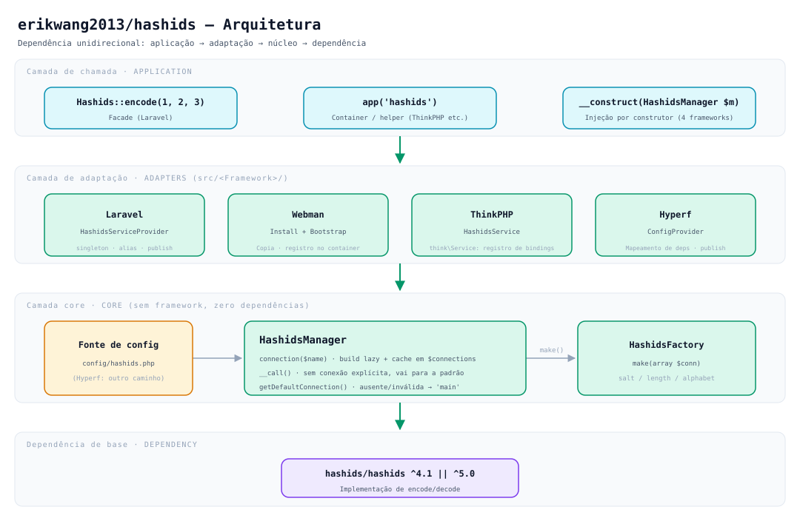
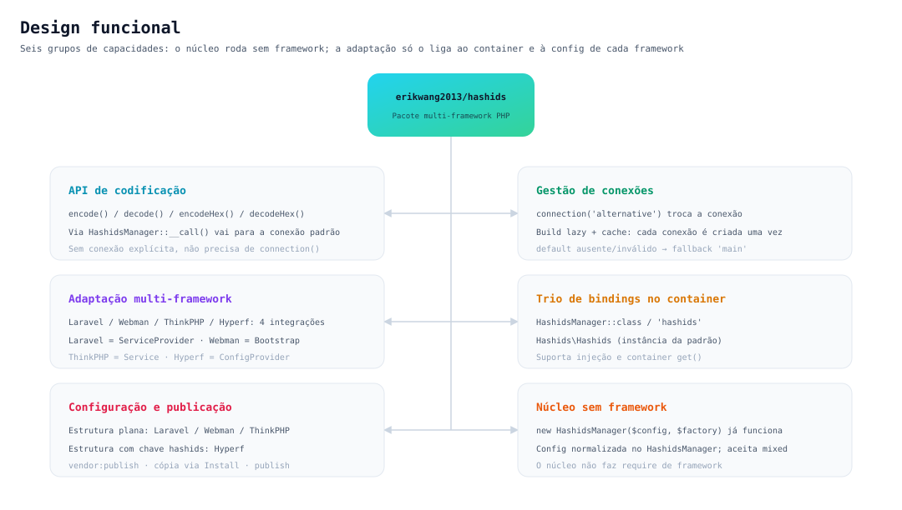
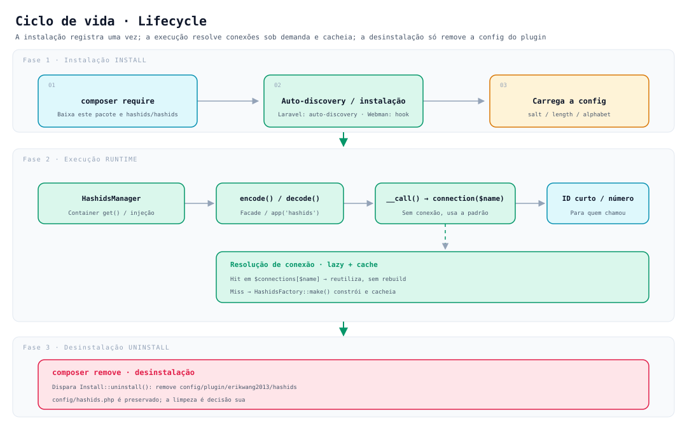

# erikwang2013/hashids

**Languages:** [中文](../../../README.md) · [English](../en/README.md) · [한국어](../ko/README.md) · [Русский](../ru/README.md) · [Deutsch](../de/README.md) · [Français](../fr/README.md) · [Español](../es/README.md) · **Português** · [हिन्दी](../hi/README.md) · [العربية](../ar/README.md) · [বাংলা](../bn/README.md) · [Bahasa Indonesia](../id/README.md) · [日本語](../ja/README.md)

<p align="center">
  
</p>

<p align="center"><strong>Hashy</strong> — o mascote do projeto, o <code>#</code> no peito é a sua marca</p>

Troque os IDs auto-incrementais do banco por strings curtas e impossíveis de adivinhar, **com uma única API rodando em Laravel, Webman, ThinkPHP e Hyperf ao mesmo tempo**.

Baseado em [`hashids/hashids`](https://github.com/vinkla/hashids) v5; a configuração e o uso seguem [**vinkla/hashids**](https://github.com/vinkla/laravel-hashids) (múltiplas conexões, conexão padrão, `HashidsManager` + factory), permitindo substituição direta.

## Sobre o projeto

**Hashids** é um gerador de IDs curtos: codifica IDs numéricos (como chaves primárias do banco) em strings curtas, únicas e impossíveis de adivinhar. Diferente de UUID ou Snowflake ID — Hashids é mais indicado para cenários voltados ao usuário (URLs, códigos de compartilhamento, número de pedido etc.), ocultando o número original sem abrir mão de um resultado curto e legível.

Este pacote `erikwang2013/hashids` é a **camada de integração multi-framework em PHP** do Hashids, com design inspirado e alinhado ao estilo de API do [vinkla/hashids](https://github.com/vinkla/laravel-hashids) (múltiplas conexões, conexão padrão, padrão Manager + Factory), e estende o suporte a outros frameworks PHP populares na China.

**Principais recursos:**

- **Compatibilidade multi-framework**: a mesma API atende Laravel, Webman, ThinkPHP e Hyperf, com custo de migração baixíssimo.
- **Múltiplas conexões**: um aplicativo pode configurar vários pares Salt/Length (por exemplo, salts diferentes para IDs de usuário e de pedido), alternando com `connection('xxx')`.
- **Sem dependência de framework**: funciona de forma independente, basta `new HashidsManager($config, $factory)`.
- **Alinhado ao vinkla/hashids**: no Laravel, a Facade, o binding no container e o formato de `config/hashids.php` são iguais aos do vinkla/hashids, permitindo substituição direta.
- **Estilo nativo de cada framework**: cada integração segue as convenções do respectivo framework — Laravel com ServiceProvider + Facade, Webman com Plugin + Bootstrap, ThinkPHP com Service, Hyperf com ConfigProvider.

**Cenários de uso:**

| Cenário | Descrição |
|------|------|
| Ocultar IDs auto-incrementais do banco | Mapeia `user_id=100` para `/user/3kTMd`, sem expor o tamanho da operação |
| Gerar links curtos / códigos de compartilhamento | Mais curto que UUID e mais controlável que uma string aleatória |
| Número de pedido / protocolo | Boa legibilidade, facilita o atendimento e a análise de logs |
| Isolamento multi-tenant / multi-módulo | Conexões diferentes usam salts diferentes, mantendo os espaços de codificação independentes |

**Atenção:**

- Hashids é **codificação (encode/decode), não criptografia**. O salt apenas dificulta a adivinhação e não serve para cenários sensíveis de segurança (como token e senha).
- Depois de entrar em produção, alterar o Salt ou o Length invalida todos os IDs já codificados; planeje e fixe a configuração com antecedência.

## Estrutura do projeto

```
hashids/
├── src/
│   ├── HashidsManager.php                     # Núcleo: resolução multi-conexão, cache de instâncias, proxy da conexão padrão
│   ├── HashidsFactory.php                     # Núcleo: cria a instância Hashids a partir da config da conexão
│   ├── Mascot.php                             # Versão ASCII do mascote do projeto, o Hashy
│   ├── Install.php                            # Hooks de instalação / desinstalação do Webman
│   ├── Laravel/
│   │   ├── HashidsServiceProvider.php         # Singleton no container + alias + publish da config
│   │   └── Facades/Hashids.php                # Facade (conexão padrão)
│   ├── Webman/
│   │   └── Bootstrap.php                      # Registra as definições no container na inicialização do processo
│   ├── ThinkPHP/
│   │   └── HashidsService.php                 # Registro de bindings do think\Service
│   ├── Hyperf/
│   │   ├── ConfigProvider.php                 # Mapeamento de dependências + publish da config
│   │   ├── HashidsManagerFactory.php
│   │   └── HashidsClientFactory.php
│   └── config/plugin/erikwang2013/hashids/    # Esqueleto do plugin Webman (copiado para o projeto na instalação)
│       ├── app.php                            # Chave enable
│       └── bootstrap.php                      # Registra Webman\Bootstrap
├── config/
│   ├── hashids.php                            # Config plana: Laravel / Webman / ThinkPHP
│   └── autoload/hashids.php                   # Config do Hyperf (chave hashids por fora)
├── tests/
│   ├── HashidsManagerTest.php                 # Comportamento do núcleo
│   ├── HashidsFactoryTest.php
│   ├── InstallTest.php
│   ├── MascotTest.php                         # Mascote do projeto: alinhamento dos glifos e saudação
│   ├── Laravel/ · Webman/ · ThinkPHP/ · Hyperf/   # Testes de adaptação de cada framework
│   ├── Config/PluginConfigTest.php
│   └── Support/FrameworkStubs.php             # Dublês das classes de framework usados nos testes
├── docs/
│   ├── mascot.svg                             # Mascote do projeto, o Hashy
│   ├── architecture.svg                       # Diagrama de arquitetura
│   ├── features.svg                           # Diagrama de design funcional
│   └── lifecycle.svg                          # Diagrama de ciclo de vida
├── .github/workflows/release.yml              # Após push na main, cria a tag e publica o release automaticamente
├── composer.json
└── phpunit.xml.dist
```

> Artefatos de dependência como `vendor/` e `composer.lock` não são listados; `src/config/` é o **esqueleto do plugin** e `config/` é o **exemplo de configuração publicável** — os dois têm finalidades diferentes.

## Arquitetura



**Quatro camadas com dependência unidirecional**: a camada de cima depende da de baixo, e nunca o contrário:

| Camada | Responsabilidade | Local |
|----|------|------|
| Camada de chamada da aplicação | Três entradas: Facade, container / função auxiliar, injeção por construtor | Código da aplicação |
| Camada de adaptação | Só faz a ligação: binding no container, leitura de config, publish da config | `src/<Framework>/` |
| Camada core | Gestão de múltiplas conexões e construção de instâncias, **sem depender de framework algum** | `src/HashidsManager.php`, `src/HashidsFactory.php` |
| Dependência de base | Implementação real de encode/decode | `hashids/hashids` |

A camada core é o centro de gravidade do pacote: `HashidsManager` guarda a configuração, `connection($name)` constrói e cacheia conexões sob demanda, e `__call()` encaminha para a conexão padrão as chamadas de método sem conexão explícita; `HashidsFactory::make()` é o único lugar que constrói um `Hashids\Hashids`. As classes de adaptação dos quatro frameworks somam cerca de 250 linhas (incluindo a Facade e as duas factories do Hyperf) — elas só ligam o núcleo ao container de cada um.

## Design funcional



Seis grupos de capacidades, todos em torno do mesmo núcleo:

- **API de codificação**: `encode()` / `decode()` / `encodeHex()` / `decodeHex()`, que via `__call()` chegam à conexão padrão, sem precisar de `connection()` explícito.
- **Gestão de múltiplas conexões**: `connection('alternative')` faz a troca; construção lazy, cada conexão é construída uma única vez.
- **Adaptação multi-framework**: Laravel usa `ServiceProvider`, Webman usa `Install` + `Bootstrap`, ThinkPHP usa `Service`, Hyperf usa `ConfigProvider`, cada um seguindo as convenções do framework.
- **Binding no container**: o trio `HashidsManager::class`, `'hashids'` e `Hashids\Hashids` (instância da conexão padrão), igual nos quatro frameworks.
- **Configuração e publicação**: Laravel/Webman/ThinkPHP usam estrutura plana, Hyperf usa a chave `hashids` por fora.
- **Núcleo sem dependência de framework**: `new HashidsManager($config, $factory)` já funciona, e o parâmetro `$config` tolera valores que não são array (normalizados para array vazio).

## Ciclo de vida



| Fase | O que acontece |
|------|-----------|
| **Instalação** | `composer require` baixa o pacote → auto-discovery do Laravel / hook de instalação do Webman copia o esqueleto do plugin → carrega `salt` / `length` / `alphabet` |
| **Execução** | O container resolve o `HashidsManager` → `encode()` / `decode()` → `__call()` encaminha para `connection($name)` → **em caso de hit, reutiliza o cache; só em caso de miss o `HashidsFactory::make()` constrói e grava em `$connections`** → retorna o ID curto ou o número original |
| **Desinstalação** | `composer remove` dispara `Install::uninstall()`, removendo `config/plugin/erikwang2013/hashids`; **`config/hashids.php` é preservado**, e a decisão de limpar fica com o usuário |

A conexão é **construída sob demanda**: processos que só usam a conexão padrão não pagam nenhum custo de construção por conexões não utilizadas, como `alternative`.

## Instalação

```bash
composer require erikwang2013/hashids
```

## Estrutura de configuração (Laravel / Webman / ThinkPHP)

Igual ao `config/hashids.php` do repositório:

- `default`: nome da conexão padrão (por exemplo, `main`).
- `connections`: nome da conexão => `salt`, `length` e `alphabet` opcional.

> **Hyperf** usa um formato de arquivo de configuração separado (chave externa `hashids`); veja a seção do Hyperf abaixo.

## Uso sem framework

É possível instanciar o manager diretamente:

```php
use Erikwang2013\Hashids\HashidsFactory;
use Erikwang2013\Hashids\HashidsManager;

$manager = new HashidsManager(
    require __DIR__ . '/config/hashids.php',
    new HashidsFactory()
);

$hash = $manager->encode(1, 2, 3);
$ids = $manager->decode($hash);
```

---

## Laravel

Semelhante ao [vinkla/hashids](https://github.com/vinkla/laravel-hashids): registra o `HashidsManager` no container, com múltiplas conexões; a conexão padrão suporta Facade e encaminhamento de métodos.

O Laravel 5.5+ lê o `extra.laravel` do `composer.json` deste pacote e registra automaticamente o `HashidsServiceProvider` e o alias de Facade `Hashids`.

**Publicar a configuração (opcional)**

```bash
php artisan vendor:publish --tag=hashids-config
```

Gera `config/hashids.php`. Se não publicar, o pacote mescla a configuração padrão embutida durante o registro.

**Facade (conexão padrão)**

```php
use Erikwang2013\Hashids\Laravel\Facades\Hashids;

$hash = Hashids::encode(1, 2, 3);
$numbers = Hashids::decode($hash);
```

**Conexão específica**

```php
use Erikwang2013\Hashids\Laravel\Facades\Hashids;

$hash = Hashids::connection('alternative')->encode(100);
```

**Injeção de dependência do `HashidsManager`**

```php
use Erikwang2013\Hashids\HashidsManager;

public function __construct(private HashidsManager $hashids) {}

$this->hashids->encode(1);
$this->hashids->connection('alternative')->encode(2);
```

**Injetar o `Hashids\Hashids` de baixo nível (conexão padrão)**

```php
use Hashids\Hashids;

public function __construct(private Hashids $hashids) {}
```

Para rodar a integração com o Laravel, o projeto precisa ter o `laravel/framework` instalado (incluindo `illuminate/support` etc.). Este pacote lista `illuminate/*` como **require-dev**, apenas para os testes do próprio pacote.

---

## Webman

No momento da instalação, o **`Install`** copia `config/plugin/erikwang2013/hashids` e o **`config/hashids.php`** da raiz, e o **bootstrap** do plugin registra o `HashidsManager` no container do Webman.

Se o `composer.json` do projeto já tiver os hooks `support\Plugin::install` / `update` / `uninstall`, o script de instalação deste pacote é executado automaticamente (`WEBMAN_PLUGIN = true`).

**Arquivos após a instalação**

- `config/plugin/erikwang2013/hashids/app.php`: a chave `enable`.
- `config/plugin/erikwang2013/hashids/bootstrap.php`: registra `Erikwang2013\Hashids\Webman\Bootstrap`.
- `config/hashids.php`: configuração multi-conexão (gravada na primeira instalação ou quando você confirma a sobrescrita).

Se a cópia automática não for executada, copie manualmente do pacote a configuração de exemplo nos caminhos acima.

**Desligar o plugin** (`config/plugin/erikwang2013/hashids/app.php`)

```php
<?php
return [
    'enable' => false,
];
```

**Binding no container**

- `Erikwang2013\Hashids\HashidsManager`
- `'hashids'`
- `Hashids\Hashids` (instância da conexão padrão)

**Exemplo de controller**

```php
use support\Request;
use Erikwang2013\Hashids\HashidsManager;
use Hashids\Hashids;

class DemoController
{
    public function index(Request $request, HashidsManager $manager)
    {
        $hash = $manager->encode(1, 2, 3);

        $client = \support\Container::instance()->get(Hashids::class);
        $hash2 = $client->encode(4);

        return json(['hash' => $hash, 'hash2' => $hash2]);
    }
}
```

**Conexão específica**

```php
$manager->connection('alternative')->encode(99);
```

Ao desinstalar o pacote, o Composer dispara `Plugin::uninstall` e remove `config/plugin/erikwang2013/hashids`; **não** apaga `config/hashids.php`, e manter ou não fica a seu critério.

---

## ThinkPHP

Registra o `HashidsManager` por meio de uma **classe de serviço personalizada**; a configuração continua sendo o **`config/hashids.php`** com `default` e `connections` no nível raiz.

**Registrar o serviço**

No `services` do **`config/service.php`** da aplicação (o caminho exato pode variar conforme a versão do TP), adicione:

```php
<?php

return [
    // ...
    \Erikwang2013\Hashids\ThinkPHP\HashidsService::class,
];
```

Se você usa o `app/AppService.php` no nível da aplicação, também pode escrever o binding equivalente em `register()`.

**Arquivo de configuração**

Copie o `config/hashids.php` do pacote para o `config/hashids.php` da aplicação (ou mescle você mesmo as configurações de mesmo nome).

```php
<?php
return [
    'default' => 'main',
    'connections' => [
        'main' => [
            'salt' => env('HASHIDS_SALT', ''),
            'length' => (int) env('HASHIDS_LENGTH', 0),
        ],
    ],
];
```

**Exemplos de uso**

```php
use Erikwang2013\Hashids\HashidsManager;
use think\facade\App;

$manager = App::make(HashidsManager::class);
$hash = $manager->encode(10, 20);
```

```php
$manager = app('hashids');
```

```php
use Hashids\Hashids;

$client = app(Hashids::class);
$hash = $client->encode(1);
```

```php
app(HashidsManager::class)->connection('alternative')->encode(100);
```

A integração com o ThinkPHP estende `think\Service` e exige um ambiente com **`topthink/framework`** (este pacote o lista como suggest).

---

## Hyperf

O **`extra.hyperf.config`** do Composer carrega o `ConfigProvider`, que registra no container o `HashidsFactory`, o `HashidsManager` e o `Hashids\Hashids` da conexão padrão.

Copie o **`config/autoload/hashids.php`** do pacote para o **`config/autoload/hashids.php`** do projeto (ou use o comando de publish de configuração do projeto).

Esse arquivo deve atender a: **chave de nível raiz `hashids`**, lida por `ConfigInterface::get('hashids')`.

```php
<?php

declare(strict_types=1);

return [
    'hashids' => [
        'default' => 'main',
        'connections' => [
            'main' => [
                'salt' => env('HASHIDS_SALT', ''),
                'length' => (int) env('HASHIDS_LENGTH', 0),
            ],
        ],
    ],
];
```

**Binding no container**

| Abstração | Implementação |
|------|------|
| `Erikwang2013\Hashids\HashidsFactory` | Construtor padrão |
| `Erikwang2013\Hashids\HashidsManager` | `HashidsManagerFactory` |
| `Hashids\Hashids` | `HashidsClientFactory` (conexão padrão) |

**Controller / injeção por construtor**

```php
<?php

declare(strict_types=1);

namespace App\Controller;

use Erikwang2013\Hashids\HashidsManager;
use Hashids\Hashids;

class DemoController
{
    public function index(HashidsManager $manager, Hashids $hashids)
    {
        $h1 = $manager->encode(1, 2, 3);
        $h2 = $hashids->encode(4);
        $alt = $manager->connection('alternative')->encode(99);

        return compact('h1', 'h2', 'alt');
    }
}
```

```php
$manager = \Hyperf\Context\ApplicationContext::getContainer()->get(
    \Erikwang2013\Hashids\HashidsManager::class
);
```

O Hyperf usa **`config/autoload/hashids.php`** com a configuração dentro da chave **`hashids`**; Laravel / Webman / ThinkPHP usam estrutura plana (`default` + `connections` na raiz). Não misture os formatos.

---

## Mascote do projeto

O mascote do projeto é o **Hashy** — um blocão de cantos arredondados, com antena na cabeça e um `#` estampado no peito; o vetor está em [`docs/mascot.svg`](../../mascot.svg).

Como o terminal não tem SVG, o código traz uma versão ASCII equivalente (`Erikwang2013\Hashids\Mascot`):

```php
use Erikwang2013\Hashids\Mascot;

echo Mascot::greet();
```

```
           ●
           │
      ╭─────────╮
      │ ◉     ◉ │
      │    ‿    │
      │    #    │
      ╰──┬───┬──╯
         ╵   ╵
哈希迪 Hashy · 把数据库自增 ID 换成短小、不可猜测的字符串
```

Na primeira vez que o plugin do Webman publica o `config/hashids.php`, essa saudação é impressa uma vez; se a configuração já existir (por exemplo, ao repetir um `composer update`), você não será incomodado de novo.

---

## Código aberto não é fácil, seu apoio é bem-vindo

<p align="center">
  
  &nbsp;&nbsp;&nbsp;&nbsp;
  
</p>

<p align="center"><strong>WeChat Pay</strong>&nbsp;&nbsp;&nbsp;&nbsp;&nbsp;&nbsp;&nbsp;&nbsp;&nbsp;&nbsp;&nbsp;&nbsp;&nbsp;&nbsp;&nbsp;&nbsp;<strong>Alipay</strong></p>

---


## Licença

MIT. Veja [LICENSE](../../../LICENSE).
