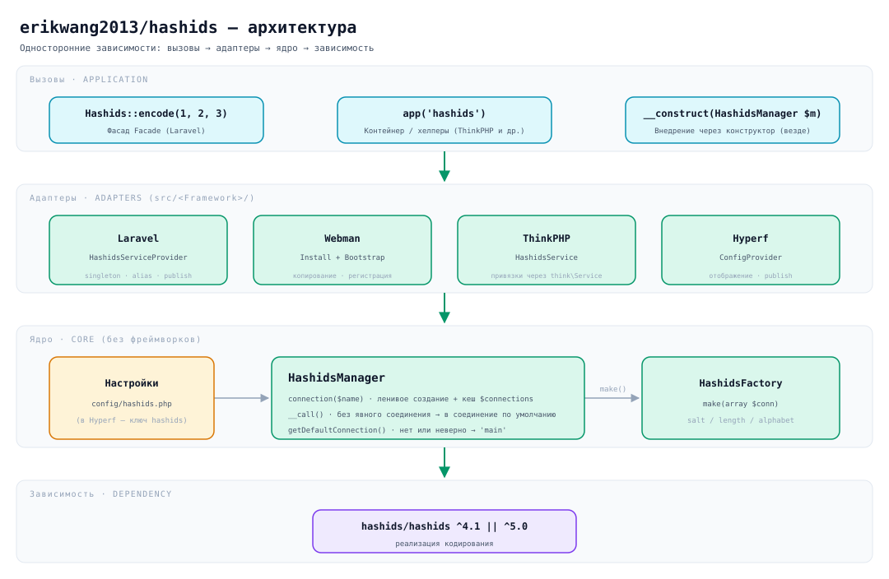
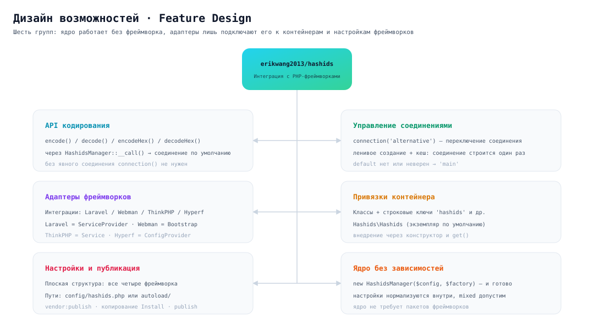
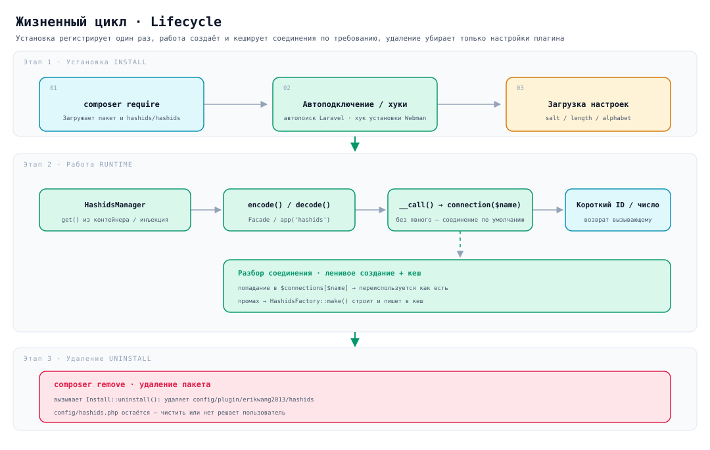

# erikwang2013/hashids

**Languages:** [中文](../../../README.md) · [English](../en/README.md) · [한국어](../ko/README.md) · **Русский** · [Deutsch](../de/README.md) · [Français](../fr/README.md) · [Español](../es/README.md) · [Português](../pt/README.md) · [हिन्दी](../hi/README.md) · [العربية](../ar/README.md) · [বাংলা](../bn/README.md) · [Bahasa Indonesia](../id/README.md) · [日本語](../ja/README.md)

<p align="center">
  
</p>

<p align="center"><strong>Хашиди Hashy</strong> — талисман проекта; <code>#</code> на груди — его визитная карточка</p>

Замените автоинкрементные ID из базы на короткие, непредсказуемые строки — **один и тот же API работает в Laravel, Webman, ThinkPHP и Hyperf**.

В основе — [`hashids/hashids`](https://github.com/vinkla/hashids) v5; конфигурация и приёмы работы повторяют [**vinkla/hashids**](https://github.com/vinkla/laravel-hashids) (несколько соединений, соединение по умолчанию, `HashidsManager` + фабрика), поэтому переход проходит гладко.

## Описание проекта

**Hashids** — генератор коротких ID: он кодирует числовые идентификаторы (например, первичные ключи БД) в короткие, уникальные и непредсказуемые строки. Это не UUID и не Snowflake ID — Hashids лучше подходит для пользовательских сценариев (URL, коды для обмена, номера заказов и т. п.): оставаясь коротким и читаемым, он скрывает исходное число.

Пакет `erikwang2013/hashids` — это **слой интеграции Hashids с несколькими PHP-фреймворками**. Его дизайн ориентирован на стиль API [vinkla/hashids](https://github.com/vinkla/laravel-hashids) (несколько соединений, соединение по умолчанию, паттерн Manager + Factory) и расширен поддержкой других распространённых PHP-фреймворков.

**Ключевые возможности:**

- **Совместимость с несколькими фреймворками**: один и тот же API работает в Laravel, Webman, ThinkPHP и Hyperf — миграция почти бесплатна.
- **Несколько соединений**: приложение может держать несколько пар Salt/Length (например, для ID пользователей и заказов — разные соли) и переключаться через `connection('xxx')`.
- **Без зависимости от фреймворка**: работает автономно, достаточно `new HashidsManager($config, $factory)`.
- **Совместимость с vinkla/hashids**: в Laravel фасад, привязки контейнера и формат `config/hashids.php` совпадают с vinkla/hashids, замена проходит гладко.
- **Идиоматичность для каждого фреймворка**: интеграции следуют местным обычаям — в Laravel это ServiceProvider + Facade, в Webman — Plugin + Bootstrap, в ThinkPHP — Service, в Hyperf — ConfigProvider.

**Сценарии использования:**

| Сценарий | Описание |
|------|------|
| Скрытие автоинкрементных ID | `user_id=100` превращается в `/user/3kTMd` — масштаб бизнеса не виден |
| Короткие ссылки и коды | Короче UUID и управляемее случайных строк |
| Номера заказов и транзакций | Хорошо читаются: удобно в поддержке и в логах |
| Изоляция тенантов и модулей | Разные соли у соединений — пространства кодирования независимы |

**Важно:**

- Hashids — это **кодирование (encode/decode), а не шифрование**. Salt лишь усложняет угадывание и не годится для задач, чувствительных к безопасности (токены, пароли).
- Если изменить Salt или Length после запуска, все уже закодированные ID станут недействительными — продумайте и зафиксируйте конфигурацию заранее.
- **Пустой Salt = нет защиты**: с пустым Salt результат кодирования перебирается (`encode(1)`, `encode(2)`… порядок
  предсказуем). При записи `env('HASHIDS_SALT', '')` забытая переменная окружения не даёт ни ошибки, ни предупреждения — просто тихо вырождается в пустой Salt. Перед релизом убедитесь, что Salt задан.
- **В долгоживущих фреймворках (Webman / Hyperf) смена настроек требует перезапуска процесса**: `HashidsManager`
  снимает снимок настроек при создании и кеширует соединения навсегда, поэтому правка `config/hashids.php` (или смена Salt через конфиг-центр) не применяется на лету — только после `reload` или перезапуска.

## Структура проекта

```
hashids/
├── src/
│   ├── HashidsManager.php                     # Ядро: разбор соединений, кеш экземпляров, проксирование
│   ├── HashidsFactory.php                     # Ядро: создаёт экземпляр Hashids из настроек соединения
│   ├── Mascot.php                             # ASCII-версия талисмана «Хашиди Hashy»
│   ├── Install.php                            # Хуки установки / удаления Webman
│   ├── Laravel/
│   │   ├── HashidsServiceProvider.php         # Синглтон в контейнере + алиас + публикация настроек
│   │   └── Facades/Hashids.php                # Facade (соединение по умолчанию)
│   ├── Webman/
│   │   └── Bootstrap.php                      # Регистрирует определения контейнера при старте
│   ├── ThinkPHP/
│   │   └── HashidsService.php                 # Регистрация привязок через think\Service
│   ├── Hyperf/
│   │   ├── ConfigProvider.php                 # Отображение зависимостей + публикация настроек
│   │   ├── HashidsManagerFactory.php
│   │   └── HashidsClientFactory.php
│   └── config/plugin/erikwang2013/hashids/    # Каркас плагина Webman (копируется при установке)
│       ├── app.php                            # Переключатель enable
│       └── bootstrap.php                      # Регистрирует Webman\Bootstrap
├── config/
│   ├── hashids.php                            # Плоские настройки: Laravel / Webman / ThinkPHP
│   └── autoload/hashids.php                   # Настройки Hyperf (структура та же, путь другой)
├── tests/
│   ├── HashidsManagerTest.php                 # Поведение ядра
│   ├── HashidsFactoryTest.php
│   ├── InstallTest.php
│   ├── MascotTest.php                         # Талисман: выравнивание глифов и приветствие
│   ├── Laravel/ · Webman/ · ThinkPHP/ · Hyperf/   # Тесты адаптеров фреймворков
│   ├── Config/PluginConfigTest.php
│   └── Support/FrameworkStubs.php             # Заглушки классов фреймворков для тестов
├── docs/
│   ├── mascot.svg                             # Талисман проекта «Хашиди Hashy»
│   ├── architecture.svg                       # Схема архитектуры
│   ├── features.svg                           # Схема возможностей
│   └── lifecycle.svg                          # Схема жизненного цикла
├── .github/workflows/release.yml              # Авто-тег и release после push в main
├── composer.json
└── phpunit.xml.dist
```

> Зависимости вроде `vendor/` и `composer.lock` не показаны; `src/config/` — это **каркас плагина**, а `config/` — **пример настроек для публикации**: назначение у них разное.

## Архитектура



**Четыре слоя с односторонними зависимостями**: верхний слой зависит от нижнего, обратное неверно:

| Слой | Ответственность | Расположение |
|----|------|------|
| Слой вызовов | Три входа: Facade, контейнер / хелперы, внедрение через конструктор | Код приложения |
| Слой адаптеров | Только связывание: привязки контейнера, чтение и публикация настроек | `src/<Framework>/` |
| Ядро | Управление соединениями и создание экземпляров, **без зависимости от фреймворков** | `src/HashidsManager.php`, `src/HashidsFactory.php` |
| Базовая зависимость | Собственно реализация кодирования | `hashids/hashids` |

Ядро — центр всего пакета: `HashidsManager` хранит настройки, `connection($name)` создаёт и кеширует соединение по требованию, `__call()` перенаправляет вызовы без явного соединения в соединение по умолчанию; `HashidsFactory::make()` — единственное место, где создаётся `Hashids\Hashids`. Адаптеры четырёх фреймворков вместе занимают около 250 строк (включая Facade и две фабрики Hyperf) — они лишь подключают ядро к контейнерам своих фреймворков.

## Дизайн возможностей



Шесть групп возможностей, и все — вокруг одного ядра:

- **API кодирования**: `encode()` / `decode()` / `encodeHex()` / `decodeHex()` через `__call()` попадают в соединение по умолчанию, явный `connection()` не нужен.
- **Управление соединениями**: переключение через `connection('alternative')`; ленивое создание — одно соединение строится один раз.
- **Адаптеры фреймворков**: `ServiceProvider` в Laravel, `Install` + `Bootstrap` в Webman, `Service` в ThinkPHP, `ConfigProvider` в Hyperf — по идиомам каждого фреймворка.
- **Привязки контейнера**: двойная схема — имена классов (`HashidsManager`, `HashidsFactory`, `Hashids\Hashids`) и строковые ключи (`'hashids'`, `'hashids.factory'`, `'hashids.connection'`) — одинакова во всех четырёх фреймворках; два последних строковых ключа совпадают с vinkla/hashids, что упрощает миграцию.
- **Настройки и публикация**: у всех четырёх фреймворков структура одинакова — **плоский массив** (корневые `default` + `connections`), различается только путь к файлу.
- **Ядро без зависимостей**: достаточно `new HashidsManager($config, $factory)`, а `$config` может быть не массивом (нормализуется в пустой массив).

## Жизненный цикл



| Этап | Что происходит |
|------|-----------|
| **Установка** | `composer require` забирает пакет → автоподключение в Laravel / хук установки Webman копирует каркас плагина → загрузка `salt` / `length` / `alphabet` |
| **Работа** | контейнер достаёт `HashidsManager` → `encode()` / `decode()` → `__call()` перенаправляет в `connection($name)` → **попадание в кеш — сразу переиспользуется, промах — `HashidsFactory::make()` строит и пишет в `$connections`** → возврат короткого ID или исходного числа |
| **Удаление** | `composer remove` вызывает `Install::uninstall()` и убирает `config/plugin/erikwang2013/hashids`; **`config/hashids.php` остаётся** — чистить его или нет, решает пользователь |

Соединения создаются **по требованию**: процесс, который обращается только к соединению по умолчанию, не платит за построение неиспользуемых соединений вроде `alternative`.

## Установка

```bash
composer require erikwang2013/hashids
```

> **Рабочее окружение**: низкоуровневый `hashids/hashids` **требует** `ext-bcmath` или `ext-gmp` (любой из двух), иначе
> первое же кодирование выбросит `RuntimeException: Missing math extension for Hashids`. В `hashids/hashids` эти
> расширения указаны только в `suggest`, а Composer 2 больше не печатает suggest — поэтому на минимальных образах
> (например, `php:8.3-fpm-alpine`) при установке нет ни намёка, падает только рантайм, и каждый запрос с Hashids даёт 500. В `composer.json` этого пакета оба ключа добавлены в `suggest`, но включённость расширений всё равно проверьте сами.

## Структура настроек (Laravel / Webman / ThinkPHP)

Совпадает с `config/hashids.php` в репозитории:

- `default`: имя соединения по умолчанию (например, `main`).
- `connections`: имя соединения => `salt`, `length`, опционально `alphabet`.

> У **Hyperf** другой путь к файлу настроек (`config/autoload/hashids.php`), но структура та же, см. раздел Hyperf ниже.

## Использование без фреймворка

Менеджер можно создать напрямую:

```php
use Erikwang2013\Hashids\HashidsFactory;
use Erikwang2013\Hashids\HashidsManager;

$manager = new HashidsManager(
    require __DIR__ . '/config/hashids.php',
    new HashidsFactory()
);

$hash = $manager->encode(1, 2, 3);
$ids = $manager->decode($hash);
```

---

## Laravel

Как и в [vinkla/hashids](https://github.com/vinkla/laravel-hashids): в контейнере регистрируется `HashidsManager`, соединений может быть несколько; для соединения по умолчанию работают Facade и перенаправление методов.

Laravel 5.5+ читает `extra.laravel` из `composer.json` этого пакета и сам регистрирует `HashidsServiceProvider` и алиас Facade `Hashids`.

**Публикация настроек (необязательно)**

```bash
php artisan vendor:publish --tag=hashids-config
```

Создаётся `config/hashids.php`. Если не публиковать, пакет на этапе регистрации подмешает встроенные значения по умолчанию.

**Facade (соединение по умолчанию)**

```php
use Erikwang2013\Hashids\Laravel\Facades\Hashids;

$hash = Hashids::encode(1, 2, 3);
$numbers = Hashids::decode($hash);
```

**Явное соединение**

```php
use Erikwang2013\Hashids\Laravel\Facades\Hashids;

$hash = Hashids::connection('alternative')->encode(100);
```

**Внедрение `HashidsManager`**

```php
use Erikwang2013\Hashids\HashidsManager;

public function __construct(private HashidsManager $hashids) {}

$this->hashids->encode(1);
$this->hashids->connection('alternative')->encode(2);
```

**Внедрение низкоуровневого `Hashids\Hashids` (соединение по умолчанию)**

```php
use Hashids\Hashids;

public function __construct(private Hashids $hashids) {}
```

Для работы интеграции с Laravel в проекте должен быть установлен `laravel/framework` (включая `illuminate/support` и прочее). В этом пакете `illuminate/*` указан как **require-dev** — только для его собственных тестов.

---

## Webman

Через **`Install`** при установке копируются `config/plugin/erikwang2013/hashids` и корневой **`config/hashids.php`**, а **bootstrap** плагина регистрирует `HashidsManager` в контейнере Webman.

Если в `composer.json` проекта уже есть хуки `support\Plugin::install` / `update` / `uninstall`, при установке пакета скрипт установки выполнится автоматически (`WEBMAN_PLUGIN = true`).

**Файлы после установки**

- `config/plugin/erikwang2013/hashids/app.php`: переключатель `enable`.
- `config/plugin/erikwang2013/hashids/bootstrap.php`: регистрирует `Erikwang2013\Hashids\Webman\Bootstrap`.
- `config/hashids.php`: настройки нескольких соединений (пишется при первой установке или при подтверждённой перезаписи).

Если автокопирование не сработало, примеры настроек можно скопировать из пакета вручную по указанным путям.

**Отключение плагина** (`config/plugin/erikwang2013/hashids/app.php`)

```php
<?php
return [
    'enable' => false,
];
```

**Привязки контейнера**

- `Erikwang2013\Hashids\HashidsManager` / `'hashids'`
- `Erikwang2013\Hashids\HashidsFactory` / `'hashids.factory'`
- `Hashids\Hashids` / `'hashids.connection'` (экземпляр соединения по умолчанию)

**Пример контроллера**

```php
use support\Request;
use Erikwang2013\Hashids\HashidsManager;
use Hashids\Hashids;

class DemoController
{
    public function index(Request $request, HashidsManager $manager)
    {
        $hash = $manager->encode(1, 2, 3);

        $client = \support\Container::instance()->get(Hashids::class);
        $hash2 = $client->encode(4);

        return json(['hash' => $hash, 'hash2' => $hash2]);
    }
}
```

**Явное соединение**

```php
$manager->connection('alternative')->encode(99);
```

Composer при удалении пакета вызывает `Plugin::uninstall` и убирает `config/plugin/erikwang2013/hashids`; `config/hashids.php` **не** удаляется — оставить его или нет, решаете вы.

---

## ThinkPHP

`HashidsManager` регистрируется через **свой класс сервиса**; настройки — всё тот же **`config/hashids.php`** с `default` и `connections` на верхнем уровне.

**Регистрация сервиса**

Добавьте в `services` файла **`config/service.php`** приложения (точный путь может отличаться в зависимости от версии TP):

```php
<?php

return [
    // ...
    \Erikwang2013\Hashids\ThinkPHP\HashidsService::class,
];
```

Если используется прикладной `app/AppService.php`, эквивалентную привязку можно прописать в `register()`.

**Файл настроек**

Скопируйте `config/hashids.php` из пакета в `config/hashids.php` приложения (или слейте одноимённые настройки самостоятельно).

```php
<?php
return [
    'default' => 'main',
    'connections' => [
        'main' => [
            'salt' => env('HASHIDS_SALT', ''),
            'length' => (int) env('HASHIDS_LENGTH', 0),
        ],
    ],
];
```

**Пример использования**

```php
use Erikwang2013\Hashids\HashidsManager;
use think\facade\App;

$manager = App::make(HashidsManager::class);
$hash = $manager->encode(10, 20);
```

```php
$manager = app('hashids');
```

```php
use Hashids\Hashids;

$client = app(Hashids::class);
$hash = $client->encode(1);
```

```php
app(HashidsManager::class)->connection('alternative')->encode(100);
```

Интеграция с ThinkPHP наследует `think\Service` и требует окружения **`topthink/framework`** (в этом пакете указан в suggest).

---

## Hyperf

Composer **`extra.hyperf.config`** загружает `ConfigProvider`, который регистрирует в контейнере `HashidsFactory`, `HashidsManager` и `Hashids\Hashids` для соединения по умолчанию.

Скопируйте **`config/autoload/hashids.php`** из пакета в **`config/autoload/hashids.php`** проекта (или используйте команду публикации настроек).

Файл должен возвращать **плоский массив** (корневые `default` + `connections`).

`ConfigFactory` в Hyperf объединяет настройки **по имени файла** (`Arr::set($config, 'hashids', require $file)`), поэтому `config('hashids')` возвращает само содержимое файла — **не оборачивайте его ещё раз в `'hashids' =>`**. Иначе `connections` станет недоступен, и при получении соединения будет выброшено `Hashids connection [main] is not configured`.

```php
<?php

declare(strict_types=1);

return [
    'default' => 'main',
    'connections' => [
        'main' => [
            'salt' => env('HASHIDS_SALT', ''),
            'length' => (int) env('HASHIDS_LENGTH', 0),
        ],
    ],
];
```

**Привязки контейнера**

| Абстракция | Реализация |
|------|------|
| `Erikwang2013\Hashids\HashidsFactory` / `'hashids.factory'` | Обычное создание |
| `Erikwang2013\Hashids\HashidsManager` / `'hashids'` | `HashidsManagerFactory` |
| `Hashids\Hashids` / `'hashids.connection'` | `HashidsClientFactory` (соединение по умолчанию) |

**Controller / внедрение через конструктор**

```php
<?php

declare(strict_types=1);

namespace App\Controller;

use Erikwang2013\Hashids\HashidsManager;
use Hashids\Hashids;

class DemoController
{
    public function index(HashidsManager $manager, Hashids $hashids)
    {
        $h1 = $manager->encode(1, 2, 3);
        $h2 = $hashids->encode(4);
        $alt = $manager->connection('alternative')->encode(99);

        return compact('h1', 'h2', 'alt');
    }
}
```

```php
$manager = \Hyperf\Context\ApplicationContext::getContainer()->get(
    \Erikwang2013\Hashids\HashidsManager::class
);
```

Структура настроек одинакова во всех четырёх фреймворках (корневые `default` + `connections`), различается только путь к файлу: в Hyperf — **`config/autoload/hashids.php`**, в Laravel / Webman / ThinkPHP — **`config/hashids.php`**.

---

## Талисман проекта

Талисман проекта — **Хашиди Hashy**: маленький питомец-квадратик со скруглёнными углами, антенной на макушке и `#` на груди. Векторная версия — [`docs/mascot.svg`](../../mascot.svg).

В терминале SVG нет, поэтому в коде есть эквивалентная ASCII-версия (`Erikwang2013\Hashids\Mascot`):

```php
use Erikwang2013\Hashids\Mascot;

echo Mascot::greet();
```

```
           ●
           │
      ╭─────────╮
      │ ◉     ◉ │
      │    ‿    │
      │    #    │
      ╰──┬───┬──╯
         ╵   ╵
哈希迪 Hashy · 把数据库自增 ID 换成短小、不可猜测的字符串
```

При первой публикации `config/hashids.php` плагин Webman заодно один раз печатает это приветствие; если настройки уже есть (например, при повторном `composer update`), оно не появится снова.

---

## Открытый код — дело непростое, поддержка приветствуется

<p align="center">
  
  &nbsp;&nbsp;&nbsp;&nbsp;
  
</p>

<p align="center"><strong>WeChat Pay</strong>&nbsp;&nbsp;&nbsp;&nbsp;&nbsp;&nbsp;&nbsp;&nbsp;&nbsp;&nbsp;&nbsp;&nbsp;&nbsp;&nbsp;&nbsp;&nbsp;<strong>Alipay</strong></p>

---


## Лицензия

MIT. См. [LICENSE](../../../LICENSE).
